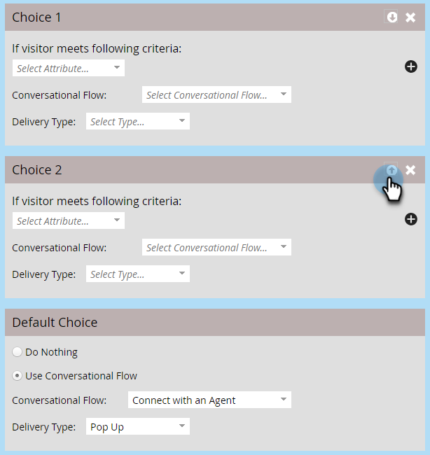

# Paramètres De Flux De Conversation Pour Marketo Engage Forms{#conversational-flow-settings-for-marketo-engage-forms}

Rendez Marketo Engage Forms conversationnel en les intégrant aux flux de conversation Dynamic Chat. Qualifiez instantanément les prospects à l’aide des données de formulaire ou de l’abonnement à la liste dynamique pour les réservations de réunions, les liens vers des articles techniques ou les objectifs personnalisés.

>[!AVAILABILITY]
>
>Le membre de la liste dynamique ou le membre des critères de liste nécessite Dynamic Chat Prime. Pour plus d’informations, contactez l’équipe du compte Adobe (votre gestionnaire de compte).

1. Recherchez et sélectionnez votre formulaire (ou créez-en un).

   

1. Cliquez sur **[!UICONTROL Modifier le brouillon]**.

   

1. Sur la page de modification du formulaire, cliquez sur **[!UICONTROL Paramètres du formulaire]**, puis **[!UICONTROL Paramètres]**.

   

1. Cliquez sur le curseur **[!UICONTROL Paramètres de flux de conversation]** pour l’activer.

   

1. Une boîte de dialogue modale Choix par défaut s’affiche. Sélectionnez votre préférence. Dans cet exemple, nous choisissons **[!UICONTROL Utiliser le flux de conversation]**.

   

1. Sélectionnez les options **[!UICONTROL Flux de conversation]** et **[!UICONTROL Type de diffusion]** souhaitées.

   

   >[!NOTE]
   >
   >[En savoir plus sur les flux de conversation](/help/marketo/product-docs/demand-generation/dynamic-chat/automated-chat/conversational-flow-overview.md){target="_blank"}

   **ÉTAPE FACULTATIVE** : Vous pouvez cliquer sur **[!UICONTROL Ajouter un choix]** pour cibler les visiteurs du chat qui répondent à un critère spécifique. Vous pouvez ajouter jusqu’à neuf choix pour un total de dix.

   

   >[!NOTE]
   >
   >Le navigateur du visiteur doit être identifié comme une personne connue avant l’envoi du formulaire pour pouvoir être membre de la liste statique/dynamique.

   **ÉTAPE FACULTATIVE** : cliquez sur le signe **+** dans chaque étape pour ajouter d’autres attributs, ce qui vous permet d’affiner votre audience ciblée (les attributs disponibles sont les champs que vous avez choisis pour le formulaire). Dans cet exemple, nous ciblons les rédacteurs techniques Adobe en Californie.

   

   >[!NOTE]
   >
   >La logique de critère définie sur « all » signifie que chaque attribut doit être satisfait pour être admissible. La logique de critère définie sur « any » signifie que l’un des attributs sera suffisant.

   **ÉTAPE FACULTATIVE** : si vous ajoutez plusieurs choix, vous pouvez les réorganiser en cliquant sur leurs flèches haut/bas.

   

1. Cliquez sur **[!UICONTROL Terminer]** lorsque vous avez terminé.

   
