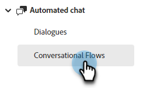
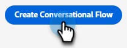

# Créer un flux conversationnel {#create-a-conversational-flow}

Pour créer un flux de conversation, procédez comme suit.

1. Sous [!UICONTROL Conversation automatisée], cliquez sur **[!UICONTROL Flux de conversation]**.

   

1. Cliquez sur **[!UICONTROL Créer un flux de conversation]**.

   

1. Sélectionnez un flux de conversation vierge ou l’un des modèles préremplis. Saisissez un nom (description facultative), modifiez la langue (facultatif), puis cliquez sur **[!UICONTROL Créer]**.

   

   >[!NOTE]
   >
   >Cette action modifie uniquement la langue du texte système. Vous êtes responsable de la traduction du contenu.

1. Comme pour les boîtes de dialogue, [créez un flux](/help/marketo/product-docs/demand-generation/dynamic-chat/automated-chat/stream-designer.md#create-a-stream){target="_blank"}.

>[!MORELIKETHIS]
>
>[Présentation du flux de conversation](/help/marketo/product-docs/demand-generation/dynamic-chat/automated-chat/conversational-flow-overview.md){target="_blank"}
