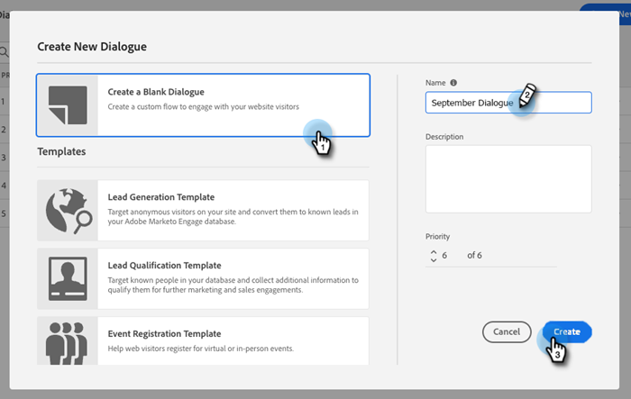

# Créer un dialogue {#create-a-dialogue}

Pour créer une boîte de dialogue, procédez comme suit.

1. Cliquez sur **[!UICONTROL Boîtes de dialogue]**.

   

1. Cliquez sur le bouton **[!UICONTROL Créer]**.

   

1. Sélectionnez une boîte de dialogue vierge ou l’un des modèles préremplis. Saisissez un nom (description facultative), modifiez le niveau de priorité (facultatif), puis cliquez sur **[!UICONTROL Créer]**.

   

>[!NOTE]
>
>La priorité détermine la boîte de dialogue qui sera présentée à un visiteur lorsqu’il remplit les critères de plusieurs boîtes de dialogue simultanément.

Découvrez ensuite comment [créer un flux](/help/marketo/product-docs/demand-generation/dynamic-chat/automated-chat/stream-designer.md#create-a-stream){target="_blank"}.

>[!MORELIKETHIS]
>
>* [Critères d’audience](/help/marketo/product-docs/demand-generation/dynamic-chat/automated-chat/audience-criteria.md){target="_blank"}
>* [Stream Designer](/help/marketo/product-docs/demand-generation/dynamic-chat/automated-chat/stream-designer.md){target="_blank"}
