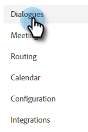

# Créer un dialogue {#create-a-dialogue}

Voici comment créer un nouveau dialogue.

1. Cliquez sur **Dialogues**.

   

1. Cliquez sur le bouton **Créer** bouton .

   

1. Sélectionnez un dialogue vierge ou l’un des modèles préremplis. Saisissez un nom (la description est facultative), modifiez le niveau de priorité (facultatif), puis cliquez sur **Créer**.

   

>[!NOTE]
>
>La priorité détermine le dialogue qui sera présenté à un visiteur lorsqu’il remplit les conditions requises pour plusieurs dialogues simultanément.

Ensuite, apprenez à [créer un flux ;](/help/marketo/product-docs/demand-generation/dynamic-chat/automated-chat/stream-designer.md#create-a-stream){target="_blank"}.

>[!MORELIKETHIS]
>
>* [Critère d’audience](/help/marketo/product-docs/demand-generation/dynamic-chat/automated-chat/audience-criteria.md){target="_blank"}
>* [Designer de flux](/help/marketo/product-docs/demand-generation/dynamic-chat/automated-chat/stream-designer.md){target="_blank"}
