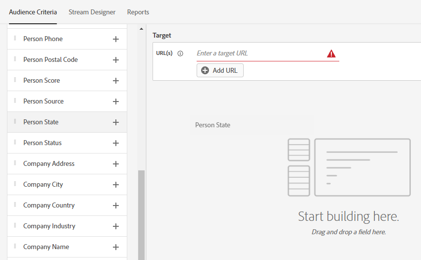

# Vue d’ensemble du dialogue {#dialogue-overview}

Les boîtes de dialogue sont des conversations individuelles. Dans chaque boîte de dialogue, vous décidez où la conversation spécifique s’affiche, à qui elle sera présentée et quel sera le contenu de la conversation. Chaque boîte de dialogue comporte également sa propre page de rapport, dans laquelle vous pouvez contrôler l’efficacité.

## Critère d’audience {#audience-criteria}

La section [Critères d’audience](/help/marketo/product-docs/demand-generation/dynamic-chat/automated-chat/audience-criteria.md){target="_blank"} d’une boîte de dialogue vous permet de définir où et à qui votre conversation sera présentée

## Concepteur de flux {#stream-designer}

La section [Stream Designer](/help/marketo/product-docs/demand-generation/dynamic-chat/automated-chat/stream-designer.md){target="_blank"} d’une boîte de dialogue vous permet de concevoir la conversation que vous souhaitez avoir avec les visiteurs de votre site web.

## Rapports {#reports}

Sous l’onglet Rapports , vous pouvez voir les mesures relatives aux performances de votre boîte de dialogue.

<table>
 <tr>
  <td><strong>Déclenchements totaux</strong></td>
  <td>S’incrémente chaque fois qu’un visiteur remplit les conditions pour une boîte de dialogue ou apparaît.
</td>
 </tr>
 <tr>
  <td><strong>Engagé</strong></td>
  <td>S’incrémente lorsqu’un visiteur interagit avec au moins une carte dans une boîte de dialogue (par exemple, question, capture d’informations, etc.)</td>
 </tr>
 <tr>
  <td><strong>Terminé</strong></td>
  <td>S’incrémente chaque fois qu’un visiteur atteint la fin d’une branche dans une boîte de dialogue.</td>
 </tr>
 <tr>
  <td><strong>Personnes acquises</strong></td>
  <td>S’incrémente chaque fois qu’un visiteur fournit une adresse e-mail valide dans un flux de boîte de dialogue.</td>
 </tr>
 <tr>
  <td><strong>Réunions programmées</strong></td>
  <td>S’incrémente chaque fois qu’un visiteur prend rendez-vous avec succès via le chatbot.</td>
 </tr>
 <tr>
  <td><strong>Objectifs atteints</strong></td>
  <td>S’incrémente chaque fois qu’un visiteur atteint un objectif dans un flux de boîte de dialogue.</td>
 </tr>
</table>

## Désactiver/activer toutes les boîtes de dialogue {#disable-enable-all-dialogues}

Vous pouvez désactiver (et réactiver) toutes les boîtes de dialogue publiées en même temps.

1. Dans Dynamic Chat, cliquez sur l’onglet **[!UICONTROL Configuration]**.

   

1. Activez le bouton (bascule) **[!UICONTROL Chat activé]** sur désactivé pour désactiver toutes les boîtes de dialogue (et le bouton (bascule) pour les réactiver).

   
