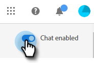

# Présentation des dialogues {#dialogue-overview}

Les dialogues sont des conversations individuelles. Dans chaque dialogue, vous décidez où s’affiche la conversation, à qui elle sera affichée et quel sera le contenu de la conversation. Chaque dialogue comporte également sa propre page de rapports où vous pouvez surveiller l’efficacité.

## Critère d’audience {#audience-criteria}

La variable [Critères d’audience](/help/marketo/product-docs/demand-generation/dynamic-chat/automated-chat/audience-criteria.md){target="_blank"} d’un dialogue : c’est là que vous définissez où et à qui votre conversation de conversation s’affichera.

## Designer de flux {#stream-designer}

La variable [Concepteur de diffusion](/help/marketo/product-docs/demand-generation/dynamic-chat/automated-chat/stream-designer.md){target="_blank"} dans une section Dialogue, vous allez concevoir la conversation que vous souhaitez avoir avec les visiteurs de votre site web.

## Rapports   {#reports}

L’onglet Rapports vous permet d’afficher les mesures relatives à l’efficacité de votre dialogue.

<table>
 <tr>
  <td><strong>Déclenchements totaux</strong></td>
  <td>S’incrémente chaque fois qu’un visiteur se qualifie pour/s’affiche dans un dialogue.
</td>
 </tr>
 <tr>
  <td><strong>Engagement</strong></td>
  <td>S’incrémente lorsqu’un visiteur interagit avec au moins une carte dans un dialogue (par exemple, question, capture d’informations, etc.)</td>
 </tr>
 <tr>
  <td><strong>Terminé</strong></td>
  <td>Incrémente chaque fois qu’un visiteur atteint la fin d’une branche dans un dialogue.</td>
 </tr>
 <tr>
  <td><strong>Personnes acquises</strong></td>
  <td>Incrémente chaque fois qu’un visiteur fournit une adresse électronique valide dans un flux de dialogue.</td>
 </tr>
 <tr>
  <td><strong>Réunions programmées</strong></td>
  <td>S’incrémente chaque fois qu’un visiteur parvient à planifier un rendez-vous via le chatterbot.</td>
 </tr>
 <tr>
  <td><strong>Objectifs atteints</strong></td>
  <td>Incrémente chaque fois qu’un visiteur atteint un objectif dans un flux de dialogue.</td>
 </tr>
</table>

## Désactiver/activer toutes les boîtes de dialogue {#disable-enable-all-dialogues}

Vous avez la possibilité de désactiver (et de réactiver) toutes les boîtes de dialogue publiées en même temps.

1. Dans Dynamic Chat, cliquez sur le **Configuration** .

   

1. Activez/désactivez la variable **Chat activé** basculez sur pour désactiver (puis réactiver) toutes les boîtes de dialogue.

   
