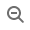
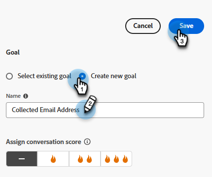

# Concepteur de flux {#stream-designer}

Il existe _de nombreuses_ combinaisons de flux possibles. Cet article contient un exemple où le spécialiste marketing demande au visiteur du site s’il a des questions sur le produit. Si oui, le visiteur peut prendre rendez-vous. Si ce n’est pas le cas, le visiteur a la possibilité de rejoindre une liste de diffusion pour sa correspondance ultérieure. Une PDF leur est également offerte. L’objectif final est de planifier un rendez-vous ou de collecter l’e-mail du visiteur.

>[!PREREQUISITES]
>
>Avant de pouvoir utiliser la carte de document, vous devez d’abord la [configurer](/help/marketo/product-docs/demand-generation/dynamic-chat/integrations/adobe-pdf-embed-api.md){target="_blank"} dans votre compte Adobe.

## Diffusion de cartes Designer {#stream-designer-cards}

Stream Designer contient plusieurs cartes que vous pouvez ajouter pour façonner la conversation en chat.

<table>
 <tr>
  <td style="width:25%"><strong>Message</strong></td>
  <td style="width:75%">À utiliser lorsque vous souhaitez effectuer une instruction sans réponse nécessaire (par exemple, « Bonjour ! Tous les articles sont 25% de réduction aujourd'hui avec le code SAVE25 »).
</td>
 </tr>
 <tr>
  <td style="width:25%"><strong>Question</strong></td>
  <td>À utiliser lorsque vous souhaitez poser une question à choix multiples, à laquelle vous fournissez les réponses disponibles (par exemple : quel type de véhicule vous intéresse ? Réponses = SUV, Compact, Truck, etc.).</td>
 </tr>
 <tr>
  <td style="width:25%"><strong>Document</strong></td>
  <td>Vous permet d’incorporer des documents PDF dans des boîtes de dialogue et de suivre l’activité d’engagement des documents des visiteurs (nombre de pages consultées, si le document a été téléchargé et/ou termes de recherche utilisés).</td>
 </tr>
 <tr>
  <td style="width:25%"><strong>Capture d’informations</strong></td>
  <td>À utiliser lorsque vous souhaitez collecter des informations (par exemple, nom, adresse e-mail, fonction, etc.). Après avoir choisi le champ auquel attribuer leur réponse, vous pouvez choisir entre laisser le visiteur saisir sa réponse ou sélectionner des options dans une liste de sélection que vous déterminez (conseil : cette dernière peut vous aider à nettoyer la base de données). Vous pouvez également choisir de remplacer les données que vous avez actuellement répertoriées par leur réponse ou d’ignorer complètement la question si vous disposez déjà d’une valeur pour elles.</td>
 </tr>
 <tr>
  <td style="width:25%"><strong>Réservation de réunion</strong></td>
  <td>Fournit au visiteur un calendrier des dates disponibles pour planifier une réunion. Choisissez la disponibilité du calendrier via la rotation à la volée, un agent spécifique ou à l’aide de règles personnalisées. Cliquez sur <b>Ajouter un attribut</b> si vous souhaitez capturer le nom ou l’adresse e-mail de l’agent et les affecter à l’enregistrement de personne du visiteur du chat pour les requêtes ultérieures (conseil : créez un <a href="/help/marketo/product-docs/administration/field-management/create-a-custom-field-in-marketo.md" target="_blank">champ personnalisé</a> pour mapper les informations de l’agent afin de ne pas remplacer un champ Marketo Engage standard).</td>
 </tr>
 <tr>
  <td style="width:25%"><strong>Objectif</strong></td>
  <td>Il s’agit de la seule carte que les visiteurs ne verront pas. Il vous appartient de déterminer à quel moment un objectif est atteint dans le chat spécifique (par exemple, si la collecte de l’e-mail du visiteur est votre objectif, placez la carte d’objectif immédiatement après la capture d’informations dans le flux).</td>
 </tr>
 <tr>
  <td style="width:25%"><strong>Action*</strong></td>
  <td>Tout comme pour les champs masqués d’un formulaire, la carte d’action vous permet de renseigner n’importe quel attribut de prospect ou d’entreprise (qui possède un <a href="/help/marketo/product-docs/administration/field-management/custom-field-type-glossary.md#string">type de données chaîne</a>) avec des valeurs implicites que vous souhaitez capturer par rapport à un enregistrement de prospect. Vous pouvez ajouter la carte d’action à tout moment de la conversation et mettre à jour les attributs respectifs avec une valeur ou des jetons natifs qui renseignent automatiquement la valeur correspondante.
  
<i>* Cette carte nécessite Dynamic Chat Prime. Pour plus d’informations, contactez l’équipe du compte Adobe (votre gestionnaire de compte).</i></td>
 </tr>
 <tr>
  <td style="width:25%"><strong>Chat en direct</strong></td>
  <td>Utilisez la carte de chat en direct lorsque vous souhaitez que les visiteurs discutent avec un agent en direct.
  <li>La carte de chat en direct doit être la dernière carte de la branche.</li>
  <li>Les visiteurs seront acheminés vers un agent dès qu'ils atteignent cette carte dans le flux. Il est donc recommandé de faire précéder cette carte d'une carte de questions demandant aux visiteurs s'ils souhaitent discuter avec un agent en direct.</li></td>
 </tr>
 <tr>
  <td style="width:25%"><strong>Réponses générées*</strong></td>
  <td>Créez un message à l’intention du visiteur lorsqu’il atteint un certain point de la conversation. Définissez un certain nombre de questions qu’ils peuvent poser en une seule fois pour atteindre l’indicateur de performance clé souhaité.
  
<i>* Cette carte nécessite Dynamic Chat Prime. Pour plus d’informations, contactez l’équipe du compte Adobe (votre gestionnaire de compte).</i></td>
 </tr>
 <tr>
  <td style="width:25%"><strong>Branche conditionnelle</strong></td>
  <td>Créez des branches dans vos flux de boîte de dialogue en fonction de différentes conditions. Présentez différents contenus à différentes personnes dans la même boîte de dialogue en fonction des attributs du prospect et de l’entreprise dans Marketo Engage.</td>
 </tr>
 <tr>
  <td style="width:25%"><strong>Flux conversationnel</strong></td>
  <td>Rationalisez plusieurs étapes d’un flux dans vos boîtes de dialogue à l’aide de la carte Flux de conversation .</td>
 </tr>
</table>

## Icônes de diffusion Designer {#stream-designer-icons}

Dans le coin supérieur droit de Stream Designer, vous pouvez voir quelques icônes. Voici ce qu&#39;ils font.

<table>
 <tr>
  <td style="width:10%"></td>
  <td>Zoom avant, création de cartes plus grandes</td>
 </tr>
 <tr>
  <td style="width:10%"></td>
  <td>Effectue un zoom arrière, créant des cartes plus petites</td>
 </tr>
 <tr>
  <td style="width:10%"></td>
  <td>Ouvre une fenêtre pour que vous puissiez tester votre chat (appuyez sur le même bouton pour fermer)</td>
 </tr>
 <tr>
  <td style="width:10%"></td>
  <td>Permet de rechercher des types de carte ou du contenu dans votre flux</td>
 </tr>
 <tr>
  <td style="width:10%"></td>
  <td>Dispose toutes les cartes de votre flux</td>
 </tr>
</table>

## Créer un flux {#create-a-stream}

Vous pouvez créer des flux pour les boîtes de dialogue ou [Conversational Forms](/help/marketo/product-docs/demand-generation/dynamic-chat/automated-chat/conversational-flow-overview.md){target="_blank"}. Dans cet exemple, nous allons en créer un pour une boîte de dialogue.

1. Après avoir [créé votre boîte de dialogue](/help/marketo/product-docs/demand-generation/dynamic-chat/automated-chat/create-a-dialogue.md){target="_blank"}, cliquez sur l’onglet **[!UICONTROL Stream Designer]**.

   

1. Effectuez un glisser-déposer de la carte _[!UICONTROL Question]_.

   

1. Sous [!UICONTROL Réponse du bot conversationnel], formulez votre question comme vous le souhaitez.

   

   >[!TIP]
   >
   >Vous pouvez personnaliser l’expérience pour les visiteurs et visiteuses de chat !
   >
   >* Cliquez sur le `</>` d’icône « insérer HTML » pour insérer votre propre HTML afin d’obtenir l’aspect souhaité de la conversation.
   >
   >* Utilisez des jetons pour les visiteurs de chat connus afin de personnaliser leur expérience (par exemple : Bonjour `{{lead.leadFirstName:""}}`). Cliquez sur l’icône de crochet `{}` et effectuez votre sélection. Ajoutez une valeur par défaut entre les guillemets si vous souhaitez que les visiteurs anonymes voient quelque chose de générique (par exemple : Bonjour `{{lead.leadFirstName:"there"}}`).

   >[!NOTE]
   >
   >Poke est défini sur activé par défaut, ce qui affiche la question d’ouverture à côté de l’icône de conversation sans que le visiteur ait à cliquer dessus pour la voir. Poke n&#39;est disponible que sur la première carte de la conversation.

1. Saisissez vos réponses utilisateur et cliquez sur **[!UICONTROL Enregistrer]**.

   

   >[!NOTE]
   >
   >**[!UICONTROL Modifier les valeurs stockées]** est une étape facultative pour ceux qui souhaitent stocker une valeur différente dans la base de données de celle qui est affichée aux visiteurs dans le chatbot pour les attributs mappés dans la carte Question (par exemple : le visiteur voit « Optimisation du moteur de recherche », vous stockez cette valeur en tant que « SEO »).

1. Pour « Oui », nous voulons réserver une réunion. Faites glisser le pointeur de la souris au-dessous de cette option sur la carte _Réservation de réunion_.

   

1. Choisissez votre option de routage et cliquez sur **[!UICONTROL Enregistrer]**.

   

1. Comme il s’agit d’un objectif, faites glisser la carte _[!UICONTROL Objectif]_ sous la réservation de la réunion.

   

1. Nommez votre objectif (ou choisissez-en un existant) et cliquez sur **[!UICONTROL Enregistrer]**. Attribuer un score de conversation est facultatif.

   

1. Pour « Non », nous voulons savoir s’ils rejoindront la liste de diffusion. Faites glisser cette option en dessous d’une autre carte [!UICONTROL Question].

   

1. Saisissez votre réponse et ajoutez des choix de réponse pour le visiteur. Cliquez sur **[!UICONTROL Enregistrer]** lorsque vous avez terminé.

   

   >[!NOTE]
   >
   >Vous pouvez ajouter d’autres réponses en cliquant sur **[!UICONTROL Ajouter une réponse]**.

1. Sous la réponse « Oui », faites glisser sur la carte _Capture d’informations_ afin de collecter l’e-mail du visiteur.

   

1. Cliquez sur la liste déroulante et sélectionnez **[!UICONTROL Adresse e-mail]**.

   

1. Saisissez un message de bot conversationnel et un espace réservé. S’il existe déjà une valeur pour cet attribut dans votre base de données, choisissez si vous souhaitez l’ignorer ou si vous souhaitez que ces données le remplacent. Cliquez sur **[!UICONTROL Enregistrer]** lorsque vous avez terminé.

   

1. Puisque la collecte de leur e-mail est un objectif, faites glisser la vignette _[!UICONTROL Objectif]_ sous Capture d’informations.

   

1. Nommez votre objectif (ou choisissez-en un existant) et cliquez sur **[!UICONTROL Enregistrer]**.

   

1. N’oubliez pas d’ajouter une réponse s’ils disent « Non ». Une option consiste à faire glisser une carte Message ci-dessous et à dire « merci quand même ». Mais dans cet exemple, nous leur fournirons un document PDF gratuit à la place.

   

1. Dans cet exemple, nous allons créer un nouveau document. Attribuez-lui un nom, saisissez l’URL du PDF que vous avez déjà hébergé, puis cliquez sur **[!UICONTROL Enregistrer]**.

   

1. Lorsque vous êtes prêt à activer votre boîte de dialogue, cliquez sur **[!UICONTROL Publier]**.

   

>[!NOTE]
>
>Avant de cliquer sur [!UICONTROL Publier], veillez à [saisir vos URL cibles)](/help/marketo/product-docs/demand-generation/dynamic-chat/automated-chat/audience-criteria.md#target){target="_blank"}.

>[!MORELIKETHIS]
>
>* [Créer une boîte de dialogue](/help/marketo/product-docs/demand-generation/dynamic-chat/automated-chat/create-a-dialogue.md){target="_blank"}
>* [Critères d’audience](/help/marketo/product-docs/demand-generation/dynamic-chat/automated-chat/audience-criteria.md){target="_blank"}
>* [API incorporée Adobe PDF](/help/marketo/product-docs/demand-generation/dynamic-chat/integrations/adobe-pdf-embed-api.md){target="_blank"}
