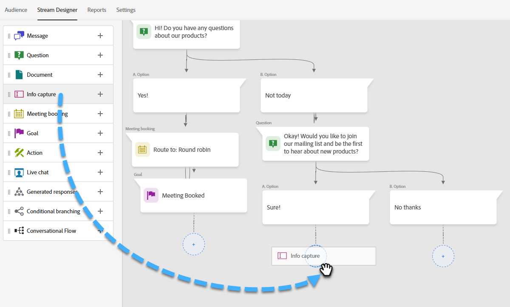

# Designer de flux {#stream-designer}

Il y a _many_ combinaisons de diffusion possibles. Cet article contient un exemple dans lequel le spécialiste du marketing demande au visiteur du site s’il lui pose des questions sur un produit. Si oui, le visiteur peut planifier un rendez-vous. Si ce n’est pas le cas, le visiteur a la possibilité de s’inscrire à une liste de distribution pour une correspondance ultérieure. On leur offre aussi un PDF gratuit. L’objectif final est de planifier un rendez-vous ou de collecter l’email du visiteur.

>[!PREREQUISITES]
>
>Avant de pouvoir utiliser la carte Document, vous devez d’abord [configurer](/help/marketo/product-docs/demand-generation/dynamic-chat/integrations/adobe-pdf-embed-api.md){target="_blank"} dans votre compte d’Adobe.

## Diffusion en continu de cartes Designer {#stream-designer-cards}

Le concepteur de flux contient plusieurs cartes que vous pouvez ajouter pour façonner la conversation de conversation.

<table>
 <tr>
  <td style="width:25%"><strong>Message</strong></td>
  <td>Utilisez cette option lorsque vous souhaitez faire une déclaration sans qu’aucune réponse ne soit nécessaire (ex : "Bonjour ! Tous les articles ont une remise de 25 % aujourd’hui avec le code SAVE25").
</td>
 </tr>
 <tr>
  <td style="width:25%"><strong>Question</strong></td>
  <td>A utiliser lorsque vous souhaitez poser une question à choix multiples, à laquelle vous fournissez les réponses disponibles (par exemple : quel type de véhicule vous intéresse ? Réponses = VUS, Compacte, Camion, etc.).</td>
 </tr>
 <tr>
  <td style="width:25%"><strong>Document</strong></td>
  <td>Permet d’incorporer des documents PDF dans les boîtes de dialogue et de suivre l’activité d’engagement des visiteurs dans les documents (nombre de pages consultées, téléchargement du document et/ou tout terme de recherche utilisé).</td>
 </tr>
 <tr>
  <td style="width:25%"><strong>Capture d’informations</strong></td>
  <td>Utilisez cette option lorsque vous souhaitez collecter des informations (par exemple, nom, adresse électronique, titre de la tâche, etc.). Après avoir choisi le champ auquel attribuer la réponse, vous pouvez choisir de laisser le visiteur saisir sa réponse ou sélectionner des options dans une liste de sélection que vous déterminez (astuce : cette dernière peut vous aider à nettoyer la base de données). Vous pouvez également choisir de remplacer les données que vous avez actuellement répertoriées pour elles par leur réponse ou, si vous avez déjà une valeur pour vous, ignorer entièrement la question.</td>
 </tr>
 <tr>
  <td style="width:25%"><strong>Réservation Réunion</strong></td>
  <td>Fournit au visiteur un calendrier des dates disponibles pour planifier une réunion. Choisissez la disponibilité du calendrier à l’aide d’un robot d’arrondi, d’un agent spécifique ou de règles personnalisées. Cliquez sur <b>Ajouter un attribut</b> si vous souhaitez capturer le nom ou l’adresse électronique de l’agent et l’affecter à l’enregistrement de personne du visiteur du chat pour une interrogation ultérieure (astuce : créez un <a href="/help/marketo/product-docs/administration/field-management/create-a-custom-field-in-marketo.md" target="_blank">champ personnalisé</a> pour mapper les informations de l’agent sur de manière à ne pas remplacer un champ de Marketo Engage standard).</td>
 </tr>
 <tr>
  <td style="width:25%"><strong>Objectif</strong></td>
  <td>Il s’agit de la seule carte que les visiteurs ne verront pas. Il vous appartient de déterminer à quel moment un objectif est atteint dans le chat spécifique (par exemple, si la collecte de l’email du visiteur est votre objectif, placez la carte Objectif immédiatement après Capture d’informations dans le flux).</td>
 </tr>
 <tr>
  <td style="width:25%"><strong>Action</strong></td>
  <td>Comme pour les champs masqués d’un formulaire, vous pouvez remplir n’importe quel attribut de piste ou de société avec la carte d’action <a href="/help/marketo/product-docs/administration/field-management/custom-field-type-glossary.md#string">type de données de chaîne</a>) avec des valeurs implicites que vous souhaitez capturer par rapport à un enregistrement de piste. Vous pouvez ajouter la carte d’action à tout moment de la conversation et mettre à jour les attributs respectifs avec une valeur ou des jetons natifs qui renseignent automatiquement la valeur correspondante.</td>
 </tr>
 <tr>
  <td style="width:25%"><strong>Chat en direct</strong></td>
  <td>Utilisez la carte de conversation en direct lorsque vous souhaitez que les visiteurs discutent avec un agent en direct.
  <li>La carte de conversation en direct doit être la dernière carte de la branche.</li>
  <li>Les visiteurs sont redirigés vers un agent dès qu’ils atteignent cette carte dans le flux. Il est donc recommandé de précéder cette carte d’une carte de questions demandant aux visiteurs s’ils souhaitent discuter avec un agent en direct.</li></td>
 </tr>
</table>

## Icônes du concepteur de diffusion en continu {#stream-designer-icons}

Dans le coin supérieur droit du concepteur de flux, vous verrez quelques icônes. Voici ce qu&#39;ils font.

<table>
 <tr>
  <td style="width:10%"></td>
  <td>Zoom avant, création de cartes plus grandes</td>
 </tr>
 <tr>
  <td style="width:10%"></td>
  <td>Zoom arrière, création de cartes plus petites</td>
 </tr>
 <tr>
  <td style="width:10%"></td>
  <td>Ouvre une fenêtre pour que vous puissiez tester votre conversation (appuyez sur le même bouton pour fermer).</td>
 </tr>
 <tr>
  <td style="width:10%"></td>
  <td>Permet de rechercher des types de carte ou du contenu dans votre flux.</td>
 </tr>
 <tr>
  <td style="width:10%"></td>
  <td>Organise toutes les cartes dans votre flux</td>
 </tr>
</table>

## Création d’un flux {#create-a-stream}

Vous pouvez créer des diffusions pour les boîtes de dialogue ou [Conversation Forms](/help/marketo/product-docs/demand-generation/dynamic-chat/automated-chat/conversational-flow-overview.md){target="_blank"}. Dans cet exemple, nous allons en créer un pour un Dialogue.

1. Après avoir [création de votre dialogue](/help/marketo/product-docs/demand-generation/dynamic-chat/automated-chat/create-a-dialogue.md){target="_blank"}, cliquez sur le **Concepteur de diffusion** .

   

1. Faites glisser et déposez la carte Question .

   

1. Sous Réponse Chatbot, entrez votre question comme vous le souhaitez.

   

   >[!TIP]
   >
   >Vous pouvez personnaliser l’expérience des visiteurs connus du chat à l’aide de jetons (par exemple : Bonjour). `{{lead.leadFirstName:""}}`). Il vous suffit de cliquer sur l’icône d’accolade à droite pour effectuer votre sélection. Ajoutez une valeur par défaut entre les guillemets si vous souhaitez que les visiteurs anonymes voient quelque chose de générique (par exemple : Hello `{{lead.leadFirstName:"there"}}`).

   >[!NOTE]
   >
   >Par défaut, le point est activé, ce qui affiche la question d’ouverture en regard de l’icône de conversation sans que le visiteur ait à cliquer dessus pour l’afficher. Poke n’est disponible que sur la première carte de la conversation.

1. Saisissez vos réponses utilisateur et cliquez sur **Enregistrer**.

   

   >[!NOTE]
   >
   >**Modifier les valeurs stockées** est une étape facultative pour ceux qui souhaitent stocker une valeur différente dans la base de données de celle affichée pour les visiteurs dans le chatbot pour les attributs mappés dans la carte Question (par exemple : le visiteur voit &quot;Optimisation du moteur de recherche&quot;, vous stockez cette valeur comme &quot;SEO&quot;).

1. Pour &quot;Oui&quot;, nous voulons planifier un rendez-vous. Par conséquent, en dessous de cette option, faites glisser sur la carte Planificateur de rendez-vous .

   

1. Dans la colonne de droite, cliquez sur **Enregistrer**.

   

1. Comme il s’agit d’un objectif, faites glisser la carte Objectif sous le Planificateur de rendez-vous.

   

1. Nommez votre objectif (ou choisissez un objectif existant) et cliquez sur **Enregistrer**.

   

1. Pour &quot;Non&quot;, nous voulons voir s’ils vont rejoindre la liste de distribution. Par conséquent, sous cette option, faites glisser sur une autre carte Question .

   

1. Saisissez votre réponse et ajoutez des choix de réponse pour le visiteur. Cliquez sur **Enregistrer** une fois terminé.

   

   >[!NOTE]
   >
   >Vous pouvez ajouter d’autres réponses en cliquant sur **Ajouter une réponse**.

1. Sous la réponse &quot;Oui&quot;, faites glisser la souris sur la carte Capture d’informations afin de collecter l’email du visiteur.

   

1. Cliquez sur le bouton **Type** et sélectionnez **Email**.

   

1. Saisissez un message de chatterbot et un espace réservé. Assurez-vous que l’attribut est mappé sur le champ approprié dans Marketo et cliquez sur **Enregistrer**.

   

   <table>
    <tr>
     <td style="width:30%"><strong>Type</strong></td>
     <td>Type d’informations que vous souhaitez capturer : téléphone, texte, courrier électronique.</td>
    </tr>
    <tr>
     <td style="width:30%"><strong>Message du chatbot</strong></td>
     <td>Le message que le visiteur voit l’invite à fournir les informations.</td>
    </tr>
    <tr>
     <td style="width:30%"><strong>Espace réservé</strong></td>
     <td>Exemple de texte aidant le visiteur à voir ce qu’il doit entrer.</td>
    </tr>
    <tr>
     <td style="width:30%"><strong>Mapper la réponse à l’attribut</strong></td>
     <td>Permet de synchroniser la réponse du visiteur avec le champ correspondant dans son enregistrement Personne de votre abonnement Marketo.</td>
    </tr>
   </table>

1. Puisque la collecte de leur email est un objectif, faites glisser la carte Objectif sous Capture d’informations.

   

1. Nommez votre objectif (ou choisissez un objectif existant) et cliquez sur **Enregistrer**.

   

1. N’oubliez pas d’ajouter une réponse s’ils disent &quot;Non&quot;. Une option consiste à faire glisser une carte Message ci-dessous et à dire &quot;merci quand même&quot;. Mais dans cet exemple, nous allons plutôt leur fournir un document de PDF gratuit.

   

1. Dans cet exemple, nous allons créer un nouveau document. Attribuez-lui un nom, saisissez l’URL du PDF que vous avez déjà hébergé, puis cliquez sur **Enregistrer**.

   

1. Sélectionnez la variable **Aperçu** bascule pour afficher l’aperçu de votre dialogue.

   

1. Lorsque vous êtes prêt à activer votre dialogue, cliquez sur **Publier**.

   

>[!NOTE]
>
>Avant de cliquer sur Publier, n’oubliez pas de vous assurer que vous avez [ont saisi votre ou vos URL cibles.](/help/marketo/product-docs/demand-generation/dynamic-chat/automated-chat/audience-criteria.md#target){target="_blank"}.

>[!MORELIKETHIS]
>
>* [Créer un dialogue](/help/marketo/product-docs/demand-generation/dynamic-chat/automated-chat/create-a-dialogue.md){target="_blank"}
>* [Critères d’audience](/help/marketo/product-docs/demand-generation/dynamic-chat/automated-chat/audience-criteria.md){target="_blank"}
>* [API intégrée Adobe PDF](/help/marketo/product-docs/demand-generation/dynamic-chat/integrations/adobe-pdf-embed-api.md){target="_blank"}
