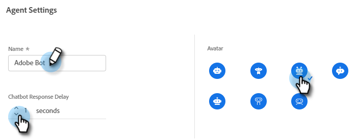

# Configuration {#configuration}

Découvrez comment personnaliser l’aspect de votre fenêtre de dialogue de chatbot.

Pour commencer, cliquez sur **Configuration**.

Il existe plusieurs options de personnalisation différentes.

## Onglet Style {#style-tab}

**Style**

C&#39;est là que vous définissez l&#39;aspect du chatbot dans lequel vos Dialogues seront affichés, notamment : couleurs, polices, emplacement du widget de robot et nom/avatar du chatbot.

La couleur de chaque catégorie est déterminée par une [valeur de couleur hexadécimale](https://color.adobe.com/create/color-wheel) (par exemple, blanc = #ffffff, rouge = #bf1932, etc.).

L’ancre permet aux visiteurs de votre site d’ouvrir/de fermer le cadre de discussion. Vous pouvez choisir si vous souhaitez que cette icône s’affiche en bas à droite ou en bas à gauche. Vous pouvez également augmenter ou diminuer le remplissage (l’espace entre l’icône et le bas de la page web).

**Paramètres de l’agent**

Dans Paramètres de l’agent, vous pouvez ajouter un libellé à votre zone de discussion (par exemple : &quot;Adobe Bot&quot;) qui s’affiche en haut de l’écran. Vous pouvez également déterminer le délai de réponse (en secondes) et modifier votre avatar de conversation. Pour charger votre propre image d’avatar, cliquez sur le bouton **+** bouton .

Une fois les modifications effectuées, pensez à cliquer sur **Enregistrer**.

## Onglet Confidentialité {#privacy-tab}

Cliquez sur le bouton **Confidentialité** pour ajouter/modifier l’URL de la politique de confidentialité de votre site (facultatif).

## Onglet Installation {#installation-tab}

Pour que le chatterbot s’affiche sur votre site web, vous devez d’abord installer le fragment de code JavaScript de conversation dynamique. Cliquez sur cet onglet pour rechercher/copier le code nécessaire. Si vous ne connaissez pas cette opération, contactez votre équipe web ou votre service informatique pour obtenir de l’aide.

>[!TIP]
>
>Si votre site utilise une stratégie de sécurité du contenu, vous devrez peut-être placer sur la liste autorisée les URL suivantes pour que le chatterbot fonctionne comme prévu :
>
>* `*.adoberesources.net`
>* `*.adobe.io`
>* `*.typekit.net`

>[!NOTE]
>
>La prise en charge de Marketo n’est pas configurée pour faciliter le HTML de dépannage. Pour obtenir de l’aide sur les HTMLS, consultez un développeur web.
