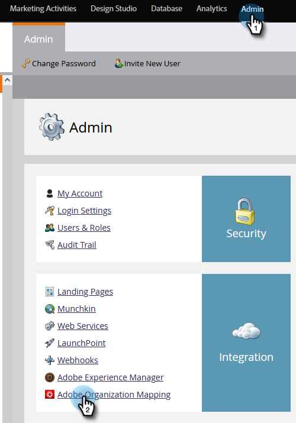
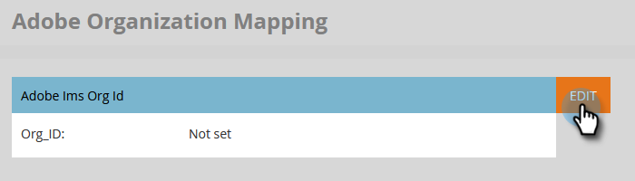

# Connexion de la messagerie dynamique à Marketo {#connect-dynamic-chat-to-marketo}

Une fois que vous avez terminé la [configuration initiale](/help/marketo/product-docs/demand-generation/dynamic-chat/initial-setup.md), il est temps d’effectuer une synchronisation unique en connectant Dynamic Chat à votre abonnement Marketo.

1. Dans Mon Marketo, cliquez sur le bouton **Chat dynamique** mosaïque.

   

   >[!NOTE]
   >
   >Si la mosaïque ne s’affiche pas, contactez votre administrateur Marketo.

1. Si vous avez déjà accédé à une application avec une Adobe ID, vous accédez directement à Dynamic Chat. Si ce n’est pas le cas, [Configuration de votre Adobe ID](https://helpx.adobe.com/manage-account/using/create-update-adobe-id.html).

1. Pour connecter votre instance Marketo, sélectionnez **Intégrations**.

   

1. Sur la carte Marketo, cliquez sur **Lancer la synchronisation**.

   

1. Sélectionnez jusqu’à 50 champs standard ou personnalisés de votre instance Marketo à synchroniser avec Dynamic Chat pour une utilisation dans le ciblage d’audience, le mappage de données et la personnalisation. Cliquez sur **Suivant** une fois terminé.

   

   >[!CAUTION]
   >
   >À l’heure actuelle, sélections d’attributs **cannot** être modifié après la synchronisation initiale. Une fois la synchronisation terminée, vous pouvez revenir en arrière et en ajouter davantage (si vous avez choisi moins de 50).

1. Vérifiez vos sélections (rappel : vous ne pouvez pas supprimer les attributs post-synchronisation. cliquez sur **Modifier les sélections** si vous devez en modifier une au cours de cette étape). Cliquez sur **Confirmer** lorsque vous avez terminé pour lancer la synchronisation.

   

>[!NOTE]
>
>Selon la taille de votre base de données, la synchronisation peut prendre entre 2 et 24 heures.

## Lier votre organisation d’Adobe et Marketo {#link-your-adobe-org-and-marketo}

Ensuite, il est temps de lier Adobe et Marketo.

>[!IMPORTANT]
>
>L’adresse électronique de l’utilisateur Marketo Engage qui crée ce mappage doit également avoir accès à l’organisation de l’Adobe en cours de connexion.

1. Connectez-vous à [experience.adobe.com](https://experience.adobe.com).

1. Cliquez sur l’écran n’importe où dans Experience Cloud et appuyez sur ctrl+i. Dans le **Organisation affectée** , mettez en surbrillance et copiez l’ID d’organisation (_moins_ le &quot;@AdobeOrg&quot;). Press **Fermer** une fois terminé.

   

1. Dans Marketo, accédez au **Administration** et sélectionnez **Mappage de l’organisation Adobe**.

   

1. Cliquez sur **Modifier**.

   

1. Collez l’ID d’organisation que vous avez copié à l’étape 2, puis cliquez sur **OK**.

   

>[!MORELIKETHIS]
>
>[Configuration initiale](/help/marketo/product-docs/demand-generation/dynamic-chat/initial-setup.md)
