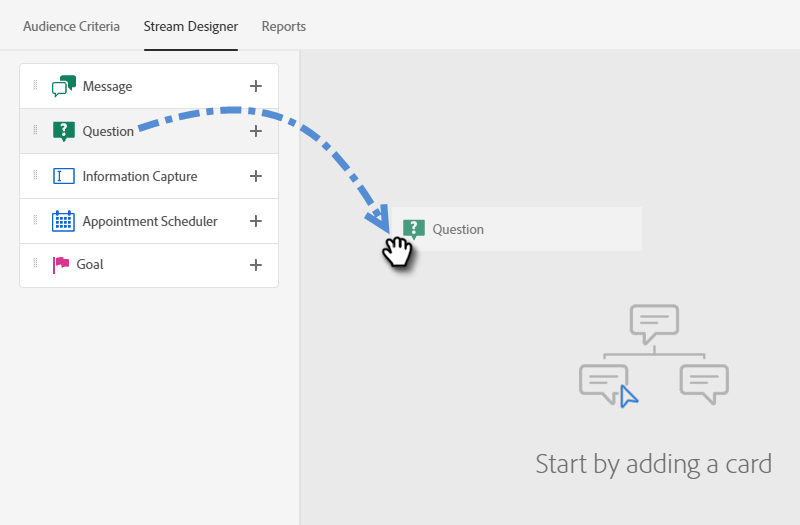

# Création d’un flux {#create-a-stream}

Il y a _many_ combinaisons de flux que vous pouvez créer. Cet article contient un exemple dans lequel le spécialiste du marketing demande au visiteur du site s’il lui pose des questions sur un produit. Si oui, le visiteur peut planifier un rendez-vous. Si ce n’est pas le cas, le visiteur a la possibilité de s’inscrire à une liste de distribution pour une correspondance ultérieure. L’objectif est de planifier un rendez-vous ou de collecter l’adresse électronique du visiteur.

1. Après vous [créer votre boîte de dialogue](/help/marketo/product-docs/demand-generation/dynamic-chat/dialogues.md#create-a-new-dialogue), cliquez sur le bouton **Concepteur de diffusion** .

   

1. Faites glisser et déposez la carte Question .

   

1. Sous Réponse Chatbot, entrez votre question comme vous le souhaitez.

   

   >[!NOTE]
   >
   >Par défaut, le point est activé, ce qui affiche la question d’ouverture en regard de l’icône de conversation sans que le visiteur ait à cliquer dessus pour l’afficher.

1. Saisissez vos réponses utilisateur et cliquez sur **Enregistrer**.

   

1. Pour &quot;Oui&quot;, nous voulons planifier un rendez-vous. Par conséquent, en dessous de cette option, faites glisser sur la carte Planificateur de rendez-vous .

   

1. Dans la colonne de droite, cliquez sur **Enregistrer**.

   

1. Comme il s’agit d’un objectif, faites glisser la carte Objectif sous le Planificateur de rendez-vous.

   

1. Nommez votre objectif (ou choisissez un objectif existant) et cliquez sur **Enregistrer**.

   

1. Pour &quot;Non&quot;, nous voulons voir s’ils vont rejoindre la liste de distribution. Par conséquent, sous cette option, faites glisser sur une autre carte Question .

   

1. Saisissez votre réponse et ajoutez des choix de réponse pour le visiteur. Cliquez sur **Enregistrer** une fois terminé.

   

   >[!NOTE]
   >
   >Vous pouvez ajouter d’autres réponses en cliquant sur **Ajouter une réponse**.

1. Sous la réponse &quot;Oui&quot;, faites glisser la souris sur la carte Capture d’informations afin de collecter l’email du visiteur.

   

1. Cliquez sur le bouton **Type** et sélectionnez **Email**.

   

1. Saisissez un message de chatterbot et un espace réservé. Assurez-vous que l’attribut est mappé sur le champ approprié dans Marketo et cliquez sur **Enregistrer**.

   

   <table>
    <tr>
     <td><strong>Type</strong></td>
     <td>Le type d’informations que vous souhaitez capturer : Téléphone, Texte, Email.</td>
    </tr>
    <tr>
     <td><strong>Message de chatbot</strong></td>
     <td>Le message que le visiteur voit l’invite à fournir les informations.</td>
    </tr>
    <tr>
     <td><strong>Paramètre fictif</strong></td>
     <td>Exemple de texte aidant le visiteur à voir ce qu’il doit entrer.</td>
    </tr>
    <tr>
     <td><strong>Associer la réponse à l’attribut</strong></td>
     <td>Permet de synchroniser la réponse du visiteur avec le champ correspondant dans son enregistrement Personne de votre abonnement Marketo.</td>
    </tr>
   </table>

1. Puisque la collecte de leur email est un objectif, faites glisser la carte Objectif sous Capture d’informations.

   

1. Nommez votre objectif (ou choisissez un objectif existant) et cliquez sur **Enregistrer**.

   

1. N’oubliez pas d’ajouter une réponse s’ils disent &quot;Non&quot;. Faites glisser une carte Message sous cette option.

   

1. Saisissez votre message et cliquez sur **Enregistrer**.

   

1. Sélectionnez la **Aperçu** bascule pour afficher l’aperçu de votre dialogue.

   

1. Lorsque vous êtes prêt à activer votre dialogue, cliquez sur **Publier**.

   

>[!NOTE]
>
>Avant de cliquer sur Publier, n’oubliez pas de vous assurer que vous avez [ont saisi votre ou vos URL cibles.](/help/marketo/product-docs/demand-generation/dynamic-chat/dialogues.md#target).

>[!MORELIKETHIS]
>
>[Dialogues](/help/marketo/product-docs/demand-generation/dynamic-chat/dialogues.md)
