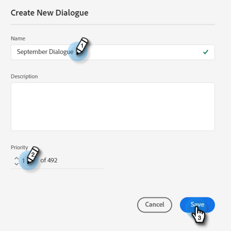
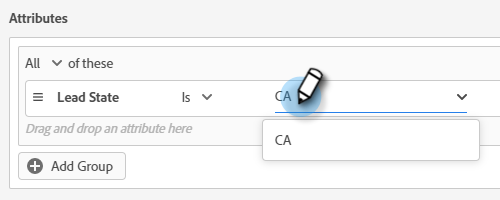

# Dialogues {#dialogues}

Les dialogues sont des conversations individuelles. Découvrez comment les personnaliser visuellement, déterminer les pages sur lesquelles elles apparaissent et déterminer ce qui est dit et qui les voit.

## Créer un dialogue {#create-a-new-dialogue}

1. Cliquez sur **Dialogues**.

   

1. Cliquez sur le bouton **Créer** .

   

1. Saisissez un nom (la description est facultative), définissez le niveau de priorité, puis cliquez sur **Enregistrer**.

   

>[!NOTE]
>
>La priorité détermine le dialogue qui sera présenté à un visiteur lorsqu’il remplit les conditions requises pour plusieurs dialogues simultanément.

## Critères d’audience {#audience-criteria}

Tout comme les listes dynamiques Marketo, les attributs Critères d’audience vous permettent de définir votre audience cible. Vous pouvez cibler des pistes connues ou inconnues à l’aide d’attributs déduits, de pistes ou de sociétés (ou d’une combinaison de ces attributs).

**Leads connus**

Il existe _de nombreuses combinaisons d’attributs_ parmi lesquelles choisir. Dans cet exemple, nous ciblons toutes les **pistes connues** en Californie qui travaillent dans une entreprise de plus de 50 employés.

1. Saisissez l’attribut **Etat de piste** et faites-le glisser vers la droite.

   

1. __ Isis défini par défaut. Dans le champ Sélectionner des valeurs , saisissez CA (vous pouvez également cliquer sur la liste déroulante et sélectionner dans la liste).

   

1. Saisissez l’attribut **Taille de la société** et faites-le glisser jusqu’à l’emplacement où il est indiqué _faites glisser un attribut ici_.

   

   >[!NOTE]
   >
   >Vous pouvez également choisir un attribut en cliquant sur son icône **+**.

1. Cliquez sur la liste déroulante des opérateurs et sélectionnez **Supérieur à**.

   

1. Saisissez 50, puis cliquez ailleurs à l’écran pour enregistrer.

   

**Leads anonymes**

Il existe un moyen simple de cibler spécifiquement les pistes qui ne se trouvent pas encore dans votre base de données. Dans cet exemple, nous ciblons toutes les **pistes anonymes** situées dans la région de New York.

1. Saisissez l’attribut **Email de piste** et faites-le glisser vers la droite.

   

1. Cliquez sur la liste déroulante des opérateurs et sélectionnez **Est vide**.

   

1. Saisissez l’attribut **État déduit** et faites-le glisser jusqu’à l’emplacement où il est indiqué _faites glisser un attribut ici_.

   

   >[!NOTE]
   >
   >Lorsqu’un visiteur se rend sur votre site Web, [Munchkin](/help/marketo/product-docs/administration/additional-integrations/add-munchkin-tracking-code-to-your-website.md) le coche et le place dans le système. Nous recherchons leur adresse IP dans une base de données spéciale et en déduisons toutes sortes de bonnes informations.

1. __ Isis défini par défaut. Dans le champ Sélectionner les valeurs , saisissez NY (vous pouvez également cliquer sur la liste déroulante et effectuer une sélection dans la liste).

   

## Ajout de groupes {#add-groups}

Vous avez également la possibilité de regrouper des attributs, au cas où vous souhaitez tous avoir certains attributs avec &quot;tous ou n’importe lequel&quot; d’un autre. Vous pouvez ajouter plusieurs groupes.

## Cible {#target}

C’est là que vous saisissez la ou les URL sur lesquelles vous souhaitez qu’un dialogue spécifique s’affiche.

Formats acceptables :

* `http://website.com`
* `https://*.website.com`
* `http://website.com/folder/*`
* `https://*.website.com/folder/*`

>[!NOTE]
>
>L’utilisation d’un astérisque agit comme un caractère générique fourre-tout. `https://*.website.com` placerait donc la boîte de dialogue sur chaque page du site, y compris les sous-domaines (par exemple : `support.website.com`). Et `https://website.com/folder/*` placerait la boîte de dialogue sur chaque page de HTML dans le dossier suivant (par exemple : dans ce cas, disons que le dossier est &quot;sports&quot;, donc : website.com/sports/baseball.html, website.com/sports/football.html, etc.).

## Concepteur de diffusion {#stream-designer}

Le concepteur de flux contient différentes cartes que vous pouvez ajouter pour façonner la conversation de conversation.

<table>
 <tr>
  <td><strong>Message</strong></td>
  <td>Utilisez cette option lorsque vous souhaitez faire une déclaration sans réponse nécessaire (par exemple : "Salut ! Tous les articles ont une remise de 25 % aujourd’hui avec le code SAVE25").
</td>
 </tr>
 <tr>
  <td><strong>Question</strong></td>
  <td>Utilisez cette option lorsque vous souhaitez poser une question à choix multiples, à laquelle vous fournissez les réponses disponibles (par exemple : Quel type de véhicule vous intéresse ? Réponses = VUS, Compacte, Camion, etc.).</td>
 </tr>
 <tr>
  <td><strong>Capture d’informations</strong></td>
  <td>Utilisez lorsque vous souhaitez collecter des informations. Les trois champs à choisir sont Adresse électronique, Numéro de téléphone et Texte (ce qui permet au visiteur d’écrire son propre message).</td>
 </tr>
 <tr>
  <td><strong>Planificateur de rendez-vous</strong></td>
  <td>Fournit au visiteur un calendrier des dates disponibles pour planifier un suivi. La disponibilité du calendrier reflète [l’agent suivant en ligne](/help/marketo/product-docs/demand-generation/dynamic-chat/dynamic-chat-overview.md#routing).</td>
 </tr>
 <tr>
  <td><strong>Objectif</strong></td>
  <td>Il s’agit de la seule carte que les visiteurs ne verront pas. Il vous appartient de déterminer à quel moment un objectif est atteint dans le chat spécifique (par exemple : Si la collecte de l’e-mail du visiteur est votre objectif, placez la carte Objectif après Capture d’informations dans le flux).</td>
 </tr>
</table>

**Création d’un flux**

Il existe _de nombreuses_ combinaisons de flux à créer. Examinons un exemple [de cet article](/help/marketo/product-docs/demand-generation/dynamic-chat/create-a-stream.md).

## Rapports {#reports}

Dans l&#39;onglet Rapports , affichez les données des 90 derniers jours. Chaque catégorie est définie ci-dessous.

<table>
 <tr>
  <td><strong>Total déclenché</strong></td>
  <td>S’incrémente chaque fois qu’un visiteur est admissible pour/s’affiche dans un dialogue.
</td>
 </tr>
 <tr>
  <td><strong>Engagé</strong></td>
  <td>S’incrémente chaque fois qu’un visiteur clique sur l’ancre de chatbot pour ouvrir le dialogue.</td>
 </tr>
 <tr>
  <td><strong>Terminé</strong></td>
  <td>Incrémente chaque fois qu’un visiteur atteint la fin d’une branche dans un dialogue.</td>
 </tr>
 <tr>
  <td><strong>Pistes capturées</strong></td>
  <td>Incrémente chaque fois qu’un visiteur fournit une adresse électronique valide dans un flux de dialogue.</td>
 </tr>
 <tr>
  <td><strong>Réunions préparées</strong></td>
  <td>S’incrémente chaque fois qu’un visiteur parvient à planifier un rendez-vous via le chatterbot.</td>
 </tr>
 <tr>
  <td><strong>Objectifs atteints</strong></td>
  <td>Incrémente chaque fois qu’un visiteur atteint un objectif dans un flux de dialogue.</td>
 </tr>
</table>
