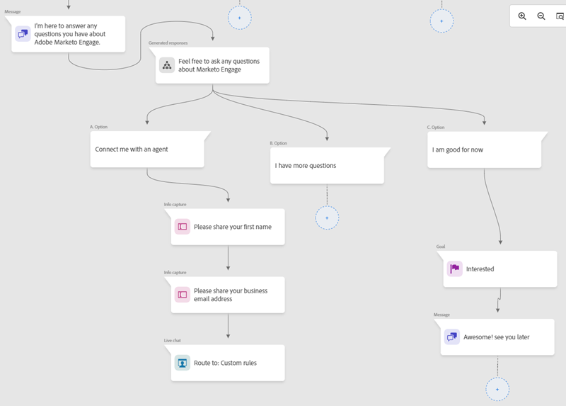

# Présentation de l’IA générique {#generative-ai-overview}

L’intelligence artificielle générée dans Adobe Dynamic Chat permet d’accélérer la création de campagnes pour le marketing, d’améliorer les réponses des agents de vente en direct et de répondre à pratiquement toutes les questions à l’aide d’un référentiel de contenu auto-géré.

## Génération de questions {#question-generation}

[Élever les expériences entrantes](/help/marketo/product-docs/demand-generation/dynamic-chat/generative-ai/question-generation.md) avec des conversations assistées par l’IA pour les visiteurs qui utilisent une interface formée à la vente, au marketing et aux connaissances produit.

## Bibliothèque de réponses {#response-library}

[Génération d’une collection personnalisée](/help/marketo/product-docs/demand-generation/dynamic-chat/generative-ai/response-library.md) de questions et réponses, toutes prévalidées par vous, à utiliser dans les campagnes de discussion Generative AI.

## Journal d’activités {#activity-log}

[Afficher la liste de toutes les tâches](/help/marketo/product-docs/demand-generation/dynamic-chat/generative-ai/activity-log.md) et les détails qui les accompagnent, notamment le nom, le propriétaire, le type, et la personne qui les a modifiés et quand.

## Questions sans réponse {#unanswered-questions}

[Créer des réponses prévalidées supplémentaires](/help/marketo/product-docs/demand-generation/dynamic-chat/generative-ai/unanswered-questions.md) pour votre bibliothèque de réponses à l’aide de l’IA basée sur un référentiel de questions sans réponse issues de conversations précédentes.

