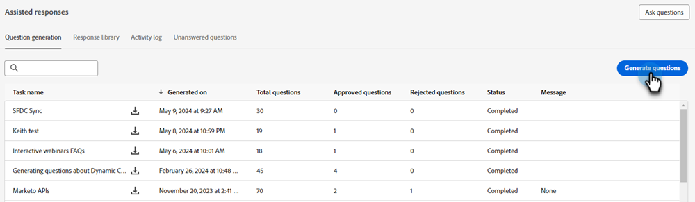

# Génération de questions {#question-generation}

Affichez toutes vos tâches et leurs détails pertinents, tels que le moment où elles ont été générées, le nombre total de questions, l’état d’approbation, etc.

## Générer des questions {#generate-questions}

1. Sous Generative AI, cliquez sur **[!UICONTROL Réponses assistées]**.

   

1. Cliquez sur **[!UICONTROL Générer des questions]**.

   

1. Donnez un nom à votre tâche et saisissez une URL source (jusqu’à 10) à partir de laquelle tout le contenu sera extrait. Saisissez les rubriques/mots-clés de votre choix, puis appuyez sur la touche Entrée de votre clavier. Lorsque vous avez terminé, cliquez sur **[!UICONTROL Générer]**.

   

   >[!IMPORTANT]
   >
   >Pour vous assurer que Marketo Engage peut extraire du contenu des URL fournies, vous devez d’abord placer sur la liste autorisée plusieurs adresses IP. [Voir ci-dessous pour plus de détails](#ip-addresses-to-allowlist).

1. En fonction de votre contenu, la génération de questions et de réponses peut prendre jusqu’à 30 minutes. Cliquez sur **[!UICONTROL OK]**.

   

   >[!TIP]
   >
   >Actualisez l’accès pour afficher le dernier état de la génération de questions.

   

## Téléchargement des questions et réponses {#download-questions-and-responses}

>[!NOTE]
>
>Les questions et réponses générées sont également visibles dans la variable [Bibliothèque de réponses](/help/marketo/product-docs/demand-generation/dynamic-chat/generative-ai/response-library.md).

1. Recherchez la tâche souhaitée et cliquez sur l’icône de téléchargement en regard de son nom.

   

1. Recherchez le dossier de téléchargements dans votre navigateur et sélectionnez le fichier. Cela peut avoir un aspect différent selon le navigateur que vous utilisez.

   

1. Dans le fichier Excel, **[!DNL Task details]** vous indique précisément cela, divers détails sur la tâche, y compris des instructions sur la façon d’ajouter/de modifier des questions et/ou des réponses.

   

   >[!NOTE]
   >
   >Si vous décidez d’ajouter/de modifier en masse des questions et/ou des réponses, [découvrez comment les recharger ici](/help/marketo/product-docs/demand-generation/dynamic-chat/generative-ai/response-library.md).

1. La variable **[!DNL Q&Rs]** fournit des détails supplémentaires, y compris les questions et réponses générées.

   

## Adresses IP à Liste autorisée {#ip-addresses-to-allowlist}

Afin de permettre l’extraction de contenu de vos URL web lors de la génération des questions et réponses, localisez votre région ci-dessous et assurez-vous que toutes les adresses IP qui y sont associées sont placées sur la liste autorisée par votre équipe web.

<table width="450">
<thead>
  <tr>
    <th>Amérique du Nord</th>
    <th>Europe</th>
    <th>APAC</th>
  </tr>
</thead>
<tbody>
  <tr>
    <td>20.10.235.188</td>
    <td>20.76.246.248</td>
    <td>20.167.0.195</td>
  </tr>
  <tr>
    <td>20.10.235.189</td>
    <td>20.76.247.92</td>
    <td>20.248.128.31</td>
  </tr>
  <tr>
    <td>20.10.235.246</td>
    <td>20.76.247.134</td>
    <td>20.167.1.48</td>
  </tr>
  <tr>
    <td>20.10.235.248</td>
    <td>20.76.247.244</td>
    <td>20.167.1.63</td>
  </tr>
  <tr>
    <td>20.10.235.255</td>
    <td>20.93.168.10</td>
    <td>20.167.1.92</td>
  </tr>
  <tr>
    <td>20.10.236.96</td>
    <td>20.93.168.44</td>
    <td>20.167.1.155</td>
  </tr>
  <tr>
    <td>20.119.144.14</td>
    <td>20.105.224.16</td>
    <td>20.211.64.11</td>
  </tr>
</tbody>
</table>
