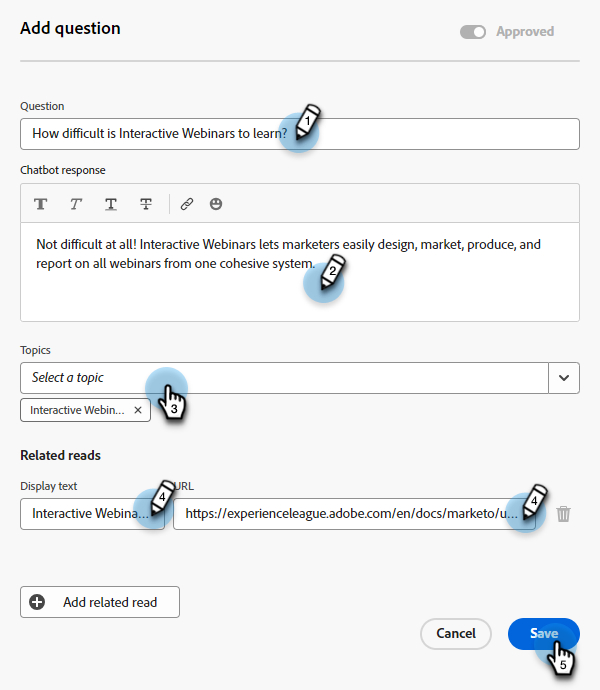
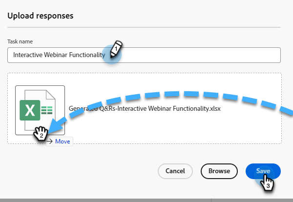

# Bibliothèque de réponses {#response-library}

Au même endroit, affichez toutes vos questions, leur statut d’approbation et le ou les noms/rubriques de tâche qui leur sont affectés.

## Ajouter manuellement une question {#manually-add-a-question}

1. Sous IA générative, cliquez sur **[!UICONTROL Réponses assistées]**.

   

1. Cliquez sur l’onglet **[!UICONTROL Bibliothèque de réponses]**.

   

1. Cliquez sur **[!UICONTROL Ajouter une question]**.

   

1. Saisissez votre question et votre réponse. Attribuez une rubrique et ajoutez une URL facultative que les utilisateurs peuvent partager avec les visiteurs. Cliquez sur **[!UICONTROL Enregistrer]** lorsque vous avez terminé.

   

1. Cliquez sur Actualiser et votre nouvelle question s’affiche en haut de l’écran avec l’état « [!UICONTROL Traitement] ».

   

1. Au bout de quelques minutes, actualisez à nouveau et le statut passe à « Approuvé ».

   

## Modifier une question/réponse individuelle {#generate-a-new-question}

>[!NOTE]
>
>Par défaut, toutes les questions et réponses générées se voient attribuer le statut « [!UICONTROL à réviser] ». Seules les questions et réponses « [!UICONTROL  approuvées ] sont mises à la disposition des visiteurs du chat.

1. Dans la **[!UICONTROL bibliothèque de réponses]**, cliquez sur la question souhaitée.

   

1. Apportez vos modifications et cliquez sur **[!UICONTROL Enregistrer]**.

   

## Modification et chargement en masse de questions/réponses {#bulk-edit-and-upload-questions-responses}

Vous trouverez ci-dessous des instructions pour apporter des modifications en bloc au [fichier Excel téléchargé](/help/marketo/product-docs/demand-generation/dynamic-chat/generative-ai/question-generation.md#download-questions-and-responses){target="_blank"}. Elles sont également visibles dans l’onglet Détails de la tâche du fichier.

<table>
<thead>
  <tr>
    <th>Action</th>
    <th>Instructions</th>
  </tr>
</thead>
<tbody>
  <tr>
    <td>Modifier une question</td>
    <td>Saisissez la nouvelle question dans la colonne « editedQuestion » (colonne H)</td>
  </tr>
  <tr>
    <td>Modification d’une réponse</td>
    <td>Saisissez la nouvelle réponse dans la colonne « editedResponse » (colonne I)</td>
  </tr>
  <tr>
    <td>Ajouter une nouvelle question</td>
    <td>Saisissez la nouvelle question dans la colonne « editedQuestion » (colonne H) et laissez questionResponsed vide. Vous devez également saisir une rubrique appropriée dans la colonne « Rubriques » (colonne C) et une URL source dans la colonne « sourceUrl ! »</td>
  </tr>
  <tr>
    <td>Ajouter une question et une réponse</td>
    <td>Saisissez la nouvelle question dans la colonne « editedQuestion » (colonne H), la nouvelle réponse dans la colonne « editedResponse » (colonne I) et laissez questionResponseld vide. Vous devez également entrer un sujet approprié dans la colonne « sujets » (colonne C)</td>
  </tr>
</tbody>
</table>

1. Une fois les modifications apportées à votre fichier, revenez à l’onglet **[!UICONTROL Bibliothèque de réponses]** et cliquez sur **[!UICONTROL Charger des réponses]**.

   

1. Saisissez le nom de la tâche applicable. Effectuez un glisser-déposer de votre fichier ou recherchez-le sur votre appareil et sélectionnez-le. Cliquez sur **[!UICONTROL Enregistrer]** lorsque vous avez terminé.

   

1. La confirmation s’affiche et vous êtes prêt.

   

## Filtrer vos questions {#filter-your-questions}

Par défaut, les questions sont répertoriées dans l’ordre par heure/date de création, les plus récentes s’affichant en premier. Si vous recherchez une question spécifique, appliquez des filtres pour affiner votre recherche. Filtrez par rubriques, nom de tâche et/ou statut d’approbation.

