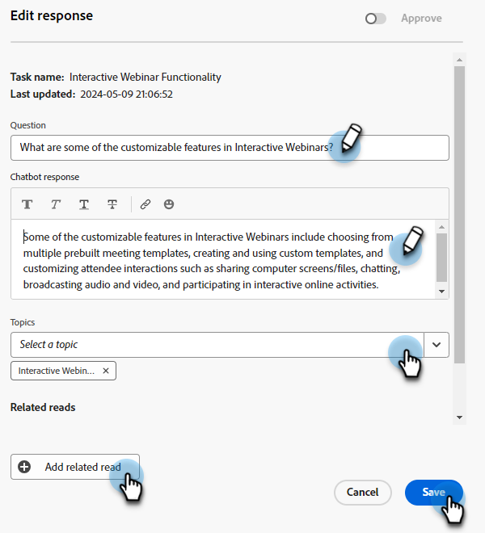

# Bibliothèque de réponses {#response-library}

Au même endroit, affichez toutes vos questions, leur état d’approbation et le ou les noms de tâches et sujets qui leur sont assignés.

## Ajouter manuellement une question {#manually-add-a-question}

1. Sous Generative AI, cliquez sur **Réponses assistées**.

   

1. Cliquez sur le bouton **Bibliothèque de réponses** .

   

1. Cliquez sur **Ajouter une question**.

   

1. Saisissez votre question et votre réponse. Attribuez une rubrique et ajoutez une URL facultative que les utilisateurs peuvent partager avec les visiteurs. Cliquez sur **Enregistrer** lorsque vous avez terminé.

   

1. Cliquez sur Actualiser et votre nouvelle question s’affiche en haut de l’écran avec le statut &quot;Traitement&quot;.

   

1. Après quelques minutes, cliquez à nouveau sur et l’état devient &quot;Approuvé&quot;.

   

## Modification d’une question/réponse individuelle {#generate-a-new-question}

>[!NOTE]
>
>Par défaut, l’état &quot;Besoin d’une révision&quot; est attribué à toutes les questions et réponses générées. Seules les questions et réponses &quot;approuvées&quot; sont mises à la disposition des visiteurs du chat.

1. Dans le **Bibliothèque de réponses**, cliquez sur la question de votre choix.

   

1. Effectuez les modifications souhaitées, puis cliquez sur **Enregistrer**.

   

## Modification et téléchargement en masse de questions/réponses {#bulk-edit-and-upload-questions-responses}

1. Texte

CAPTURE D’ÉCRAN

1. Texte

CAPTURE D’ÉCRAN

1. Texte

CAPTURE D’ÉCRAN

1. Texte

CAPTURE D’ÉCRAN

## Filtrage des questions {#filter-your-questions}

Par défaut, les questions sont répertoriées par date/heure de création, les questions les plus récentes étant affichées en premier. Si vous recherchez une question spécifique, appliquez des filtres pour affiner votre recherche. Filtrez par rubriques, nom de la tâche et/ou état d’approbation.

CAPTURE D’ÉCRAN
