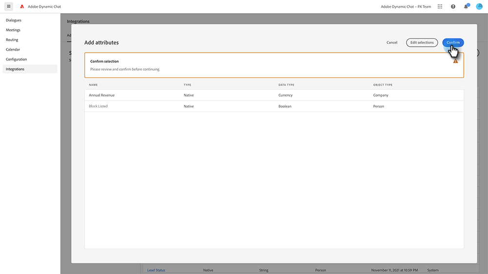
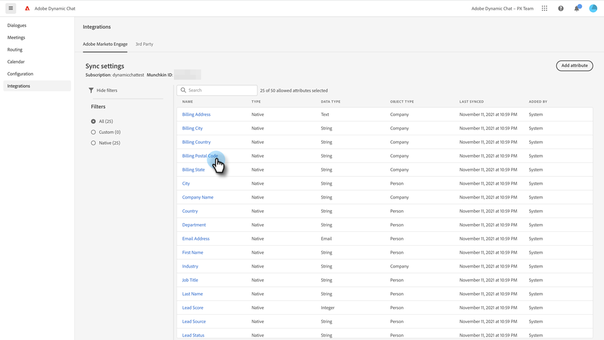

# Adobe Marketo Engage {#adobe-marketo-engage}

## Connexion à Dynamic Chat {#connecting-dynamic-chat}

Une fois la [configuration initiale](/help/marketo/product-docs/demand-generation/dynamic-chat/setup-and-configuration/initial-setup.md){target="_blank"} terminée, il est temps d’effectuer la synchronisation ponctuelle connectant Dynamic Chat à votre abonnement Adobe Marketo Engage.

>[!NOTE]
>
>Dynamic Chat prend en charge la synchronisation des champs de personne et d&#39;entreprise natifs[&#128279;](https://experienceleague.adobe.com/en/docs/marketo-developer/marketo/rest/lead-database/field-types){target="_blank"} personnalisés et Marketo.

1. Dans Mon Marketo, cliquez sur la mosaïque **[!UICONTROL Dynamic Chat]**.

   

   >[!NOTE]
   >
   >Si la mosaïque ne s’affiche pas, contactez votre administrateur Marketo.

1. Si vous avez déjà accédé à une application à l’aide d’une Adobe ID, vous accédez directement à Dynamic Chat. Dans le cas contraire, [configurez votre Adobe ID](https://helpx.adobe.com/manage-account/using/create-update-adobe-id.html){target="_blank"}.

1. Pour connecter votre instance Marketo, sélectionnez **[!UICONTROL Intégrations]**.

   

1. Sur la carte Marketo, cliquez sur **[!UICONTROL Lancer la synchronisation]**.

   

1. Sélectionnez jusqu’à 50 attributs (champs standard ou personnalisés) de votre instance Marketo à synchroniser avec Dynamic Chat pour les utiliser dans le ciblage des audiences, le mappage des données et la personnalisation. Cliquez sur **[!UICONTROL Suivant]** lorsque vous avez terminé.

   

1. Vérifiez vos sélections. Cliquez sur **[!UICONTROL Confirmer]** pour lancer la synchronisation.

   

>[!NOTE]
>
>La synchronisation peut prendre entre 2 et 24 heures, selon la taille de votre base de données.

## Ajouter un attribut {#add-an-attribute}

Après la synchronisation initiale, procédez comme suit pour ajouter des attributs supplémentaires.

1. Dans **[!UICONTROL Intégrations]**, vérifiez que l’onglet **[!UICONTROL Adobe Marketo Engage]** est sélectionné, puis cliquez sur **[!UICONTROL Ajouter un attribut]**.

   

1. Sélectionnez le ou les attributs à ajouter, puis cliquez sur **[!UICONTROL Suivant]**.

   

1. Vérifiez vos sélections et cliquez sur **[!UICONTROL Confirmer]**.

   

## Supprimer un attribut {#remove-an-attribute}

Après la synchronisation initiale, procédez comme suit pour supprimer un attribut.

>[!NOTE]
>
>L’option permettant de supprimer un attribut n’apparaît que s’il n’est actuellement utilisé par aucune boîte de dialogue.

1. Dans **[!UICONTROL Intégrations]**, vérifiez que l’onglet **[!UICONTROL Adobe Marketo Engage]** est sélectionné, puis cliquez sur l’attribut à supprimer.

   

1. Cliquez sur **[!UICONTROL Supprimer l’attribut]**.

   

>[!MORELIKETHIS]
>
>[Configuration initiale](/help/marketo/product-docs/demand-generation/dynamic-chat/setup-and-configuration/initial-setup.md){target="_blank"}
