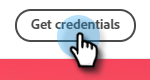

# API Adobe PDF Embed {#adobe-pdf-embed-api}

La carte de document vous permet d’incorporer des documents PDF dans des boîtes de dialogue et d’effectuer le suivi de l’activité d’engagement des documents des visiteurs. Voici comment le configurer.

1. Accédez à [l’API incorporée Adobe PDF](https://udp.adobe.io/document-services/apis/pdf-embed/){target="_blank"}.

1. Cliquez sur **[!UICONTROL Obtenir les informations d’identification]**.

   

1. Connectez-vous à votre compte Adobe.

   

1. Saisissez vos informations d’identification, acceptez les conditions, puis cliquez sur **[!UICONTROL Créer des informations d’identification]**.

   

   >[!IMPORTANT]
   >
   >Vous devrez utiliser le domaine sur lequel vous hébergerez le bot conversationnel (par exemple, si vous hébergez le bot conversationnel sur mycompany.com, veillez à le saisir à l’étape 4).

1. Cliquez sur **[!UICONTROL Copier]** pour copier votre identifiant client.

   

1. De retour dans Dynamic Chat, cliquez sur **[!UICONTROL Intégrations]**. Dans la vignette API incorporée Adobe PDF , cliquez sur **[!UICONTROL Activer]**.

   

1. Collez votre [!UICONTROL ID client] et cliquez sur **[!UICONTROL Enregistrer]**.

   

Vous pouvez désormais utiliser la carte Document dans le [Stream Designer](/help/marketo/product-docs/demand-generation/dynamic-chat/automated-chat/stream-designer.md){target="_blank"} de vos boîtes de dialogue.
