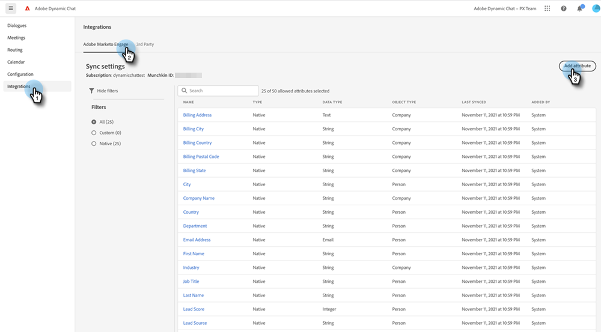

# Connexion de la messagerie dynamique à Marketo {#connect-dynamic-chat-to-marketo}

## Dynamic Chat de connexion {#connecting-dynamic-chat}

Une fois que vous avez terminé la [configuration initiale](/help/marketo/product-docs/demand-generation/dynamic-chat/initial-setup.md){target="_blank"}, il est temps d’effectuer la synchronisation unique du Dynamic Chat de connexion à votre abonnement Marketo.

1. Dans Mon Marketo, cliquez sur le bouton **Dynamic Chat** mosaïque.

   

   >[!NOTE]
   >
   >Si la mosaïque ne s’affiche pas, contactez votre administrateur Marketo.

1. Si vous avez déjà accédé à une application avec une Adobe ID, vous serez directement dirigé vers Dynamic Chat. Si ce n’est pas le cas, [Configuration de votre Adobe ID](https://helpx.adobe.com/manage-account/using/create-update-adobe-id.html){target="_blank"}.

1. Pour connecter votre instance Marketo, sélectionnez **Intégrations**.

   

1. Sur la carte Marketo, cliquez sur **Lancer la synchronisation**.

   

1. Sélectionnez jusqu’à 50 attributs (champs standard ou personnalisés) de votre instance Marketo à synchroniser avec Dynamic Chat pour une utilisation dans le ciblage d’audience, le mappage de données et la personnalisation. Cliquez sur **Suivant** une fois terminé.

   

1. Vérifiez vos sélections. Cliquez sur **Confirmer** pour lancer la synchronisation.

   

>[!NOTE]
>
>Selon la taille de votre base de données, la synchronisation peut prendre entre 2 et 24 heures.

## Ajout d’un attribut {#add-an-attribute}

Après la synchronisation initiale, voici comment ajouter des attributs supplémentaires.

1. Dans **Intégrations**, assurez-vous que la variable **Adobe Marketo Engage** sélectionné, puis cliquez sur **Ajouter un attribut**.

   

1. Sélectionnez le ou les attributs que vous souhaitez ajouter, puis cliquez sur **Suivant**.

   

1. Vérifiez vos sélections, puis cliquez sur **Confirmer**.

   

## Suppression d’un attribut {#remove-an-attribute}

Après la synchronisation initiale, voici comment supprimer un attribut.

>[!NOTE]
>
>Vous ne verrez l&#39;option de suppression d&#39;un attribut que s&#39;il n&#39;est actuellement utilisé par aucun dialogue.

1. Dans **Intégrations**, assurez-vous que la variable **Adobe Marketo Engage** est sélectionné et cliquez sur l’attribut à supprimer.

   

1. Cliquez sur **Supprimer un attribut**.

   

>[!MORELIKETHIS]
>
>[Configuration initiale](/help/marketo/product-docs/demand-generation/dynamic-chat/initial-setup.md){target="_blank"}
