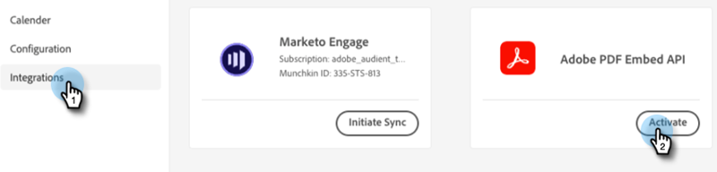

# Utilisation de la carte de document {#using-the-document-card}

La vignette Document permet d’incorporer des documents PDF dans les boîtes de dialogue et de suivre l’activité d’engagement des visiteurs dans les documents. Voici comment le mettre en place.

1. Accédez à [API Adobe PDF Incorporer](https://udp.adobe.io/document-services/apis/pdf-embed/){target="_blank"}.

1. Cliquez sur **Obtention des informations d’identification**.

   

1. Connectez-vous à votre compte Adobe.

   

1. Saisissez vos informations d’identification, acceptez les conditions, puis cliquez sur **Création d’informations d’identification**.

   

   >[!IMPORTANT]
   >
   >Vous devez utiliser le domaine sur lequel vous hébergerez le chatbot (par exemple, si vous hébergez le chatbot sur mycompany.com, veillez à le saisir à l’étape 4).

1. Cliquez sur **Copier** pour copier votre ID de client.

   

1. De retour en Dynamic Chat, cliquez sur **Intégrations**. Dans la carte de l’API intégrée Adobe PDF, cliquez sur **Activer**.

   

1. Collez votre ID client et cliquez sur **Enregistrer**.

   

Vous pouvez maintenant utiliser la carte Document dans vos boîtes de dialogue&#39; [Concepteur de diffusion](/help/marketo/product-docs/demand-generation/dynamic-chat/dialogues/stream-designer.md)!
