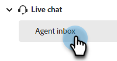
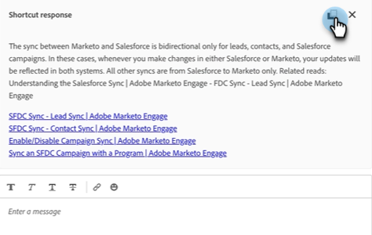

# Boîte de réception de l’agent(e) {#agent-inbox}

Les agents afficheront les discussions en direct dans la boîte de réception de l’agent. En plus des conversations actives, ils peuvent voir les conversations passées, les informations sur les visiteurs, etc.

## Basculement de disponibilité {#availability-toggle}

Dans le coin supérieur droit de l’écran Boîte de réception de l’agent , vous avez la possibilité de définir votre statut comme disponible ou indisponible.

>[!IMPORTANT]
>
>**Cette option remplace** la [disponibilité du chat en direct](/help/marketo/product-docs/demand-generation/dynamic-chat/setup-and-configuration/agent-settings.md#live-chat-availability){target="_blank"} que vous avez établie dans les paramètres de l’agent. Le statut reste inchangé jusqu’à ce que vous le reveniez ou que vous passiez à la période suivante de votre disponibilité.

>[!NOTE]
>
>La définition de votre statut sur indisponible n’affecte pas les conversations actives.

## Notifications de conversation en direct {#live-chat-notifications}

En savoir plus sur les notifications dans la [Présentation du chat en direct](/help/marketo/product-docs/demand-generation/dynamic-chat/live-chat/live-chat-overview.md#live-chat-notifications){target="_blank"}.

## Conversations {#conversations}

Sur le côté gauche de l’écran Boîte de réception de l’agent , vous pouvez choisir d’afficher uniquement les conversations actives, ou toutes les conversations.

>[!NOTE]
>
>Bien que vous puissiez voir les conversations passées (inactives) de vous-même et d’autres agents, vous ne pourrez voir que vos propres conversations actives.

## Informations sur le visiteur {#visitor-information}

Sur le côté droit de l’écran Boîte de réception de l’agent , vous pouvez voir (de haut en bas) leurs : nom, fonction, adresse e-mail, numéro de téléphone et statut CRM. Toutes les informations non transmises sont affichées sous la forme d’un tiret (-).

## Terminer une session {#end-a-session}

Les agents peuvent mettre fin manuellement à une session en cliquant simplement sur le bouton **Terminer la session** en regard des informations sur le visiteur.

## Raccourcis {#shortcuts}

>[!NOTE]
>
>Cette fonctionnalité fait partie de l’IA générative, disponible via l’abonnement Dynamic Chat Prime. Pour plus d’informations, contactez l’équipe du compte Adobe (votre gestionnaire de compte).

Les raccourcis, optimisés par la [bibliothèque de réponse](/help/marketo/product-docs/demand-generation/dynamic-chat/generative-ai/response-library.md) d’IA générative, sont un excellent moyen d’obtenir de l’aide à la volée lorsque vous discutez avec un visiteur. Saisissez simplement une barre oblique (`/`) dans la zone de texte et choisissez `ask` ou `search`.

**Demander** sert à répondre à une question.

1. Saisissez ou choisissez `/ask` dans la zone de texte. Saisissez votre question et appuyez sur Entrée sur votre clavier.

   

1. Une réponse s’affiche. Cliquez sur l’icône de copie pour la coller dans la zone de texte. Vous pouvez modifier le texte avant de l’envoyer au visiteur.

   

La recherche **Search** sert à trouver des pages associées à un texte spécifique.

1. Saisissez ou choisissez `/search` dans la zone de texte.

   

1. Saisissez ce que vous souhaitez rechercher et appuyez sur la touche Entrée de votre clavier.

   

1. Les liens applicables s’affichent. Cliquez sur l’icône de copie pour les coller dans la zone de texte. Vous pouvez apporter des modifications avant d’envoyer les informations au visiteur.

   

## Historique de l&#39;activité {#activity-history}

Sous les informations sur le visiteur se trouve l’historique des activités. Affichez les types d’activité et les dates, et même les transcriptions des conversations.

>[!NOTE]
>
>Les informations s’affichent uniquement pour les 90 derniers jours.

## Partage de calendriers {#calendar-sharing}

Au bas de la fenêtre de chat en direct se trouve une icône qui vous permet de partager le calendrier de votre ou d&#39;un autre agent avec le visiteur du chat.

1. Cliquez sur l’icône de calendrier.

   

1. Sélectionnez le calendrier de l’agent souhaité, puis cliquez sur **Envoyer**.

   

1. Le visiteur du chat pourra réserver une réunion.

   

## Résumé de conversation {#conversation-summary}

>[!NOTE]
>
>Cette fonctionnalité fait partie de l’IA générative, disponible via l’abonnement Dynamic Chat Prime. Pour plus d’informations, contactez l’équipe du compte Adobe (votre gestionnaire de compte).

Le résumé de la conversation génère un résumé rapide pour vous en temps réel, y compris les sujets qui ont intéressé le visiteur. Il est disponible dans le coin inférieur droit de chaque écran de conversation.

>[!NOTE]
>
>Un résumé de la conversation terminé se trouve également dans le journal d’activité de l’enregistrement de personne du visiteur dans votre base de données Marketo Engage.
