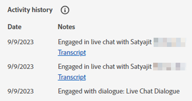

# Boîte de réception de l’agent(e) {#agent-inbox}

Les agents activeront des tchats en direct dans la boîte de réception de l’agent. Outre les conversations actives, ils peuvent voir les conversations passées, les informations sur les visiteurs, etc.

## Basculement de disponibilité {#availability-toggle}

Dans le coin supérieur droit de l’écran de la boîte de réception de l’agent, vous avez la possibilité de définir votre statut comme étant disponible ou non disponible.

>[!IMPORTANT]
>
>**Cela remplacera** la [disponibilité de la conversation en direct](/help/marketo/product-docs/demand-generation/dynamic-chat/setup-and-configuration/agent-settings.md#live-chat-availability){target="_blank"} que vous avez définie dans Paramètres de l’agent. L’état reste actif jusqu’à ce que vous le reveniez ou que vous reveniez au bloc de temps suivant dans votre disponibilité.

>[!NOTE]
>
>La définition de votre état sur non disponible n’affecte aucune discussion active.

## Notifications de tchat en direct {#live-chat-notifications}

Pour en savoir plus sur les notifications, consultez la [présentation de la messagerie instantanée](/help/marketo/product-docs/demand-generation/dynamic-chat/live-chat/live-chat-overview.md#live-chat-notifications){target="_blank"}.

## Conversations {#conversations}

Dans la partie gauche de l’écran Boîte de réception de l’agent, vous pouvez choisir d’afficher uniquement les conversations actives, ou toutes celles-ci.

>[!NOTE]
>
>Bien que vous puissiez voir les conversations passées (inactives) de vous-même et d’autres agents, vous ne pourrez voir que vos propres conversations actives.

## Informations sur le visiteur {#visitor-information}

Sur le côté droit de l’écran de boîte de réception de l’agent, vous pouvez voir (du haut vers le bas) leur : nom, titre de la tâche, adresse électronique, numéro de téléphone et état CRM. Toutes les informations qui ne sont pas transmises s’affichent sous la forme d’un tiret (-).

## Fin d’une session {#end-a-session}

Les agents peuvent mettre fin manuellement à une session en cliquant simplement sur le bouton **Terminer la session** en regard des informations sur le visiteur.

## Raccourcis {#shortcuts}

>[!NOTE]
>
>Cette fonctionnalité fait partie de l’IA générative, disponible via l’abonnement Dynamic Chat Prime. Pour plus d’informations, contactez l’équipe Compte d’Adobe (votre gestionnaire de compte).

Les raccourcis, optimisés par la [bibliothèque de réponse](/help/marketo/product-docs/demand-generation/dynamic-chat/generative-ai/response-library.md) de l’IA générative, sont un excellent moyen d’obtenir de l’aide à la volée lorsque vous discutez avec un visiteur. Il vous suffit de saisir une barre oblique (`/`) dans la zone de texte et de choisir `ask` ou `search`.

**Poser des questions** est utile pour obtenir de l’aide sur les réponses à une question.

1. Saisissez ou sélectionnez `/ask` dans la zone de texte. Saisissez votre question et appuyez sur Entrée sur votre clavier.

   

1. Une réponse apparaît. Cliquez sur l’icône de copie pour qu’elle soit collée dans la zone de texte. Vous pouvez modifier le texte avant de l’envoyer au visiteur.

   

**La recherche** sert à rechercher de l’aide sur les pages liées à du texte spécifique.

1. Saisissez ou sélectionnez `/search` dans la zone de texte.

   

1. Saisissez ce que vous souhaitez rechercher et appuyez sur Entrée sur votre clavier.

   

1. Les liens applicables s’affichent. Cliquez sur l’icône de copie pour les coller dans la zone de texte. Vous pouvez apporter des modifications avant d’envoyer les informations au visiteur.

   

## Historique de l&#39;activité {#activity-history}

L’historique des activités se trouve sous les informations sur les visiteurs. Affichez les types d’activité et les dates, et même les transcriptions de conversation.

>[!NOTE]
>
>Les informations s’affichent uniquement pour les 90 derniers jours.

## Partage de calendriers {#calendar-sharing}

Au bas de la fenêtre de conversation en direct se trouve une icône qui vous permet de partager le calendrier de votre agent ou de celui d’un autre agent avec le visiteur de la conversation.

1. Cliquez sur l’icône du calendrier.

   

1. Choisissez le calendrier de l&#39;agent désiré et cliquez sur **Envoyer**.

   

1. Le visiteur pourra réserver une réunion.

   

## Résumé de conversation {#conversation-summary}

>[!NOTE]
>
>Cette fonctionnalité fait partie de l’IA générative, disponible via l’abonnement Dynamic Chat Prime. Pour plus d’informations, contactez l’équipe Compte d’Adobe (votre gestionnaire de compte).

Le résumé de conversation génère un résumé rapide en temps réel à votre intention, y compris les sujets qui intéressent le visiteur. Il est disponible en bas à droite de chaque écran de conversation.

>[!NOTE]
>
>Vous trouverez également un résumé de conversation terminé dans le journal d’activité de l’enregistrement de personne du visiteur dans votre base de données de Marketo Engage.
