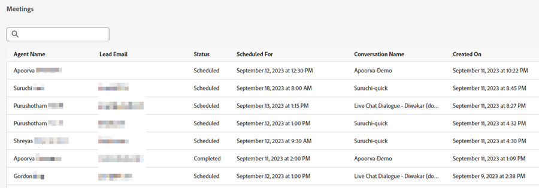

# Liste des réunions {#meeting-list}

C&#39;est là que vous verrez toutes les nominations programmées par les visiteurs de votre site web à travers vos Dialogues. Vous trouverez ici l’adresse électronique de la personne ayant réservé le rendez-vous, l’agent auprès duquel elle a réservé le rendez-vous, le moment où le rendez-vous est prévu et si l’heure de la réunion planifiée est passée ou non.

>[!NOTE]
>
>Lorsqu’une réunion est enregistrée sur le calendrier de l’agent, l’agent reçoit une notification par e-mail à propos de la réservation, y compris des informations détaillées sur l’engagement du Dynamic Chat du visiteur.

## Notifications d’action ayant échoué {#failed-action-notifications}

Lorsqu’une action telle qu’une réservation de réunion ou une conversation en direct échoue, les utilisateurs sont avertis par e-mail.

