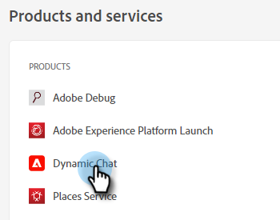
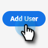

# Ajout ou suppression d’utilisateurs de conversation {#add-or-remove-chat-users}

Suivez les étapes ci-dessous pour ajouter ou supprimer des utilisateurs de chat.

## Ajout d’un utilisateur de conversation {#add-a-chat-user}

1. Connectez-vous au [Adobe Admin Console](https://adminconsole.adobe.com/){target="_blank"}.

   

1. Cliquez sur **Dynamic Chat**.

   

   >[!NOTE]
   >
   >Si vous disposez de plusieurs abonnements Marketo, sélectionnez-les avant l’étape suivante.

1. Cliquez sur le bouton **Utilisateurs** .

   

1. Cliquez sur le bouton **Ajouter un utilisateur** bouton .

   

1. Saisissez le nom, le groupe d’utilisateurs ou l’adresse électronique de l’utilisateur que vous souhaitez ajouter. Prénom et nom sont facultatifs.

   

1. Cliquez sur le bouton **+** et sélectionnez le profil de produit souhaité.

   

1. Cliquez sur **Enregistrer**.

   

## Ajout d’un accès Dynamic Chat au rôle Marketo {#add-dynamic-chat-access-to-marketo-role}

Si le rôle Marketo de l’utilisateur Chat nouvellement ajouté n’a pas déjà l’autorisation du Dynamic Chat, voici comment l’ajouter.

1. Dans Marketo, cliquez sur **Administration** et sélectionnez **Utilisateurs et rôles**.

   

1. Cliquez sur le bouton **Rôles** .

   

1. Dans la liste, sélectionnez le rôle à modifier, puis cliquez sur **Modifier le rôle**.

   

1. Sélectionner **Dynamic Chat d’accès** et cliquez sur **Enregistrer**.

   

## Suppression d’un utilisateur de conversation {#remove-a-chat-user}

1. Connectez-vous au [Adobe Admin Console](https://adminconsole.adobe.com/){target="_blank"}.

   

1. Cliquez sur **Dynamic Chat**.

   

   >[!NOTE]
   >
   >Si vous disposez de plusieurs abonnements Marketo, sélectionnez-les avant l’étape suivante.

1. Cliquez sur le bouton **Utilisateurs** .

   

1. Sélectionnez l’utilisateur que vous souhaitez supprimer.

   

1. Cliquez sur le bouton **Supprimer un utilisateur** bouton .

   

1. Cliquez sur **Supprimer un utilisateur** pour confirmer.

   

>[!MORELIKETHIS]
>
>* [Utilisateurs de Adobe Admin Console](https://helpx.adobe.com/enterprise/using/users.html){target="_blank"}
>* [Gérer les utilisateurs individuellement](https://helpx.adobe.com/enterprise/using/manage-users-individually.html){target="_blank"}
