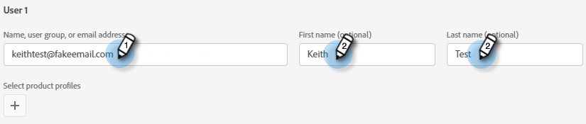
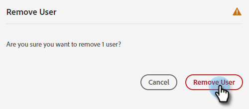

# Ajouter ou supprimer des utilisateurs et utilisatrices de conversation {#add-or-remove-chat-users}

Suivez les étapes ci-dessous pour ajouter ou supprimer des utilisateurs et utilisatrices de chat.

>[!NOTE]
>
>Par défaut, tous les administrateurs Marketo Engage disposent des droits d’administrateur dans Dynamic Chat.

## Ajouter un utilisateur ou une utilisatrice de conversation {#add-a-chat-user}

1. Connectez-vous à [Adobe Admin Console](https://adminconsole.adobe.com/){target="_blank"}.

   

1. Cliquez sur **[!UICONTROL Dynamic Chat]**.

   

   >[!NOTE]
   >
   >Si vous disposez de plusieurs abonnements Marketo, sélectionnez celui de votre choix avant l’étape suivante.

1. Cliquez sur l’onglet **[!UICONTROL Utilisateurs]**.

   

1. Cliquez sur le bouton **[!UICONTROL Ajouter un utilisateur]**.

   

1. Saisissez le [!UICONTROL nom, groupe d’utilisateurs ou adresse e-mail] de l’utilisateur que vous souhaitez ajouter. Le prénom et le nom sont facultatifs.

   

1. Cliquez sur l’icône **+** et sélectionnez le profil de produit souhaité.

   

1. Cliquez sur **[!UICONTROL Enregistrer]**

   

   >[!NOTE]
   >
   >Après l’ajout d’un utilisateur dans Adobe Admin Console, il peut s’écouler jusqu’à deux heures avant qu’il n’apparaisse dans la page de gestion de l’agent Dynamic Chat.

## Ajouter un accès Dynamic Chat au rôle Marketo {#add-dynamic-chat-access-to-marketo-role}

Si le rôle Marketo de l’utilisateur de conversation nouvellement ajouté ne dispose pas déjà de l’autorisation [!DNL Dynamic Chat], voici comment l’ajouter.

1. Dans Marketo, cliquez sur **[!UICONTROL Admin]** et sélectionnez **[!UICONTROL Utilisateurs et rôles]**.

   

1. Cliquez sur l’onglet **[!UICONTROL Rôles]**.

   

1. Dans la liste, sélectionnez le rôle à modifier, puis cliquez sur **[!UICONTROL Modifier le rôle]**.

   

1. Sélectionnez **[!UICONTROL Accéder à Dynamic Chat]** puis cliquez sur **[!UICONTROL Enregistrer]**.

   

## Supprimer un utilisateur de conversation {#remove-a-chat-user}

1. Connectez-vous à [Adobe Admin Console](https://adminconsole.adobe.com/){target="_blank"}.

   

1. Cliquez sur **[!UICONTROL Dynamic Chat]**.

   

   >[!NOTE]
   >
   >Si vous disposez de plusieurs abonnements Marketo, sélectionnez celui de votre choix avant l’étape suivante.

1. Cliquez sur l’onglet **[!UICONTROL Utilisateurs]**.

   

1. Sélectionnez l’utilisateur que vous souhaitez supprimer.

   

1. Cliquez sur le bouton **[!UICONTROL Supprimer un utilisateur]**.

   

1. Cliquez sur **[!UICONTROL Supprimer un utilisateur]** pour confirmer.

   

>[!MORELIKETHIS]
>
>* [Utilisateurs Adobe Admin Console](https://helpx.adobe.com/fr/enterprise/using/users.html){target="_blank"}
>* [Gérer les utilisateurs individuellement](https://helpx.adobe.com/fr/enterprise/using/manage-users-individually.html){target="_blank"}
