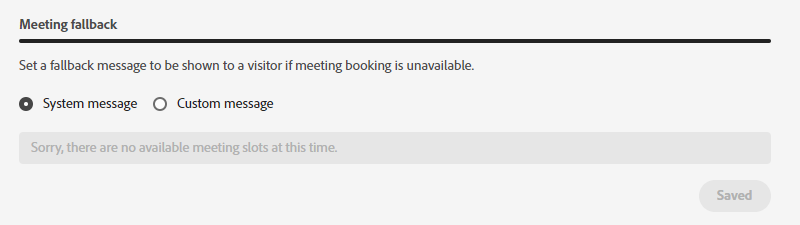

# Gestion des agents {#agent-management}

Dans Gestion des agents, affichez une liste des agents dans votre instance de Dynamic Chat, gérez les équipes et définissez vos règles de secours.

## Agents {#agents}

Cet onglet répertorie tous les agents de votre instance de Dynamic Chat et inclut des informations telles que leur nom, adresse électronique, état du chat en direct, etc.

>[!NOTE]
>
>Ne pas voir un agent que vous _just_ ajouté ? Il peut s’écouler jusqu’à deux heures avant qu’ils n’apparaissent ici après leur ajout dans la console d’administration Adobe.

## Équipes {#teams}

Les administrateurs peuvent créer des équipes d’agents pour faciliter le routage vers des groupes spécifiques d’agents de vente.

### Créer une équipe {#create-a-team}

1. Cliquez sur **+ Créer une équipe**.

   

1. Donnez un nom à votre équipe.

   

1. Cliquez sur le bouton **Ajout d’agents** et sélectionnez les agents de votre choix.

   

1. Cliquez sur **Créer**.

   

## Règles de secours {#fallback-rules}

### Secours de la réunion {#meeting-fallback}

Sélectionnez un message standard (système) ou créez un message personnalisé que les visiteurs verront lorsqu’aucune réservation de réunion n’est disponible.

### Secours de la conversation en direct {#live-chat-fallback}

Sélectionnez un message standard (système) ou créez-en un personnalisé pour que les visiteurs puissent voir quand Live Chat n’est pas disponible.

>[!NOTE]
>
>En sélectionnant le **Option de réservation d’une réunion** La case à cocher permet au visiteur de la conversation de réserver une réunion lorsqu’aucun agent n’est disponible pour la discussion en direct.

>[!TIP]
>
>Lors de la création d’un message personnalisé, vous pouvez mettre en forme la police, utiliser des liens et même insérer des émoticônes ! `:)`
