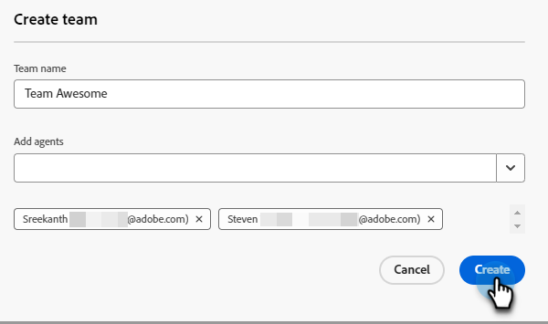

# Gestion de l’agent {#agent-management}

Dans Gestion des agents, affichez une liste d’agents dans votre instance Dynamic Chat, gérez les équipes et définissez vos règles de secours.

## Agents {#agents}

Cet onglet répertorie tous les agents de votre instance Dynamic Chat et inclut des informations telles que leur nom, leur adresse e-mail, le statut du chat en direct, etc.

{width="800" zoomable="yes"}

>[!NOTE]
>
>Vous ne voyez pas un agent que vous _venez_ d&#39;ajouter ? Cela peut prendre jusqu’à deux heures pour qu’ils apparaissent ici après les avoir ajoutés dans l’Admin Console d’Adobe.

## Équipes {#teams}

Les administrateurs peuvent créer des équipes d’agents pour faciliter le routage vers des groupes spécifiques d’agents commerciaux.

>[!AVAILABILITY]
>
>L’accès à Teams nécessite un abonnement à Dynamic Chat Prime. Pour plus d’informations, contactez l’équipe du compte Adobe (votre gestionnaire de compte).

### Création d’une équipe {#create-a-team}

1. Cliquez sur **+ Créer une équipe**.

   

1. Donnez un nom à votre équipe.

   

1. Cliquez sur le menu déroulant **Ajouter des agents** et sélectionnez les agents souhaités.

   

1. Cliquez sur **Créer**.

   

## Règles de secours {#fallback-rules}

### Réunion de secours {#meeting-fallback}

Sélectionnez un message standard (système) ou écrivez-en un personnalisé pour que les visiteurs puissent le voir lorsque la réservation de réunion n’est pas disponible.

### Secours de la discussion en direct {#live-chat-fallback}

Sélectionnez un message standard (système) ou écrivez-en un personnalisé pour que les visiteurs puissent le voir lorsque la discussion en direct n’est pas disponible.

>[!NOTE]
>
>* Si vous cochez la case _Inclure l’option de réservation de réunion_, le visiteur du chat aura la possibilité de réserver une réunion lorsqu’aucun agent n’est disponible pour le chat en direct.
>
>* **Pour toutes les règles/équipes personnalisées en tant que carte de conversation en direct** : lors de la recherche d’agents, s’ils ne sont pas disponibles ou ne peuvent pas se connecter, il faudra retourner à la table ronde pour essayer de trouver les « agents disponibles » (tous ceux qui sont disponibles à ce moment, quelle que soit la logique/règle de routage placée dans le flux).

>[!TIP]
>
>Lors de la création d’un message personnalisé, vous pouvez appliquer un style à la police, utiliser des liens et même insérer des émoticônes ! `:)`
