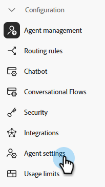
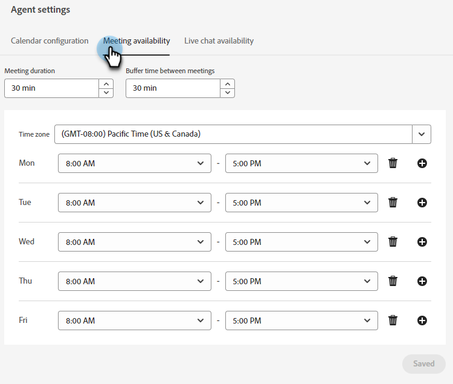

# Paramètres de l’agent {#agent-settings}

Configurez votre calendrier et définissez la disponibilité du chat en direct ou en réunion.

>[!PREREQUISITES]
>
>Assurez-vous que les agents ont reçu les [permissions](/help/marketo/product-docs/demand-generation/dynamic-chat/setup-and-configuration/permissions.md){target="_blank"}.

## Connexion au calendrier {#connect-calendar}

Dans l’onglet Configuration du calendrier , connectez votre calendrier Outlook ou Gmail pour l’utiliser dans la planification des rendez-vous dans le chatterbot.

Une fois que le calendrier d’un utilisateur est connecté à Dynamic Chat, il est ajouté à la file d’attente et son calendrier est disponible pour que les visiteurs du site web programment les rendez-vous.

>[!NOTE]
>
>Vous pouvez connecter un calendrier par utilisateur. Si vous souhaitez recevoir des réunions sur plusieurs calendriers, vous devez ajouter plusieurs utilisateurs et leur demander chacun de connecter leurs calendriers.

Les utilisateurs peuvent également personnaliser le corps de l’invitation envoyée au visiteur lorsqu’il planifie un rendez-vous dans le calendrier de l’utilisateur. Ils peuvent également cocher la case en bas pour inclure un lien Google Meet ou Microsofts Teams (selon le calendrier qui a été connecté).

>[!TIP]
>
>Utilisez l’icône de jeton (accolades) pour personnaliser les emails de confirmation de réservation de réunions à l’aide des attributs de personne ou de société.

### Autorisations {#permissions}

La configuration avec Outlook accorde les autorisations suivantes à Dynamic Chat :

* Accès complet à vos calendriers
* Connectez-vous et lisez votre profil
* Maintenir l’accès aux données auxquelles vous avez donné accès
* Lire les paramètres de la boîte aux lettres

La configuration avec Google accorde les autorisations suivantes à Dynamic Chat :

* Créer, modifier ou supprimer des calendriers
* Mise à jour d’événements de calendrier individuels
* Modifier vos paramètres, y compris qui peut voir vos événements
* Modifier avec qui le calendrier est partagé
* Accès à votre nom, adresse électronique, préférences linguistiques et photo de profil

## Disponibilité de la réservation d’une réunion {#meeting-booking-availability}

Définissez le fuseau horaire et l’heure/le jour de la semaine disponibles pour recevoir les réservations de réunions.

<table> 
 <tbody> 
  <tr> 
   <td><b>Durée de la réunion</b></td>
   <td>Détermine le temps que les visiteurs verront dans les tranches horaires de réunion disponibles.</td>
  </tr> 
  <tr> 
   <td><b>Période tampon entre les réunions</b></td>
   <td>Durée définie comme tampon après la réunion. Si vous la définissez sur 30 minutes, personne ne pourra vous réserver une réunion jusqu’à 30 minutes après la fin programmée d’une réunion sur votre calendrier.</td>
  </tr>
 </tbody> 
</table>

>[!TIP]
>
>Vous pouvez sélectionner plusieurs blocs de temps le même jour (par exemple, le vendredi de 8a à 12p). _et_ 1p-5p) en cliquant sur le bouton **+** inscrivez-vous à droite.

## Disponibilité de la messagerie instantanée {#live-chat-availability}

Définissez le fuseau horaire et l’heure/le jour de la semaine disponibles pour recevoir des conversations en direct.

Si vous êtes connecté à l’application, vous recevrez une notification in-app d’une conversation entrante. Si vous n’êtes pas connecté, vous recevrez une notification du navigateur (si vous avez [configurer](/help/marketo/product-docs/demand-generation/dynamic-chat/live-chat/agent-inbox.md#live-chat-notifications){target="_blank"}).

>[!IMPORTANT]
>
>La variable [basculement de disponibilité](/help/marketo/product-docs/demand-generation/dynamic-chat/live-chat/agent-inbox.md#availability-toggle){target="_blank"} dans la boîte de réception de l’agent **remplace** ce que vous saisissez dans l’onglet Disponibilité de la messagerie instantanée. Ainsi, si vous êtes programmé comme disponible à partir de 1p-5p mais que vous devez effectuer une pause rapide à 3p, vous n’avez pas besoin de modifier les paramètres de votre agent. Le statut de basculement de disponibilité reste tant que vous ne le modifiez pas manuellement ou jusqu’à ce que le bloc de temps suivant de votre disponibilité soit atteint.

>[!TIP]
>
>Vous pouvez sélectionner plusieurs blocs de temps le même jour (par exemple, le vendredi de 8a à 12p). _et_ 1p-5p) en cliquant sur le bouton **+** inscrivez-vous à droite.
