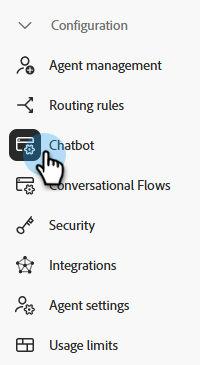

# Configuration {#configuration}

Découvrez comment personnaliser l’aspect de votre fenêtre de dialogue de chatbot.

Pour commencer, cliquez sur **Paramètres de chatbot** under **Configuration**.

Il existe plusieurs options de personnalisation différentes.

## Onglet Style {#style-tab}

### Style {#style}

C’est là que vous définissez l’aspect du chatbot dans lequel vos Dialogues s’affichent, notamment : les couleurs, les polices, le positionnement du widget de bot et le nom/avatar du chatbot.

La couleur de chaque catégorie est déterminée par une [valeur de couleur hexadécimale](https://color.adobe.com/create/color-wheel){target="_blank"} (par exemple, blanc = #ffffff, rouge = #bf1932, etc.).

L’ancre permet aux visiteurs de votre site d’ouvrir/de fermer le cadre de discussion. Vous pouvez choisir si vous souhaitez que cette icône s’affiche en bas à droite ou en bas à gauche. Vous pouvez également augmenter ou diminuer le remplissage (l’espace entre l’icône et le bas de la page web).

### Paramètres des robots {#agent-settings}

Dans Paramètres des robots, vous pouvez ajouter un libellé à votre chatbox (par exemple : &quot;Assistant d’Adobe&quot;) qui apparaîtra en haut de celui-ci. Vous pouvez également déterminer le délai de réponse (en secondes) et modifier votre avatar de conversation. Pour charger votre propre image d’avatar, cliquez sur le bouton **+** bouton .

>[!NOTE]
>
>Les avatars personnalisés doivent être des images carrées inférieures à 256 Ko et inférieures à 200 x 200 pixels. Les types de fichiers pris en charge sont les suivants : .jpg, .png, .gif, .webp, .svg.

Une fois les modifications effectuées, pensez à cliquer sur **Enregistrer**.

## Onglet Confidentialité {#privacy-tab}

Cliquez sur le bouton **Privacy** pour ajouter/modifier l’URL de la politique de confidentialité de votre site (facultatif).

## Onglet Installation {#installation-tab}

Pour que le chatterbot s’affiche sur votre site web, vous devez d’abord installer le fragment de code JavaScript du Dynamic Chat. Cliquez sur cet onglet pour rechercher/copier le code nécessaire. Si vous ne connaissez pas cette opération, contactez votre équipe web ou votre service informatique pour obtenir de l’aide.

>[!TIP]
>
>Consultez le code ci-dessous pour savoir quoi ajouter si votre site utilise la stratégie de sécurité du contenu (CSP).

>[!NOTE]
>
>La prise en charge de Marketo n’est pas configurée pour faciliter le HTML de dépannage. Pour obtenir de l’aide sur les HTMLS, consultez un développeur web.
