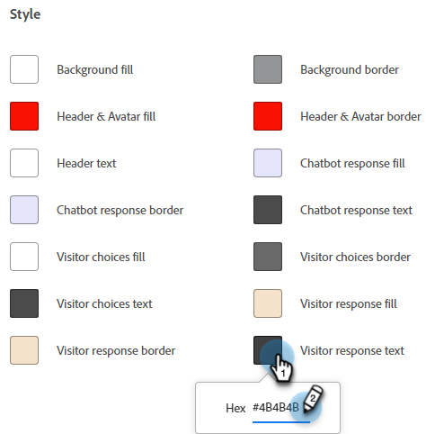
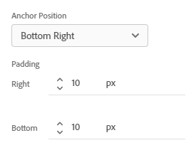

# Configuration {#configuration}

Découvrez comment personnaliser l’aspect de la fenêtre de la boîte de dialogue du bot conversationnel.

Pour commencer, cliquez sur **Chatbot** sous **Configuration**.

Il existe plusieurs options de personnalisation différentes.

## Onglet Style {#style-tab}

### Style {#style}

C’est là que vous définissez l’aspect du bot conversationnel où vos boîtes de dialogue s’afficheront, notamment : les couleurs, les polices, l’emplacement du widget de bot conversationnel et le nom/avatar du bot conversationnel.

La couleur de chaque catégorie est déterminée par une [valeur de couleur hexadécimale](https://color.adobe.com/create/color-wheel){target="_blank"} (par exemple, blanc = #ffffff, rouge = #bf1932, etc.).

L’ancre permet aux visiteurs de votre site d’ouvrir ou de fermer le chat box. Vous pouvez choisir d’afficher cette icône en bas à droite ou en bas à gauche. Vous pouvez également augmenter ou réduire la marge intérieure (quantité d’espace entre l’icône et le bas de la page web).

### Paramètres de robots {#agent-settings}

Dans Paramètres des robots, vous pouvez ajouter un libellé à votre chatbox (par exemple : « Assistant Adobe ») qui s’affichera en haut de celui-ci. Vous pouvez également déterminer le délai de réponse (en secondes) et modifier votre avatar de chat. Pour télécharger votre propre image d’avatar, cliquez sur le bouton **+**.

>[!NOTE]
>
>Les avatars personnalisés doivent être des images carrées de moins de 256 ko et inférieures à 200 x 200 px. Les types de fichiers pris en charge sont les suivants : .jpg, .png, .gif, .webp, .svg.

**Son de notification de nouveau message**

Cliquez sur la liste déroulante pour sélectionner un son pour le visiteur chaque fois que le chatbot est déclenché au cours d’une session. Vous avez le choix entre plusieurs sons.

**Activer les messages poke sur mobile**

Sélectionnez le curseur pour activer le « Poke », qui affiche la question d’ouverture à côté de l’icône de conversation sans que le visiteur ait à cliquer dessus pour la voir, pour les visiteurs qui discutent à partir d’un appareil mobile.

>[!NOTE]
>
>Poke n&#39;est disponible que sur la première [carte](/help/marketo/product-docs/demand-generation/dynamic-chat/automated-chat/stream-designer.md#stream-designer-cards){target="_blank"} de la conversation.

Lorsque vous avez terminé d’apporter des modifications, pensez à cliquer sur **Enregistrer**.

## Onglet Confidentialité {#privacy-tab}

Cliquez sur l’onglet **Confidentialité** pour ajouter/modifier l’URL de la politique de confidentialité de votre site (facultatif).

## Onglet Installation {#installation-tab}

Pour que le chatbot s’affiche sur votre site web, vous devez d’abord installer le fragment de code JavaScript de Dynamic Chat. Cliquez sur cet onglet pour rechercher/copier le code nécessaire. Si vous ne connaissez pas cette opération, contactez votre équipe Web ou votre service informatique pour obtenir de l’aide.

>[!TIP]
>
>Regardez sous le code pour savoir ce qu’il faut ajouter si votre site utilise Content-Security-Policy (CSP).

>[!NOTE]
>
>La prise en charge de Marketo n’est pas configurée pour vous aider à résoudre les problèmes d’HTML. Pour obtenir de l’aide sur HTML, consultez un développeur web.
