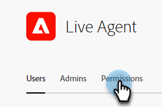

# Autorisations {#permissions}

Il existe cinq profils par défaut avec des autorisations prédéfinies que vous pouvez modifier en Dynamic Chat. Vous pouvez également créer un profil personnalisé avec un ensemble personnalisé d’autorisations. Passons en revue les deux.

## Modifier les autorisations existantes {#edit-existing-permissions}

1. Dans le [Adobe Admin Console](https://adminconsole.adobe.com/){target="_blank"}, cliquez sur **Dynamic Chat**.

   

1. Dans l’onglet **Profils de produit**, sélectionnez le profil à modifier. Dans cet exemple, nous choisissons **Live Agent**.

   

1. Cliquez sur l’onglet **Autorisations** .

   

1. Sélectionnez la zone du profil que vous souhaitez modifier. Dans cet exemple, nous choisissons la messagerie instantanée. Cliquez sur l’icône en forme de crayon.

   

1. Les éléments d’autorisation disponibles sont répertoriés à gauche. Vous pouvez choisir d’ajouter les autorisations une par une ou toutes à la fois. Cliquez sur le signe **+**.

   

   >[!NOTE]
   >
   >L’activation de l’inclusion automatique ajoute tous les éléments d’autorisation à la liste incluse. Lorsque de nouveaux éléments d’autorisation deviennent disponibles, ils sont automatiquement inclus pour ce profil de produit.

1. Cliquez sur **Enregistrer**.

   

Vous pouvez désormais répéter ce processus pour toutes les autres zones de Dynamic Chat.

## Création d’un profil {#create-a-profile}

1. Dans le [Adobe Admin Console](https://adminconsole.adobe.com/){target="_blank"}, cliquez sur **Dynamic Chat**.

   

1. Dans l’onglet **Profils de produit**, cliquez sur **Nouveau profil**.

   

1. **Nommez** votre profil de produit. Vous pouvez éventuellement lui attribuer un nom d’affichage et/ou une description, et choisir de faire en sorte que les utilisateurs soient informés lorsqu’ils sont ajoutés/supprimés. Cliquez sur **Enregistrer** lorsque vous avez terminé.

   

1. Votre nouveau profil apparaîtra dans l’onglet Profils de produit . Sélectionnez-le.

   

1. Suivez maintenant les étapes 3 à 6 de la [section ci-dessus](#edit-existing-permissions) pour chaque zone de votre choix.

## Liste des autorisations {#list-of-permissions}

Vous trouverez ci-dessous une liste de toutes les autorisations disponibles pour chaque zone.

<table>
<thead>
  <tr>
    <th style="width:25%">Zone de Dynamic Chat</th>
    <th>Autorisations</th>
  </tr>
</thead>
<tbody>
  <tr>
    <td>Gestion des conversations</td>
    <td><li>Afficher les boîtes de dialogue</li>
    <li>Gérer les boîtes de dialogue (créer, supprimer)</li>
    <li>Dialogues Publish</li>
    <li>Afficher les flux de conversation</li>
    <li>Gérer les flux de conversation (créer, supprimer)</li>
    <li>Flux de conversation Publish</li></td>
  </tr>
  <tr>
    <td>Chat en direct</td>
    <td><li>Afficher mes conversations</li>
    <li>Afficher toutes les conversations</li>
  </tr>
  <tr>
    <td>Réunions</td>
    <td><li>Gérer toutes les réunions</li>
  </tr>
  <tr>
    <td>Analytics</td>
    <td><li>Affichage des rapports de performances globales</li>
    <li>Afficher les rapports de tchat en direct</li>
    <li>Afficher les rapports sur les réunions</li>
    <li>Exporter des rapports</li></td>
  </tr>
  <tr>
    <td>Paramètres de l’agent</td>
    <td><li>Gérer la disponibilité de la messagerie instantanée</li>
    <li>Connexion à votre calendrier</li>
    <li>Gestion de la disponibilité du calendrier</li></td>
  </tr>
  <tr>
    <td>Paramètres d’administration</td>
    <td><li>Affichage d’un tour</li>
    <li>Afficher des règles personnalisées</li>
    <li>Gestion des règles personnalisées (ajout, modification, suppression)</li>
    <li>Afficher la liste des comptes <b>*</b></li>
    <li>Gestion des comptes (ajout, modification, suppression) <b>*</b></li>
    <li>Gestion des paramètres de Chatbot</li>
    <li>Gérer les paramètres de flux de conversation</li>
    <li>Gérer la confidentialité et la sécurité</li>
    <li>Gestion des intégrations</li>
    <li>Gestion des agents</li>
    <li>Afficher les équipes d’agents <b>*</b></li>
    <li>Gérer les équipes d’agents (ajouter, modifier, supprimer) <b>*</b></li></td>
  </tr>
</tbody>
</table>

**&#42;** Actuellement disponible uniquement pour les utilisateurs de Dynamic Prime

## Autorisations de profil par défaut {#default-profile-permissions}

Vous trouverez ci-dessous les cinq profils par défaut et les autorisations activées par défaut.

<table>
<thead>
  <tr>
    <th style="width:25%">Profile</th>
    <th>Autorisations par défaut</th>
  </tr>
</thead>
<tbody>
  <tr>
    <td>Utilisateur marketing</td>
    <td><i>Gestion des conversations</i>
    <li>Afficher les boîtes de dialogue</li>
    <li>Gérer les boîtes de dialogue (créer, supprimer)</li>
    <li>Dialogues Publish</li>
    <li>Afficher les flux de conversation</li>
    <li>Gérer les flux de conversation (créer, supprimer)</li>
    <li>Flux de conversation Publish</li>
     
    <i>Chat en direct</i>
    <li>s/o</li>
     
    <i>Réunions</i>
    <li>s/o</li>
     
    <i>Analytics</i>
    <li>Affichage des rapports de performances globales</li>
    <li>Afficher les rapports de tchat en direct</li>
    <li>Afficher les rapports sur les réunions</li>
     
    <i>Paramètres d’agent</i>
    <li>s/o</li>
     
    <i>Paramètres d’administration</i>
    <li>Affichage d’un tour</li>
    <li>Afficher des règles personnalisées</li>
    <li>Afficher la liste des comptes <b>*</b></li>
    <li>Afficher les équipes d’agents <b>*</b></li>
    </td>
  </tr>
  <tr>
    <td><b>LiveAgent</b></td>
    <td><i>Gestion des conversations</i>
    <li>Afficher les boîtes de dialogue</li>
    <li>Afficher les flux de conversation</li>
     
    <i>Chat en direct</i>
    <li>Afficher mes conversations</li>
     
    <i>Réunions</i>
    <li>s/o</li>
     
    <i>Analytics</i>
    <li>Affichage des rapports de performances globales</li>
    <li>Afficher les rapports de tchat en direct</li>
    <li>Afficher les rapports sur les réunions</li>
     
    <i>Paramètres d’agent</i>
    <li>Gérer la disponibilité de la messagerie instantanée</li>
    <li>Connexion à votre calendrier</li>
    <li>Gestion de la disponibilité du calendrier</li>
     
    <i>Paramètres d’administration</i>
    <li>Affichage d’un tour</li>
    <li>Afficher des règles personnalisées</li>
    <li>Afficher la liste des comptes <b>*</b></li>
    <li>Afficher les équipes d’agents <b>*</b></li>
    </td>
  </tr>
  <tr>
    <td><b>Agent du calendrier</b></td>
    <td><i>Gestion des conversations</i>
    <li>Afficher les boîtes de dialogue</li>
    <li>Afficher les flux de conversation</li>
     
    <i>Chat en direct</i>
    <li>s/o</li>
     
    <i>Réunions</i>
    <li>s/o</li>
     
    <i>Analytics</i>
    <li>Affichage des rapports de performances globales</li>
    <li>Afficher les rapports de tchat en direct</li>
    <li>Afficher les rapports sur les réunions</li>
     
    <i>Paramètres d’agent</i>
    <li>Connexion à votre calendrier</li>
    <li>Gestion de la disponibilité du calendrier</li>
     
    <i>Paramètres d’administration</i>
    <li>Affichage d’un tour</li>
    <li>Afficher des règles personnalisées</li>
    <li>Afficher la liste des comptes <b>*</b></li>
    <li>Afficher les équipes d’agents <b>*</b></li>
    </td>
  </tr>
  <tr>
    <td><b>Administrateur marketing</b></td>
    <td><i>Gestion des conversations</i>
    <li>Afficher les boîtes de dialogue</li>
    <li>Gérer les boîtes de dialogue (créer, supprimer)</li>
    <li>Dialogues Publish</li>
    <li>Afficher les flux de conversation</li>
    <li>Gérer les flux de conversation (créer, supprimer)</li>
    <li>Flux de conversation Publish</li>
     
    <i>Chat en direct</i>
    <li>s/o</li>
     
    <i>Réunions</i>
    <li>s/o</li>
     
    <i>Analytics</i>
    <li>Affichage des rapports de performances globales</li>
    <li>Afficher les rapports de tchat en direct</li>
    <li>Afficher les rapports sur les réunions</li>
    <li>Exporter des rapports</li>
     
    <i>Paramètres d’agent</i>
    <li>s/o</li>
     
    <i>Paramètres d’administration</i>
    <li>Affichage d’un tour</li>
    <li>Afficher des règles personnalisées</li>
    <li>Gestion des règles personnalisées (ajout, modification, suppression)</li>
    <li>Afficher la liste des comptes <b>*</b></li>
    <li>Gestion des comptes (ajout, modification, suppression) <b>*</b></li>
    <li>Gestion des paramètres de Chatbot</li>
    <li>Gérer les paramètres de flux de conversation</li>
    <li>Gérer la confidentialité et la sécurité</li>
    <li>Gestion des intégrations</li>
    <li>Afficher les équipes d’agents <b>*</b></li>
    </td>
  </tr>
  <tr>
    <td><b>Administrateur des ventes</b></td>
    <td><i>Gestion des conversations</i>
    <li>Afficher les boîtes de dialogue</li>
    <li>Afficher les flux de conversation</li>
     
    <i>Chat en direct</i>
    <li>Afficher mes conversations</li>
    <li>Afficher toutes les conversations</li>
     
    <i>Réunions</i>
    <li>Gérer toutes les réunions</li>
     
    <i>Analytics</i>
    <li>Affichage des rapports de performances globales</li>
    <li>Afficher les rapports de tchat en direct</li>
    <li>Afficher les rapports sur les réunions</li>
    <li>Exporter des rapports</li>
     
    <i>Paramètres d’agent</i>
    <li>Gérer la disponibilité de la messagerie instantanée</li>
    <li>Connexion à votre calendrier</li>
    <li>Gestion de la disponibilité du calendrier</li>
     
    <i>Paramètres d’administration</i>
    <li>Affichage d’un tour</li>
    <li>Afficher des règles personnalisées</li>
    <li>Gestion des règles personnalisées (ajout, modification, suppression)</li>
    <li>Afficher la liste des comptes <b>*</b></li>
    <li>Gestion des comptes (ajout, modification, suppression) <b>*</b></li>
    <li>Gestion des agents</li>
    <li>Afficher les équipes d’agents <b>*</b></li>
    <li>Gérer les équipes d’agents <b>*</b></li>
    </td>
  </tr>
</tbody>
</table>

**&#42;** Actuellement disponible uniquement pour les utilisateurs de Dynamic Prime
