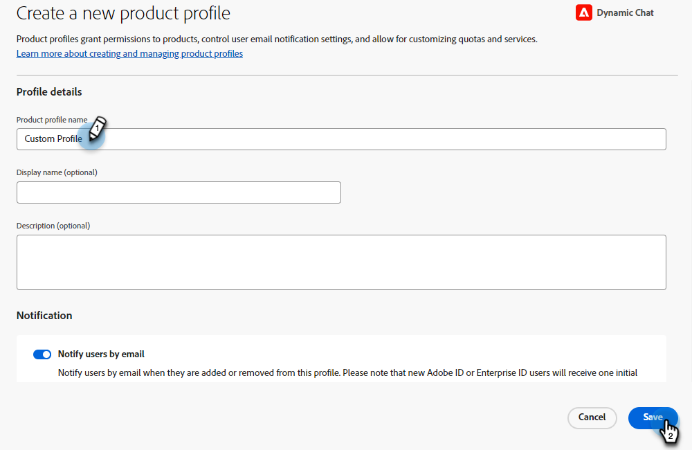

# Autorisations {#permissions}

Vous pouvez modifier cinq profils par défaut avec des autorisations prédéfinies dans Dynamic Chat. Vous pouvez également créer un profil personnalisé avec un ensemble personnalisé d’autorisations. Passons en revue les deux.

## Modifier les autorisations existantes {#edit-existing-permissions}

1. Dans [Adobe Admin Console](https://adminconsole.adobe.com/){target="_blank"}, cliquez sur **Dynamic Chat**.

   

1. Dans l’onglet **Profils de produit**, sélectionnez le profil à modifier. Dans cet exemple, nous choisissons **Agent en direct**.

   

1. Cliquez sur l’onglet **Autorisations**.

   

1. Sélectionnez la zone du profil que vous souhaitez modifier. Dans cet exemple, nous choisissons le Module de conversation en direct. Cliquez sur l’icône en forme de crayon.

   

1. Les éléments d’autorisation disponibles sont répertoriés sur la gauche. Vous pouvez choisir d’ajouter des autorisations une par une ou toutes en même temps. Cliquez sur le signe **+**.

   

   >[!NOTE]
   >
   >L’activation de l’inclusion automatique ajoutera tous les éléments d’autorisation à la liste incluse. Lorsque de nouveaux éléments d’autorisation seront disponibles, ils seront automatiquement inclus pour ce profil de produit.

1. Cliquez sur **Enregistrer**

   

Vous pouvez maintenant répéter ce processus pour toutes les autres zones de Dynamic Chat.

## Création d’un profil {#create-a-profile}

1. Dans [Adobe Admin Console](https://adminconsole.adobe.com/){target="_blank"}, cliquez sur **Dynamic Chat**.

   

1. Dans l’onglet **Profils de produit**, cliquez sur **Nouveau profil**.

   

1. **Nommez** votre profil de produit. Vous pouvez éventuellement lui donner un nom d’affichage et/ou une description, et choisir de notifier les utilisateurs et utilisatrices lorsqu’ils sont ajoutés/supprimés. Cliquez sur **Enregistrer** lorsque vous avez terminé.

   

1. Votre nouveau profil apparaîtra dans l’onglet Profils de produit . Sélectionnez-le.

   

1. Suivez maintenant les étapes 3 à 6 de la [section ci-dessus](#edit-existing-permissions) pour chaque zone souhaitée.

## Liste des autorisations {#list-of-permissions}

Vous trouverez ci-dessous une liste de toutes les autorisations disponibles pour chaque zone.

<table>
<thead>
  <tr>
    <th style="width:25%">Zone Dynamic Chat</th>
    <th>Autorisations</th>
  </tr>
</thead>
<tbody>
  <tr>
    <td>Gestion des conversations</td>
    <td><li>Afficher les boîtes de dialogue</li>
    <li>Gestion des boîtes de dialogue (création, suppression)</li>
    <li>Boîtes de dialogue de publication</li>
    <li>Afficher les flux de conversation</li>
    <li>Gestion des flux de conversation (création, suppression)</li>
    <li>Publier les flux de conversation</li></td>
  </tr>
  <tr>
    <td>Conversation en direct</td>
    <td><li>Afficher mes conversations</li>
    <li>Afficher toutes les conversations</li>
  </tr>
  <tr>
    <td>Réunions</td>
    <td><li>Gérer toutes les réunions</li>
  </tr>
  <tr>
    <td>Analyse</td>
    <td><li>Afficher les rapports de performances globaux</li>
    <li>Afficher les rapports de conversation en direct</li>
    <li>Afficher les rapports de réunion</li>
    <li>Export Reports</li></td>
  </tr>
  <tr>
    <td>Paramètres de l’agent ou de l’agente</td>
    <td><li>Gérer la disponibilité du chat en direct</li>
    <li>Connecter votre calendrier</li>
    <li>Gérer la disponibilité du calendrier</li></td>
  </tr>
  <tr>
    <td>Paramètres d’administration</td>
    <td><li>Afficher la rotation</li>
    <li>Afficher les règles personnalisées</li>
    <li>Gestion des règles personnalisées (ajout, modification et suppression)</li>
    <li>Afficher la liste des comptes <b>*</b></li>
    <li>Gérer les comptes (ajouter, modifier, supprimer) <b>*</b></li>
    <li>Gérer les paramètres du bot conversationnel</li>
    <li>Gérer les paramètres de flux de conversation</li>
    <li>Gestion de la confidentialité et de la sécurité</li>
    <li>Gestion des intégrations</li>
    <li>Gérer les agents</li>
    <li>Afficher les équipes d’agents <b>*</b></li>
    <li>Gérer les équipes d’agents (ajout, modification et suppression) <b>*</b></li></td>
  </tr>
</tbody>
</table>

**&#42;** Actuellement disponible uniquement pour les utilisateurs de Dynamic Prime

## Autorisations de profil par défaut {#default-profile-permissions}

Vous trouverez ci-dessous les cinq profils par défaut et les autorisations activées par défaut.

<table>
<thead>
  <tr>
    <th style="width:25%">Profile</th>
    <th>Autorisations par défaut</th>
  </tr>
</thead>
<tbody>
  <tr>
    <td>Utilisateur marketing</td>
    <td><i>Gestion des conversations</i>
    <li>Afficher les boîtes de dialogue</li>
    <li>Gestion des boîtes de dialogue (création, suppression)</li>
    <li>Boîtes de dialogue de publication</li>
    <li>Afficher les flux de conversation</li>
    <li>Gestion des flux de conversation (création, suppression)</li>
    <li>Publier les flux de conversation</li>
     
    <i>Discussion en direct</i>
    <li>s/o</li>
     
    <i>Réunions</i>
    <li>s/o</li>
     
    <i> Analytics </i>
    <li>Afficher les rapports de performances globaux</li>
    <li>Afficher les rapports de conversation en direct</li>
    <li>Afficher les rapports de réunion</li>
     
    <i>Paramètres de l’agent</i>
    <li>s/o</li>
     
    <i>Paramètres d’administration</i>
    <li>Afficher la rotation</li>
    <li>Afficher les règles personnalisées</li>
    <li>Afficher la liste des comptes <b>*</b></li>
    <li>Afficher les équipes d’agents <b>*</b></li>
    </td>
  </tr>
  <tr>
    <td><b>LiveAgent</b></td>
    <td><i>Gestion des conversations</i>
    <li>Afficher les boîtes de dialogue</li>
    <li>Afficher les flux de conversation</li>
     
    <i>Discussion en direct</i>
    <li>Afficher mes conversations</li>
     
    <i>Réunions</i>
    <li>s/o</li>
     
    <i> Analytics </i>
    <li>Afficher les rapports de performances globaux</li>
    <li>Afficher les rapports de conversation en direct</li>
    <li>Afficher les rapports de réunion</li>
     
    <i>Paramètres de l’agent</i>
    <li>Gérer la disponibilité du chat en direct</li>
    <li>Connecter votre calendrier</li>
    <li>Gérer la disponibilité du calendrier</li>
     
    <i>Paramètres d’administration</i>
    <li>Afficher la rotation</li>
    <li>Afficher les règles personnalisées</li>
    <li>Afficher la liste des comptes <b>*</b></li>
    <li>Afficher les équipes d’agents <b>*</b></li>
    </td>
  </tr>
  <tr>
    <td><b>Agent du calendrier</b></td>
    <td><i>Gestion des conversations</i>
    <li>Afficher les boîtes de dialogue</li>
    <li>Afficher les flux de conversation</li>
     
    <i>Discussion en direct</i>
    <li>s/o</li>
     
    <i>Réunions</i>
    <li>s/o</li>
     
    <i> Analytics </i>
    <li>Afficher les rapports de performances globaux</li>
    <li>Afficher les rapports de conversation en direct</li>
    <li>Afficher les rapports de réunion</li>
     
    <i>Paramètres de l’agent</i>
    <li>Connecter votre calendrier</li>
    <li>Gérer la disponibilité du calendrier</li>
     
    <i>Paramètres d’administration</i>
    <li>Afficher la rotation</li>
    <li>Afficher les règles personnalisées</li>
    <li>Afficher la liste des comptes <b>*</b></li>
    <li>Afficher les équipes d’agents <b>*</b></li>
    </td>
  </tr>
  <tr>
    <td><b>Administrateur marketing</b></td>
    <td><i>Gestion des conversations</i>
    <li>Afficher les boîtes de dialogue</li>
    <li>Gestion des boîtes de dialogue (création, suppression)</li>
    <li>Boîtes de dialogue de publication</li>
    <li>Afficher les flux de conversation</li>
    <li>Gestion des flux de conversation (création, suppression)</li>
    <li>Publier les flux de conversation</li>
     
    <i>Discussion en direct</i>
    <li>s/o</li>
     
    <i>Réunions</i>
    <li>s/o</li>
     
    <i> Analytics </i>
    <li>Afficher les rapports de performances globaux</li>
    <li>Afficher les rapports de conversation en direct</li>
    <li>Afficher les rapports de réunion</li>
    <li>Export Reports</li>
     
    <i>Paramètres de l’agent</i>
    <li>s/o</li>
     
    <i>Paramètres d’administration</i>
    <li>Afficher la rotation</li>
    <li>Afficher les règles personnalisées</li>
    <li>Gestion des règles personnalisées (ajout, modification et suppression)</li>
    <li>Afficher la liste des comptes <b>*</b></li>
    <li>Gérer les comptes (ajouter, modifier, supprimer) <b>*</b></li>
    <li>Gérer les paramètres du bot conversationnel</li>
    <li>Gérer les paramètres de flux de conversation</li>
    <li>Gestion de la confidentialité et de la sécurité</li>
    <li>Gestion des intégrations</li>
    <li>Afficher les équipes d’agents <b>*</b></li>
    </td>
  </tr>
  <tr>
    <td><b>Administrateur des ventes</b></td>
    <td><i>Gestion des conversations</i>
    <li>Afficher les boîtes de dialogue</li>
    <li>Afficher les flux de conversation</li>
     
    <i>Discussion en direct</i>
    <li>Afficher mes conversations</li>
    <li>Afficher toutes les conversations</li>
     
    <i>Réunions</i>
    <li>Gérer toutes les réunions</li>
     
    <i> Analytics </i>
    <li>Afficher les rapports de performances globaux</li>
    <li>Afficher les rapports de conversation en direct</li>
    <li>Afficher les rapports de réunion</li>
    <li>Export Reports</li>
     
    <i>Paramètres de l’agent</i>
    <li>Gérer la disponibilité du chat en direct</li>
    <li>Connecter votre calendrier</li>
    <li>Gérer la disponibilité du calendrier</li>
     
    <i>Paramètres d’administration</i>
    <li>Afficher la rotation</li>
    <li>Afficher les règles personnalisées</li>
    <li>Gestion des règles personnalisées (ajout, modification et suppression)</li>
    <li>Afficher la liste des comptes <b>*</b></li>
    <li>Gérer les comptes (ajouter, modifier, supprimer) <b>*</b></li>
    <li>Gérer les agents</li>
    <li>Afficher les équipes d’agents <b>*</b></li>
    <li>Gérer les équipes d’agents <b>*</b></li>
    </td>
  </tr>
</tbody>
</table>

**&#42;** Actuellement disponible uniquement pour les utilisateurs de Dynamic Prime
