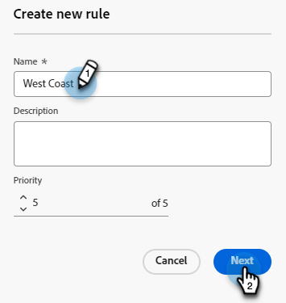
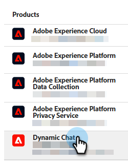

# Routage {#routing}

Les réunions réservées dans Dynamic Chat peuvent être acheminées de deux façons. Round-robin ou utilisation d’une règle personnalisée.

Round-robin : les réunions sont attribuées aux agents de manière séquentielle. Donc, si vous avez cinq agents et que l&#39;agent trois a pris la dernière réunion, l&#39;agent quatre aura la prochaine réunion, suivi de l&#39;agent cinq, puis de l&#39;agent un.

Règle personnalisée : vous pouvez choisir des agents spécifiques pour recevoir des réunions en fonction des attributs que vous sélectionnez.

>[!NOTE]
>
>Le routage de compte reçoit la priorité la plus élevée. Lorsqu’un visiteur atteint le point de la conversation pour réserver une réunion ou lancer un chat en direct, le [Routage du compte](#account-routing) est d’abord vérifié avant que d’autres options de routage ne soient prises en compte.

## Création d’une règle personnalisée {#create-a-custom-rule}

Dans cet exemple, nous envoyons toutes les réunions des États présumés CA, OR et WA à l&#39;agent John.

1. Sous Configuration, cliquez sur **Règles de transmission**.

   

1. L’onglet **Règles personnalisées** s’ouvre par défaut.

   

1. Cliquez sur **Créer une règle**.

   

1. Nommez votre règle. Vous pouvez éventuellement ajouter une description et définir son niveau de priorité. Cliquez sur **Suivant**.

   

1. Choisissez le ou les agents souhaités.

   

1. Faites glisser sur le(s) attribut(s) de votre choix.

   

1. Recherchez et sélectionnez la ou les valeurs souhaitées.

   

1. Lorsque toutes les valeurs souhaitées sont sélectionnées, cliquez sur **Enregistrer**.

   

## Routage de compte {#account-routing}

Identifiez et chargez votre compte cible et les propriétaires de ventes respectifs, puis acheminez les visiteurs provenant de ces comptes directement vers le propriétaire du compte respectif.

>[!PREREQUISITES]
>
>Pour que le _Routage de compte_ soit visible dans Dynamic Chat, les autorisations doivent être activées dans Admin Console. Voir [Activer les autorisations](#enable-permissions) ci-dessous.

### Activer les autorisations {#enable-permissions}

+++ Activer les autorisations de routage de compte

1. Connectez-vous à [https://adminconsole.adobe.com/](https://adminconsole.adobe.com/){target="_blank"}.

1. Sous _Produits_, sélectionnez **Dynamic Chat**.

   

1. Sous _Profils de produit_, sélectionnez le profil souhaité.

   

1. Cliquez sur l’onglet **Autorisations**.

   

1. Cliquez sur l’icône Modifier () en regard de _Configuration_.

   

1. Cliquez sur le signe **+** en regard de _Afficher le routage du compte_.

   {width="600" zoomable="yes"}

1. Cliquez sur **Enregistrer** lorsque vous avez terminé.

+++

### Ajouter un compte {#add-an-account}

Dans cet exemple, nous allons acheminer tous les employés de Lego directement à l&#39;agent Steven.

1. Dans l’onglet Routage du compte , cliquez sur **+ Ajouter un compte**.

   

   >[!TIP]
   >
   >Vous pouvez créer plusieurs comptes à la fois en cliquant sur **Charger la liste des comptes** et en chargeant un fichier CSV.

1. Saisissez le nom de la société, le domaine et sélectionnez l’agent souhaité.

   
