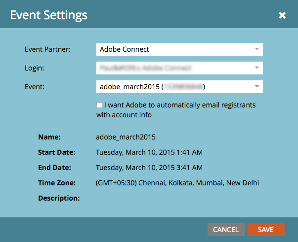

# Créer un Événement avec Adobe Connect {#create-an-event-with-adobe-connect}

La synchronisation avec Adobe Connect vous permet de gérer votre inscription et votre participation au webinaire dans Marketo, ce qui garantit que l’engagement ne sera pas non suivi.

>[!PREREQUISITES]
>
>* [Lier Adobe Connect et Marketo](/help/marketo/product-docs/administration/additional-integrations/add-adobe-connect-as-a-launchpoint-service.md)
>* [Créer un Programme de Événement](/help/marketo/product-docs/demand-generation/events/understanding-events/create-a-new-event-program.md)

Tout d&#39;abord, assurez-vous d&#39;avoir créé votre réunion ou séminaire à Adobe Connect. Si vous avez besoin d&#39;aide, consultez le [Guide de l&#39;utilisateur Adobe Connect](http://help.adobe.com/en_US/connect/9.0/using/index.html). Les réunions et séminaires que vous créez en Adobe Connect doivent être créés dans le dossier que vous avez spécifié lorsque vous avez saisi vos informations d’identification dans Marketing Cloud. Après avoir créé votre réunion ou séminaire, prenez note de toute information logistique pertinente (telle que le numéro de téléphone) à utiliser dans votre courriel de confirmation et votre fichier ICS.

>[!NOTE]
>
>Nous **ne prenons pas** en charge Adobe Connect On-Site pour le moment.

1. Sur la page d’accueil d’un nouveau événement, sélectionnez **Actions du Événement**, puis **Paramètres du Événement**.

   

   >[!NOTE]
   >
   >Si **Paramètres du Événement** ne s’affiche pas dans la liste déroulante, assurez-vous que le canal du événement a **Événement avec le webinaire** sélectionné sous &quot;S’applique à&quot;.

1. Sous **Partenaire de Événement**, sélectionnez **Adobe Connect**.

   

1. Sélectionnez votre **identifiant de connexion** et votre **Événement**.

   

1. Cliquez sur **Enregistrer**.

   

   Sympa ! Votre événement Adobe Connect est désormais synchronisé avec votre événement Marketing.

   >[!NOTE]
   >
   >Les champs envoyés par Marketo sont les suivants : Prénom, Nom, Adresse électronique.

   >[!TIP]
   >
   >Pour insérer l’URL unique de la personne dans un courrier électronique, utilisez ce jeton : `{{member.webinar url}}`. Lorsque le courrier électronique est envoyé, ce jeton résout automatiquement l’URL de confirmation unique de la personne en provenance d’Adobe Connect.
   >
   >Définissez votre message de confirmation sur **Opérationnel** pour vous assurer que les personnes qui s&#39;inscrivent et peuvent ne pas s&#39;abonner reçoivent toujours leurs informations de confirmation.

   

   >[!CAUTION]
   >
   >Evitez d’utiliser des programmes de messagerie imbriqués pour envoyer vos messages de confirmation. Utilisez plutôt la campagne intelligente du programme de événement, comme illustré ci-dessus.

   >[!TIP]
   >
   >L’affichage des données dans Marketo peut prendre jusqu’à 48 heures. Si, après avoir attendu si longtemps, vous ne voyez toujours rien, sélectionnez **Actualiser à partir du fournisseur de webinaires** dans le menu Actions du Événement de l&#39;onglet Résumé de votre événement.

   >[!MORELIKETHIS]
   >
   > * [Ajouter Adobe Connect en tant que service LaunchPoint](/help/marketo/product-docs/administration/additional-integrations/add-adobe-connect-as-a-launchpoint-service.md)
   > * [Modification d’un Canal de Événement](/help/marketo/product-docs/demand-generation/events/understanding-events/edit-an-event-channel.md)

Les personnes qui s’abonnent à votre webinaire seront repoussées vers votre fournisseur de webinaires via l’étape de flux Modifier l’état du Programme lorsque le nouvel état est défini sur &quot;Inscrit&quot;. Aucun autre statut ne poussera la personne vers le bas. Veillez également à passer à l’étape 1 du flux d’état du Programme de modification et à l’étape 2 du flux d’envoi de courrier électronique.
