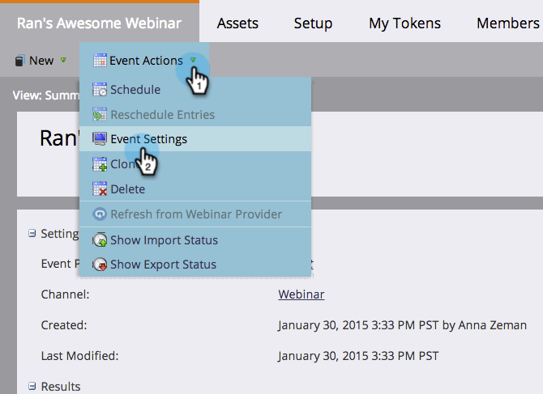

# Création d’un événement avec Adobe Connect {#create-an-event-with-adobe-connect}

La synchronisation avec Adobe Connect vous permet de gérer l’inscription et la participation au webinaire dans Marketo, ce qui garantit que l’engagement n’est pas ignoré.

>[!PREREQUISITES]
>
>* [Lier Adobe Connect et Marketo](/help/marketo/product-docs/administration/additional-integrations/add-adobe-connect-as-a-launchpoint-service.md)
>* [Créer un programme d’événement](/help/marketo/product-docs/demand-generation/events/understanding-events/create-a-new-event-program.md)

Tout d’abord, assurez-vous d’avoir créé votre réunion ou séminaire dans Adobe Connect. Si vous avez besoin d’aide, consultez le [Guide de l’utilisateur d’Adobe Connect](https://help.adobe.com/en_US/connect/9.0/using/index.html).

Les réunions et séminaires créés dans Adobe Connect doivent l&#39;être dans le dossier spécifié lors de la saisie des informations d&#39;identification dans Marketo. Après avoir créé votre réunion ou séminaire, notez toute information logistique pertinente (comme le numéro de téléphone), à utiliser dans votre e-mail de confirmation et votre fichier ICS.

>[!CAUTION]
>
>En tant qu&#39;hôte de l&#39;événement, veillez à le rejoindre à partir de l&#39;application et **pas** via le lien envoyé aux participants.

>[!NOTE]
>
>Nous ne prenons pas en charge Adobe Connect On-Site pour le moment.

1. Sur la page d&#39;accueil d&#39;un nouvel événement, sélectionnez **[!UICONTROL Actions d&#39;événement]**, puis **[!UICONTROL Paramètres d&#39;événement]**.

   

   >[!NOTE]
   >
   >Si vous ne voyez pas l’option **[!UICONTROL Paramètres d’événement]** dans la liste déroulante, assurez-vous que le canal de l’événement comporte l’option **[!UICONTROL Événement avec webinaire]** sélectionnée sous « [!UICONTROL S’applique à] ».

1. Sous **[!UICONTROL Partenaire d’événement]**, sélectionnez **[!UICONTROL Adobe Connect]**.

   

1. Sélectionnez votre identifiant **[!UICONTROL Login]** puis sélectionnez votre **[!UICONTROL Événement]**.

   

1. Cliquez sur **[!UICONTROL Enregistrer]**.

   

   Joli ! Votre événement Adobe Connect est maintenant synchronisé avec votre événement Marketo.

   >[!NOTE]
   >
   >Les champs envoyés par Marketo sont les suivants : Prénom, Nom, Adresse e-mail.

   >[!TIP]
   >
   >Pour insérer l’URL unique de la personne dans un e-mail, utilisez le jeton suivant : `{{member.webinar url}}`. Lorsque l’e-mail est envoyé, ce jeton résout automatiquement l’URL de confirmation unique de la personne à partir d’Adobe Connect.
   >
   >Définissez votre e-mail de confirmation sur **Opérationnel** afin de vous assurer que les personnes qui s’inscrivent et peuvent se désinscrire reçoivent toujours leurs informations de confirmation.

   Les personnes qui s’inscrivent à votre webinaire sont redirigées vers votre fournisseur de webinaires via l’étape de flux [!UICONTROL Modifier le statut du programme] lorsque le [!UICONTROL Nouveau statut] est défini sur « Enregistré ». Aucun autre statut ne poussera la personne vers le serveur. Veillez également à ce que les étapes de flux [!UICONTROL  Modifier le statut du programme ] #1 et [!UICONTROL  Envoyer un e-mail ] soient #2.

   

   >[!CAUTION]
   >
   >Évitez d’utiliser des programmes de messagerie imbriqués pour envoyer vos e-mails de confirmation. Utilisez plutôt la campagne intelligente du programme d’événement, comme illustré ci-dessus.

   >[!TIP]
   >
   >L’affichage des données dans Marketo peut prendre jusqu’à 48 heures. Si, après avoir attendu si longtemps, vous ne voyez toujours rien, sélectionnez **[!UICONTROL Actualiser à partir du fournisseur de webinaires]** dans le menu Actions d’événement de l’onglet Résumé de votre événement.

   >[!MORELIKETHIS]
   >
   >* [Ajouter Adobe Connect as a [!DNL LaunchPoint] Service](/help/marketo/product-docs/administration/additional-integrations/add-adobe-connect-as-a-launchpoint-service.md)
   >* [Modifier un canal d’événement](/help/marketo/product-docs/demand-generation/events/understanding-events/edit-an-event-channel.md)
