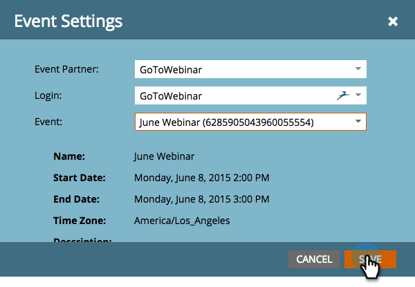
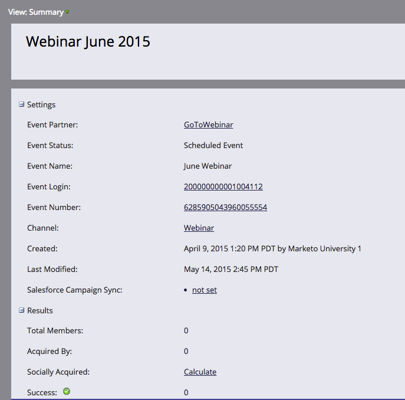

# Créer un Événement avec GotoWebinar {#create-an-event-with-gotowebinar}

>[!PREREQUISITES]
>
>* [Ajouter GoToWebinar comme service LaunchPoint](/help/marketo/product-docs/administration/additional-integrations/add-gotowebinar-as-a-launchpoint-service.md)
>* [Créer un Programme de Événement](/help/marketo/product-docs/demand-generation/events/understanding-events/create-a-new-event-program.md)
>* Définir les [actions de flux](http://docs.marketo.com/display/DOCS/Flow+Actions)appropriées pour suivre l&#39;engagement

Commencez par créer votre webinaire dans GoToWebinar. Certains paramètres de création de votre GoToWebinar sont utilisés par Marketo et d&#39;autres ne sont utilisés que par GoToWebinar.

Après avoir créé un événement Marketo et associé le GoToWebinar à celui-ci, les systèmes pourront partager les informations d&#39;inscription et de présence. Pour obtenir de l&#39;aide sur la création d&#39;un GoToWebinar, consultez le [Guide de l&#39;utilisateur GoToWebinar](http://docs.marketo.com/display/docs/assets/gotowebinar-user-guide.pdf).

Vous trouverez ci-dessous une liste des paramètres utilisés par Marketo.

## Titre et description {#title-and-description}

**Nom**  du webinaire : entrez le nom du webinaire. Ce nom peut être affiché dans Marketing.

**Description**  (facultatif) : entrez la description du webinaire. La description sera visible dans Marketo.

## Date et heure {#date-time}

`Enter the following information for your webinar and it will be pulled into Marketo via the`adaptateur. Si vous apportez des modifications à ces informations, vous devez cliquer sur le lien &quot;**Actualiser à partir du fournisseur de webinaire**&quot; sous **Actions du Événement**, afin que Marketo puisse voir les modifications.

**Date**  du début - entrez votre date de début. Ceci sera visible dans Marketing Cloud.

**Heure**  du début - entrez votre heure de début. Ceci sera visible dans Marketing Cloud.

**Heure**  de fin : entrez votre heure de fin. Ceci sera visible dans Marketing Cloud.

**Fuseau**  horaire : sélectionnez le fuseau horaire approprié. Il sera visible dans Marketo.

**Saisissez -** défini sur  **Une session**.

>[!NOTE]
>
>Actuellement, Marketo ne prend pas en charge les webinaires récurrents. Vous devez configurer une session unique entre chaque Événement de marketing et chaque webinaire GoToWebinaire.

>[!TIP]
>
>D&#39;autres champs que vous allez configurer dans GoToWebinar n&#39;affecteront PAS l&#39;intégration. Consultez le [Guide de l&#39;utilisateur GoToWebinar](http://docs.marketo.com/display/docs/assets/gotowebinar-user-guide.pdf) pour plus d&#39;informations sur ces champs, car ils ne seront pas traités dans cet article. Si vous avez besoin d&#39;une aide supplémentaire de GoToWebinar, consultez leur [site d&#39;aide](http://support.logmeininc.com/gotowebinar).

Maintenant, passons à Marketo !

1. Sélectionnez un événement. Cliquez sur **Actions de Événement** et sélectionnez **Paramètres de Événement**.

   

   >[!NOTE]
   >
   >Le type de canal du événement sélectionné doit être **webinar**.

1. Sélectionnez **GoToWebinar** dans la Liste **Événement** **Partenaire**.

   

1. Sélectionnez le compte.

   

1. Sélectionnez le webinaire.

   

1. Cliquez sur **Enregistrer**.

   

1. Excellent ! Le événement est désormais synchronisé et planifié par **GoToWebinar**.

   

   >[!NOTE]
   >
   >Les champs envoyés par Marketo sont les suivants : Prénom, Nom, Adresse électronique. Ces champs sont obligatoires et ne doivent pas être vides.

   >[!TIP]
   >
   >Pour renseigner votre message de confirmation avec cette URL unique, utilisez le jeton suivant dans votre message électronique : `{{member.webinar url}}`. Lorsque l’URL de confirmation est envoyée, ce jeton correspond automatiquement à l’URL de confirmation unique de la personne.
   >
   >Définissez votre message de confirmation sur **Opérationnel** pour vous assurer que les personnes qui s&#39;inscrivent et peuvent ne pas s&#39;abonner reçoivent toujours leurs informations de confirmation.

   

   >[!CAUTION]
   >
   >Evitez d’utiliser des programmes de messagerie imbriqués pour envoyer vos messages de confirmation. Utilisez plutôt la campagne intelligente du programme de événement, comme illustré ci-dessus.

   >[!TIP]
   >
   >L’affichage des données dans Marketo peut prendre jusqu’à 48 heures. Si, après avoir attendu si longtemps, vous ne voyez toujours rien, sélectionnez **Actualiser à partir du fournisseur de webinaires** dans le menu Actions du Événement de l&#39;onglet **Résumé** de votre événement.

Les personnes qui s’abonnent à votre webinaire seront repoussées vers votre fournisseur de webinaires via l’étape de flux Modifier l’état du Programme lorsque le nouvel état est défini sur &quot;Inscrit&quot;. Aucun autre statut ne poussera la personne vers le bas. Veillez également à passer à l’étape 1 du flux d’état du Programme de modification et à l’étape 2 du flux d’envoi de courrier électronique.

## Affichage de la planification {#viewing-the-schedule}

Dans la [vue de Planning du programme](http://docs.marketo.com/display/docs/program+schedule+view), cliquez sur l&#39;entrée de calendrier de votre événement. Vous pouvez voir la planification sur le côté droit de l’écran.

>[!NOTE]
>
>Pour modifier le calendrier de votre événement, vous devez modifier le webinaire sur GoToWebinar.

