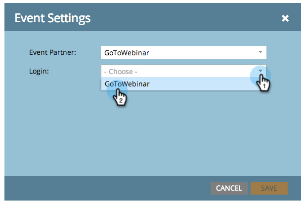

# Créer un événement avec [!DNL GotoWebinar] {#create-an-event-with-gotowebinar}

>[!PREREQUISITES]
>
>* [Add [!DNL GoToWebinar] as a [!DNL LaunchPoint] service](/help/marketo/product-docs/administration/additional-integrations/add-gotowebinar-as-a-launchpoint-service.md)
>* [Créer un programme d’événement](/help/marketo/product-docs/demand-generation/events/understanding-events/create-a-new-event-program.md)
>* Définir les [actions de flux](/help/marketo/product-docs/core-marketo-concepts/smart-campaigns/flow-actions/add-a-flow-step-to-a-smart-campaign.md) appropriées pour suivre l’engagement

Créez d’abord votre webinaire dans [!DNL GoToWebinar]. Certains paramètres de création de votre [!DNL GoToWebinar] sont utilisés par Marketo et d’autres le sont uniquement par [!DNL GoToWebinar].

Une fois que vous avez créé un événement Marketo et que vous y avez associé le [!DNL GoToWebinar], les systèmes peuvent partager les informations d’inscription et de présence.

Vous trouverez ci-dessous une liste des paramètres utilisés par Marketo.

## Titre et description {#title-and-description}

**[!UICONTROL Titre]** - Saisissez le nom du webinaire. Ce nom sera visible dans Marketo.

**[!UICONTROL Description]** (facultatif) - saisissez la description du webinaire. La description peut être consultée dans Marketo.

## Date et heure {#date-time}

Saisissez les informations suivantes pour votre webinaire. Elles seront extraites dans Marketo via l’adaptateur. Si vous apportez des modifications à ces informations, vous devez cliquer sur le lien « **[!UICONTROL Actualiser à partir du fournisseur de webinaires]** » sous **[!UICONTROL Actions d’événement]** pour que Marketo voie les modifications.

**[!UICONTROL Date de début]** - saisissez votre date de début. Il sera visible dans Marketo.

**[!UICONTROL Heure de début]** - Saisissez votre heure de début. Il sera visible dans Marketo.

**[!UICONTROL Heure de fin]** - Saisissez votre heure de fin. Il sera visible dans Marketo.

**[!UICONTROL Fuseau horaire du webinaire]** - Sélectionnez le fuseau horaire applicable. Il sera visible dans Marketo.

**[!UICONTROL Type]** - Défini sur **[!UICONTROL Une session]**.

>[!NOTE]
>
>Marketo ne prend actuellement pas en charge les webinaires récurrents. Vous devez configurer une seule session entre chaque événement Marketo et [!DNL GoToWebinar] webinaire.

>[!TIP]
>
>Si vous avez besoin d’aide [!DNL GoToWebinar] supplémentaire, consultez leur [site d’aide](https://support.logmeininc.com/gotowebinar).

Maintenant, plongeons-nous dans Marketo !

1. Sélectionnez un événement. Cliquez sur **[!UICONTROL Actions d’événement]** et choisissez **[!UICONTROL Paramètres d’événement]**.

   

   >[!NOTE]
   >
   >Le type de canal de l’événement sélectionné doit être **webinaire**.

1. Choisissez **[!UICONTROL GoToWebinar]** dans la liste **[!UICONTROL Partenaire d’événement]**.

   

1. Choisissez le compte.

   

1. Sélectionnez le webinaire .

   

1. Cliquez sur **[!UICONTROL Enregistrer]**.

   

1. Excellent ! Désormais, l’événement est synchronisé et planifié par **[!DNL GoToWebinar]**.

   

   >[!NOTE]
   >
   >Les champs envoyés par Marketo sont les suivants : Prénom, Nom, Adresse e-mail. Ces champs sont obligatoires et ne doivent pas être vides.

   >[!TIP]
   >
   >Pour remplir votre e-mail de confirmation avec cette URL unique, utilisez le jeton suivant dans votre e-mail : `{{member.webinar url}}`. Lorsque l’URL de confirmation est envoyée, ce jeton est automatiquement résolu sur l’URL de confirmation unique de la personne.
   >
   >Définissez votre e-mail de confirmation sur **Opérationnel** afin de vous assurer que les personnes qui s’inscrivent et peuvent se désinscrire reçoivent toujours leurs informations de confirmation.

   

   >[!CAUTION]
   >
   >Évitez d’utiliser des programmes de messagerie imbriqués pour envoyer vos e-mails de confirmation. Utilisez plutôt la campagne intelligente du programme d’événement, comme illustré ci-dessus.

   >[!TIP]
   >
   >L’affichage des données dans Marketo peut prendre jusqu’à 48 heures. Si, après avoir attendu si longtemps, vous ne voyez toujours rien, sélectionnez **[!UICONTROL Actualiser à partir du fournisseur de webinaires]** dans le menu [!UICONTROL Actions d’événement] de l’onglet **[!UICONTROL Résumé]** de votre événement.

Les personnes qui s’inscrivent à votre webinaire sont redirigées vers votre fournisseur de webinaires via l’étape de flux [!UICONTROL Modifier le statut du programme] lorsque le [!UICONTROL Nouveau statut] est défini sur « Enregistré ». Aucun autre statut ne poussera la personne vers le serveur. Veillez également à ce que les étapes de flux [!UICONTROL &#x200B; Modifier le statut du programme &#x200B;] #1 et [!UICONTROL &#x200B; Envoyer un e-mail &#x200B;] soient #2.

## Affichage du planning  {#viewing-the-schedule}

Dans la vue Planning du programme, cliquez sur l’entrée de calendrier de votre événement. Le planning s’affiche dans la partie droite de l’écran.

>[!NOTE]
>
>Pour modifier le planning de vos événements, vous devez modifier le webinaire sur [!DNL GoToWebinar].

