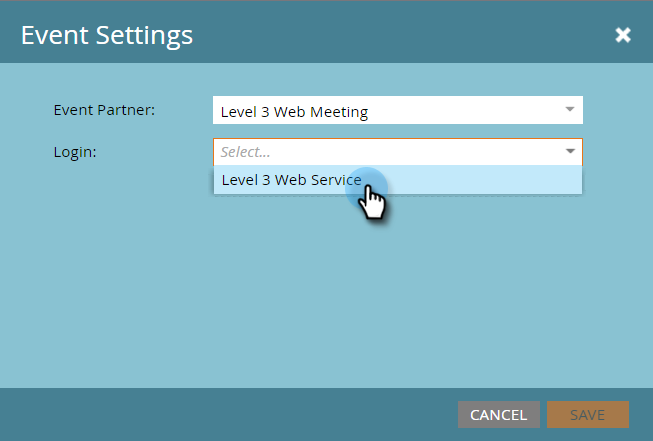
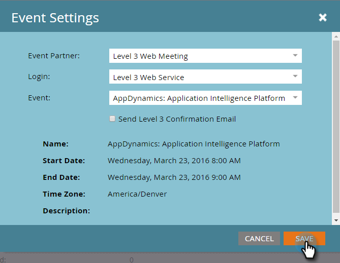

# [!DNL Level 3 Web Meeting] {#create-an-event-with-level-web-meeting}

>[!PREREQUISITES]
>
>* [ [!DNL Level 3 Web Meeting]  [!DNL LaunchPoint] ](/help/marketo/product-docs/administration/additional-integrations/add-level-3-web-meeting-as-a-launchpoint-service.md)
>* 
>* 

[!DNL Level 3] [[!DNL Level 3] ](https://www.level3.com/en/resource-library/) [!DNL BrightTalk]  [!DNL Level 3]

* ****
* ****
* ****
* ****
* ****

1. Sélectionnez votre nouvel événement. ********

   

1. ****

   

1. [!DNL Level 3]

   

1. [!DNL Level 3]

   

1. Cliquez sur **[!UICONTROL Enregistrer]**

   

   Most excellent! [!DNL Level 3]

## Viewing the Schedule  {#viewing-the-schedule}

In the program schedule view, click the calendar entry for your event. You can see the schedule on the right side of the screen!

