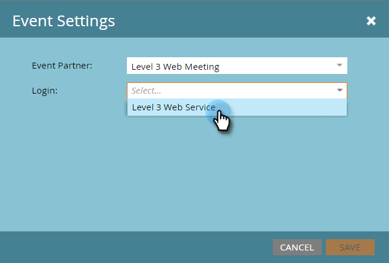

# Créer un événement avec [!DNL Level 3 Web Meeting] {#create-an-event-with-level-web-meeting}

>[!PREREQUISITES]
>
>* [Ajouter [!DNL Level 3 Web Meeting] as a [!DNL LaunchPoint] Service](/help/marketo/product-docs/administration/additional-integrations/add-level-3-web-meeting-as-a-launchpoint-service.md)
>* [Créer un programme d’événement](/help/marketo/product-docs/demand-generation/events/understanding-events/create-a-new-event-program.md)
>* Définir les [actions de flux](/help/marketo/product-docs/core-marketo-concepts/smart-campaigns/flow-actions/add-a-flow-step-to-a-smart-campaign.md) appropriées pour suivre l’engagement

Créez d’abord votre webinaire dans [!DNL Level 3]. Si vous avez besoin d’aide, consultez la [[!DNL Level 3]  Bibliothèque de ressources &#x200B;](https://www.level3.com/en/resource-library/). Vous constaterez qu&#39;il ressemble beaucoup à [!DNL BrightTalk].  Marketo utilise un petit sous-ensemble de champs [!DNL Level 3] :

* **Nom** - Nom de la diffusion web.
* **Date de début** - Date de début de la diffusion web.
* **Date de fin** - Date de fin de la diffusion web.
* **Fuseau horaire** - Fuseau horaire défini pour la diffusion web.
* **Description** - Description de la diffusion web.

1. Sélectionnez votre nouvel événement. Cliquez sur **[!UICONTROL Actions d’événement],** puis **[!UICONTROL Paramètres d’événement].**

   

1. Sous [!UICONTROL Partenaire de l’événement], sélectionnez **[!UICONTROL Réunion web de niveau 3]**.

   

1. Sous [!UICONTROL Connexion], sélectionnez votre connexion [!DNL Level 3].

   

1. Sous [!UICONTROL Événement], choisissez l’événement [!DNL Level 3] que vous souhaitez utiliser.

   

1. Cliquez sur **[!UICONTROL Enregistrer]**.

   

   Excellent ! Vous avez associé votre événement à [!DNL Level 3] !

## Affichage du planning  {#viewing-the-schedule}

Dans la vue Planning du programme, cliquez sur l’entrée de calendrier de votre événement. Vous pouvez voir le planning sur le côté droit de l&#39;écran !

