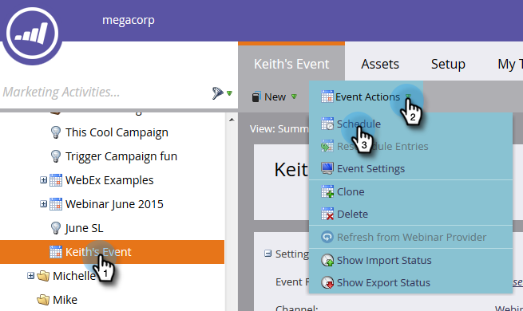

# Configuration des paramètres du Événement et synchronisation du marketing avec votre webinaire {#configure-event-settings-and-sync-marketo-with-your-webinar}

Suivez ces étapes pour configurer les paramètres du événement Marketo et connecter Marketo et ON24.

## Définir le Événement {#set-the-event}

1. Sélectionnez le événement à associer à un webinaire ON24, puis cliquez sur la liste déroulante Actions **** Événement et sélectionnez Paramètres **du**&#x200B;Événement.

   

1. Sélectionnez ON24 comme partenaire de Événement.

   

1. Sélectionnez le compte Connexion (par exemple, le nom d’affichage).

   

1. Saisissez l’identifiant de Événement (obtenez-le à partir d’ON24). Cliquez sur **Enregistrer**.

   

   >[!NOTE]
   >
   >Aux heures de pointe, on24 peut prendre de 15 à 20 minutes pour mettre les informations du Événement à la disposition de Marketo. Si vous recevez un message &quot;ID de session non valide&quot;, veuillez réessayer un peu plus tard.

## Définir la planification {#set-the-schedule}

Lorsque vous configurez un événement associé à un webinaire ON24, le planning de événement est renseigné avec les données ON24. Pour accéder à la boîte de dialogue Planification du Événement, procédez comme suit.

1. Sélectionnez le événement. Cliquez sur la liste déroulante Actions **** Événement et sélectionnez **Planifier.**

   

1. Choisissez la date de **Début, la date** de fin et le **fuseau horaire**. Cliquez sur **Enregistrer**.

   

   >[!NOTE]
   >
   >Si vous mettez à jour des informations de événement dans ON24, vous devez cliquer sur **Actualiser à partir du fournisseur** de webinaires dans le menu Actions du Événement pour voir les nouvelles données renseignées.

   [création de campagnes enfants et de ressources locales](create-child-campaigns-and-local-assets.md)

Vous pouvez passer à l’étape suivante : .

>[!MORELIKETHIS]
>
>* [Présentation des Événements d&#39;adaptateur Marketo On24](understanding-marketo-on24-adapter-events.md)
>* [Créer des campagnes enfants et des ressources locales](create-child-campaigns-and-local-assets.md)

>

