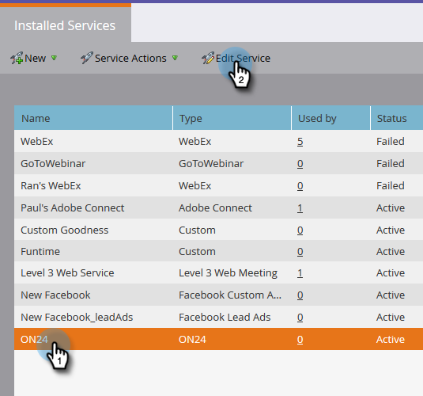
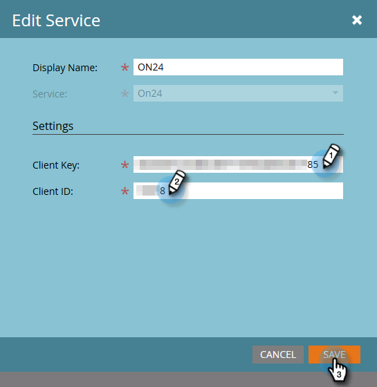

# Entrez vos informations d&#39;identification ON24 dans Marketo {#enter-your-on-credentials-in-marketo}

Commençons à intégrer votre événement ON24. Si vous devez modifier ou supprimer vos informations d’identification, ces étapes sont également incluses ci-dessous.

## Saisir des informations d&#39;identification {#enter-credentials}

1. Connectez-vous à Marketing et cliquez sur **Admin**.

   

1. Dans Intégration, cliquez sur **LaunchPoint**.

   

1. Sous Services installés, cliquez sur **Nouveau** , puis sur **Nouveau service**.

   

1. Dans la boîte de dialogue Nouveau service, saisissez les informations suivantes :

   * **Nom** d’affichage - Saisissez un nom à utiliser dans Marketing. Il peut s’agir de votre nom ou du nom de votre groupe si vous partagez des informations d’identification.
   * **Service** - Sélectionnez **On24** dans le menu déroulant.

   * **Clé** client - Saisissez la clé client ON24 que vous utilisez pour vous connecter. La clé du client est une chaîne de 32 chiffres contenant un mélange de lettres et de chiffres.
   * **ID** client : saisissez l’ID client ON24 à 4 chiffres que vous utilisez pour vous connecter. Vous pouvez obtenir l’ID de client et la clé de client directement auprès de votre gestionnaire de compte ON24.

   

1. Cliquez sur **Créer**.

   

1. Une fois les informations d’identification validées, elles sont ajoutées à la page Services installés. En cas d&#39;erreur, vous ne pourrez pas enregistrer les informations d&#39;identification.

## Modifier les informations d’identification {#edit-credentials}

Vous pouvez modifier vos informations d’identification si votre mot de passe expire ou si vous devez apporter une modification à des informations d’identification existantes.

1. Dans l’onglet Services installés, sélectionnez les informations d’identification à modifier, puis cliquez sur **Modifier le service**.

   

1. Mettez à jour les informations dans la boîte de dialogue Modifier le service, puis cliquez sur **Enregistrer**.

   

## Suppression d’un service {#delete-a-service}

1. Dans l’onglet Services installés, sélectionnez le service à supprimer, cliquez sur la liste déroulante Actions **** Service et sélectionnez **Supprimer le service**.

   

1. Cliquez sur **Supprimer**.

   

L’étape suivante consiste à [créer votre événement de webinaire dans ON24](create-your-webinar-event-in-on24.md).

>[!MORELIKETHIS]
>
>* [Présentation des Événements d&#39;adaptateurs Marketo ON24](understanding-marketo-on24-adapter-events.md)

>

