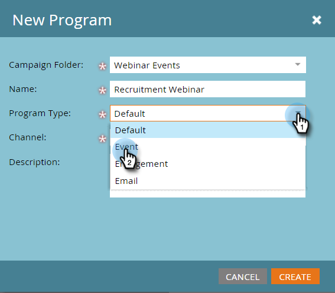

# Exemple d&#39;intégration de Événement ON24 {#example-on-event-integration}

Voici un exemple de événement, y compris des campagnes, pour un webinaire ON24. Lorsque vous créez votre événement, veillez à tester vos campagnes avant de les exécuter.

## Créer un nouveau Événement dans les Activités marketing {#create-a-new-event-in-marketing-activities}

1. Sélectionnez **Nouveau** > **Nouveau Programme**.

   

1. Sélectionnez un **dossier Campaign** dans lequel le événement sera installé.

   

1. Entrez un **nom** pour le événement.

   

1. Sélectionnez **Événement** comme **type de Programme**.

   

1. Sélectionnez **Webinaire** comme **Canal** pour le événement.

   

1. Cliquez sur **Créer**.

   

## Invitation (Campaign par lot) {#invite-batch-campaign}

* **Liste**  intelligente - Définissez qui vous inviterez au événement.
* **Flux**

   * Envoyer un courrier électronique - S&#39;il s&#39;agit d&#39;un courrier électronique de ressources local, il aura la convention d&#39;affectation de nom suivante : EventName.EmailName. Vous pouvez également utiliser des courriers électroniques globaux.
   * Modifier l’état dans Progression - Définissez sur Webinaire > Invité.

* **Planification**  : définissez la date d&#39;envoi de l&#39;invitation.

## Inscription/Confirmation (Trigger Campaign) {#registration-confirmation-trigger-campaign}

* **Liste intelligente**

   * Déclenchez la campagne en fonction de **Remplit le formulaire**. Veillez à inclure le landing page sur lequel réside le formulaire en utilisant **Ajoute Constraint**, en particulier si le formulaire est utilisé sur plusieurs landings page.

>[!CAUTION]
>
>Vous devez utiliser un formulaire Marketo pour enregistrer des personnes pour le événement, ou un formulaire non Marketo avec l’intégration d’API appropriée pour envoyer les données d’enregistrement à Marketo. Ceci est essentiel à la réussite de l&#39;intégration de votre partenaire de Événement. **REMARQUE** : Si vous utilisez un formulaire Marketo sur un landing page non Marketo, votre déclencheur sera  **Remplit** le formulaire avec le nom du formulaire.

* **Flux**

   * **Changez d’état dans Progression**  - Définissez sur Webinaire > Inscrit. **ATTENTION** : Cette étape de flux est requise lors de la configuration de votre campagne enfant. Lorsque l’état de progression d’une personne passe à **Enregistrée**, Marketo envoie les informations d’inscription à ON24.

   * **Envoyer un e-mail** - Confirmation par e-mail (défini sur  **** Operationégalement que les personnes désabonnées qui se sont inscrites continuent de le recevoir).

**REMARQUE** : Si la personne est renvoyée avec une erreur d’enregistrement, elle ne recevra pas la confirmation par courrier électronique.

## Rappel (Batch Campaign) {#reminder-batch-campaign}

* **Liste**  intelligente - Filtrez en utilisant  **Membre du** programme et définissez le statut sur  **Enregistrement**.

* **Flux**  - Envoyer un courriel (rappel).

**REMARQUE** : Vous pouvez utiliser une campagne similaire pour envoyer un  ** autre courriel de suivi aux personnes qui ont été invitées mais qui ne se sont pas encore inscrites.

## Campaign de suivi (Lot ou Trigger Campaign) {#follow-up-campaign-batch-or-trigger-campaign}

* **Liste**  intelligente - Déclenche en fonction des modifications de l’état du programme.

* **Flux**  - Envoyer un courriel. Utilisez les choix pour envoyer différents courriers électroniques en fonction de l’état du programme.

>[!MORELIKETHIS]
>
>[Présentation des Événements d&#39;adaptateurs Marketo ON24](/help/marketo/product-docs/demand-generation/events/create-an-event/create-an-event-with-the-marketo-on24-adapter/understanding-marketo-on24-adapter-events.md)
