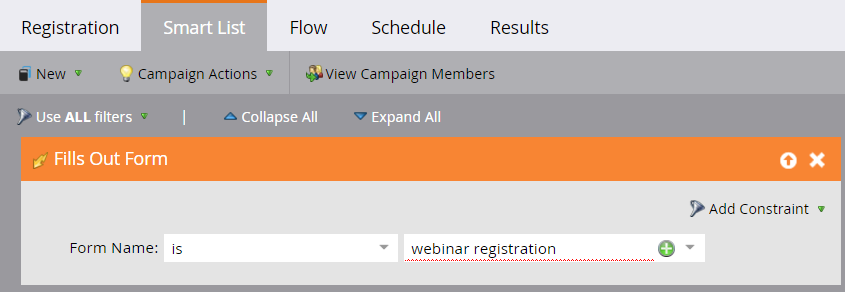
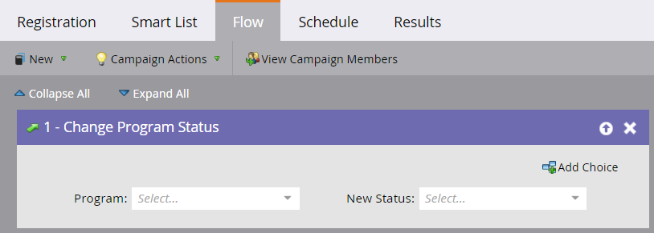

# Exemple d’intégration d’événement ON24 {#example-on-event-integration}

>[!IMPORTANT]
>
>Depuis août 2022, ON24 ne prend plus en charge les nouvelles intégrations Marketo. Les informations de cet article s’appliquent uniquement aux utilisateurs existants.

Voici un exemple d’événement, y compris des campagnes, pour un webinaire ON24. Lorsque vous créez votre événement, veillez à tester vos campagnes avant de les exécuter.

## Création d’un événement dans les activités marketing {#create-a-new-event-in-marketing-activities}

1. Sélectionner **Nouveau** > **Nouveau programme**.

   

1. Sélectionnez une **Dossier Campaign** où l’événement se produira.

   

1. Saisissez un **Nom** pour l’événement .

   

1. Sélectionner **Événement** comme la propriété **Type de programme**.

   

1. Sélectionner **Webinaire** comme la propriété **Canal** pour l’événement .

   

1. Cliquez sur **Créer**.

   

## Invitation (campagne par lots)  {#invite-batch-campaign}

* **Liste dynamique** - Définissez qui vous inviterez à l’événement.
* **Flux**

   * Envoyer un courrier électronique : s’il s’agit d’un courrier électronique de ressource local, il aura la convention d’affectation des noms suivante : EventName.EmailName. Vous pouvez également utiliser des emails globaux.
   * Changez l’état dans Progression - Défini sur Webinaire > Invité.

* **Planification** - Définissez la date d’envoi de l’invitation.

## Enregistrement/Confirmation (campagne de déclenchement) {#registration-confirmation-trigger-campaign}

* **Liste intelligente**

   * Déclenchez la campagne en fonction de **Remplir le formulaire**. Veillez à inclure la page d’entrée sur laquelle se trouve le formulaire en utilisant **Ajouter une contrainte**, en particulier si le formulaire est utilisé sur plusieurs landing pages.

>[!CAUTION]
>
>Vous devez utiliser un formulaire Marketo pour enregistrer des personnes pour l’événement, ou un formulaire non Marketo avec l’intégration d’API appropriée pour transmettre les données d’enregistrement à Marketo. C’est essentiel au succès de l’intégration de votre partenaire d’événement. **REMARQUE**: Si vous utilisez un formulaire Marketo sur une page d’entrée autre que Marketo, votre déclencheur sera **Remplir le formulaire** par le nom du formulaire.

* **Flux**

   * **Changement d’état dans la progression** - Définissez sur Webinaire > Enregistré. **ATTENTION**: Cette étape de flux est requise lors de la configuration de votre campagne enfant. Lorsque l’état de progression d’une personne passe à **Inscrits**, Marketo transmet les informations d’enregistrement à ON24.

   * **Envoyer un courrier électronique** - Adresse électronique de confirmation (définie sur **Opérationnel** afin que les personnes désabonnées qui se sont inscrites continuent de le recevoir).

**REMARQUE**: Si la personne est renvoyée avec une erreur d’enregistrement, elle ne recevra pas la confirmation par email.

## Rappel (campagne par lots) {#reminder-batch-campaign}

* **Liste dynamique** - Filtrage à l’aide de **Membre du programme** et définissez l’état sur **Inscrits**.

* **Flux** - Envoyer un courrier électronique (rappel).

**REMARQUE**: Vous pouvez utiliser une campagne similaire pour envoyer une *différent* e-mail de relance destiné aux personnes qui ont été invitées mais qui ne se sont pas encore enregistrées.

## Campagne de relance (campagne par lot ou de déclenchement) {#follow-up-campaign-batch-or-trigger-campaign}

* **Liste dynamique** - Déclencheur en fonction des modifications de l’état du programme.

* **Flux** - Envoyer un courrier électronique. Utilisez les choix pour envoyer différents emails en fonction de l’état du programme.

>[!MORELIKETHIS]
>
>[Présentation des événements de l’adaptateur Marketo ON24](/help/marketo/product-docs/demand-generation/events/create-an-event/create-an-event-with-the-marketo-on24-adapter/understanding-marketo-on24-adapter-events.md)
