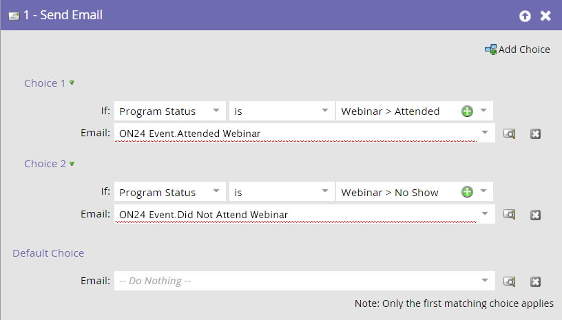

# Exemple d’intégration d’événement ON24 {#example-on-event-integration}

Voici un exemple d’événement, y compris de campagnes, pour un webinaire ON24. Lorsque vous créez votre événement, veillez à tester vos campagnes avant de les exécuter.

## Créer un événement dans les activités marketing {#create-a-new-event-in-marketing-activities}

1. Sélectionnez **[!UICONTROL Nouveau]** > **[!UICONTROL Nouveau programme]**.

   

1. Sélectionnez un **[!UICONTROL dossier Campaign]** où se tiendra l’événement.

   

1. Saisissez un **[!UICONTROL Nom]** pour l’événement.

   

1. Sélectionnez **[!UICONTROL Événement]** comme **[!UICONTROL Type de programme]**.

   

1. Sélectionnez **[!UICONTROL Webinaire]** comme **[!UICONTROL Canal]** pour l’événement.

   

1. Cliquez sur **[!UICONTROL Créer]**.

   

## Inviter (Campagne Par Lots)  {#invite-batch-campaign}

* **Liste dynamique** - Définissez les personnes que vous inviterez à l’événement.
* **Flux**

   * Envoyer un e-mail : s’il s’agit d’un e-mail de ressource locale, la convention de nommage sera la suivante : EventName.EmailName. Vous pouvez également utiliser des e-mails globaux.
   * Modifier le statut en cours - Définir sur Webinaire > Invité.

* **Planification** - Définissez la date d’envoi de l’invitation.

## Inscription/Confirmation (Déclencher La Campagne) {#registration-confirmation-trigger-campaign}

* **Liste dynamique**

   * Déclenchez la campagne en fonction de **[!UICONTROL Remplit le formulaire]**. Veillez à inclure la page de destination sur laquelle réside le formulaire à l’aide de l’option **[!UICONTROL Ajouter une contrainte]**, en particulier si le formulaire est utilisé sur plusieurs pages de destination.

>[!CAUTION]
>
>Vous devez utiliser un formulaire Marketo pour inscrire des personnes à l’événement ou un formulaire autre que Marketo avec l’intégration d’API appropriée pour pousser les données d’enregistrement vers Marketo. Ceci est essentiel au succès de votre intégration [!UICONTROL partenaire d’événement]. **REMARQUE** : si vous utilisez un formulaire Marketo sur une page de destination autre que Marketo, votre déclencheur sera **[!UICONTROL remplit le formulaire]** avec le [!UICONTROL nom du formulaire].

* **Flux**

   * **Modifier le statut en progression** - Définissez sur Webinaire > Enregistré. **ATTENTION** : cette étape de flux est requise lors de la configuration de votre campagne enfant. Lorsque le statut de progression d’une personne passe à **Enregistré**, Marketo transmet les informations d’enregistrement à ON24.

   * **Envoyer un e-mail** - E-mail de confirmation (défini sur **Opérationnel** afin que les personnes désabonnées qui se sont inscrites le reçoivent toujours).

**REMARQUE** : si la personne est renvoyée avec une erreur d’enregistrement, elle ne recevra pas l’e-mail de confirmation.

## Rappel (Campagne Par Lots) {#reminder-batch-campaign}

* **Liste dynamique** - Filtrez à l’aide de **Membre du programme** et définissez le statut sur **Enregistré**.

* **Flux** - Envoyer un e-mail (e-mail de rappel).

**REMARQUE** : vous pouvez utiliser une campagne similaire pour envoyer un e-mail de relance *différent* aux personnes invitées qui ne se sont pas encore inscrites.

## Campagne de suivi (campagne par lots ou par déclencheurs) {#follow-up-campaign-batch-or-trigger-campaign}

* **Liste dynamique** - Déclenchement en fonction des modifications du statut du programme.

* **Flux** - Envoyez Un E-Mail. Utilisez des choix pour envoyer différents e-mails en fonction du statut du programme.

>[!MORELIKETHIS]
>
>[Présentation des événements de l&#39;adaptateur Marketo ON24](/help/marketo/product-docs/demand-generation/events/create-an-event/create-an-event-with-the-marketo-on24-adapter/understanding-marketo-on24-adapter-events.md){target="_blank"}
