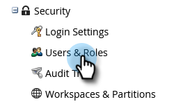
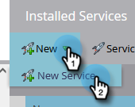

# Configuration de l’intégration ON24 à Marketo{#set-up-the-on24-integration-with-marketo}

Voici comment configurer votre intégration d’événement ON24.

## Création d’un rôle API uniquement {#create-an-api-only-role}

1. Dans Mon Marketo, cliquez sur **Admin**.

   

1. Sous Sécurité, cliquez sur **Utilisateurs et rôles**.

   

1. Cliquez sur l’onglet **Rôles** , puis sur **Nouveau rôle**.

   

1. Saisissez un Nom de rôle. Ouvrez le menu **Access API** et sélectionnez &quot;Read-Write Custom Object&quot; et &quot;Read-Write Persson&quot;. Cliquez sur **Créer**.

   

## Création d’un utilisateur {#create-a-new-user}

1. Toujours dans Utilisateurs et rôles, cliquez sur l’onglet **Utilisateurs** et cliquez sur **Inviter un nouvel utilisateur**.

   

1. Saisissez les informations du nouvel utilisateur et cliquez sur **Suivant**.

   

1. Sélectionnez le rôle API uniquement ON24 que vous venez de créer. Cochez la case **API Only** . Cliquez sur **Suivant**.

   

1. Cliquez sur **Send**.

   

>[!NOTE]
>
>Une invitation n’est pas requise pour les utilisateurs d’API uniquement.

## Configuration de la connexion ON24 {#set-up-on24-connection}

1. Toujours dans la section Admin, cliquez sur **LaunchPoint**.

   

1. Cliquez sur **New** , puis sur **New Service**.

   

1. Choisissez un nom d’affichage. Cliquez sur la liste déroulante **Service** et sélectionnez **Personnalisé**. Saisissez une description. Cliquez sur le menu déroulant API Only User et sélectionnez l’utilisateur que vous avez créé [dans les étapes ci-dessus](#create-a-new-user). Cliquez sur **Créer**.

   

1. Recherchez le service LaunchPoint personnalisé que vous venez de créer, puis cliquez sur Afficher les détails.

   

1. Mettez en surbrillance l’ID client, cliquez avec le bouton droit de la souris, copiez-le et enregistrez-le (vous en aurez besoin ultérieurement). Répétez l’opération pour le secret client.

   

1. Dans l’arborescence de gauche, cliquez sur Services Web.

   

1. Sous &quot;API REST&quot;, mettez en surbrillance, cliquez avec le bouton droit de la souris, copiez et enregistrez la première partie de l’identité (jusqu’à la &quot;m&quot; dans .com).

   

1. Avec votre identifiant client enregistré, votre secret client et votre identité, accédez à votre compte ON24. Le reste des étapes y sont effectuées et sont [décrites ici](https://on24support.force.com/Support/s/article/Connect-Marketo-ON24-Connect-Data-Integration#Step6){target="_blank"}.
