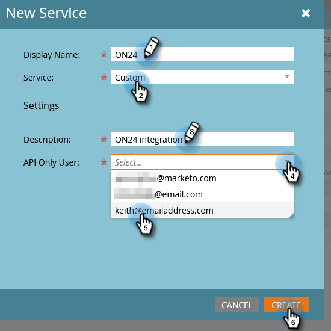

# Configurer l’intégration d’ON24 à Marketo{#set-up-the-on24-integration-with-marketo}

Voici comment configurer votre intégration d’événement ON24.

## Créer un rôle API uniquement {#create-an-api-only-role}

1. Dans Mon Marketo, cliquez sur **[!UICONTROL Admin]**.

   

1. Sous [!UICONTROL Sécurité], cliquez sur **[!UICONTROL Utilisateurs et rôles]**.

   

1. Cliquez sur l’onglet **[!UICONTROL Rôles]** puis sur **[!UICONTROL Nouveau rôle]**.

   

1. Saisissez un [!UICONTROL Nom du rôle]. Ouvrez le menu **[!UICONTROL API Access]** et sélectionnez « [!UICONTROL Objet personnalisé en lecture-écriture] » et « [!UICONTROL Personne en lecture-écriture] ». Cliquez sur **[!UICONTROL Créer]**.

   

## Créer un nouvel utilisateur {#create-a-new-user}

1. Toujours en [!UICONTROL Utilisateurs et rôles], cliquez sur l’onglet **[!UICONTROL Utilisateurs]** et cliquez sur **[!UICONTROL Inviter un nouvel utilisateur]**.

   

1. Saisissez les informations du nouvel utilisateur et cliquez sur **[!UICONTROL Suivant]**.

   

1. Sélectionnez le rôle [!UICONTROL API ON24 uniquement (tous les espaces de travail)] que vous venez de créer. Cochez la case **[!UICONTROL API uniquement]**. Cliquez sur **[!UICONTROL Suivant]**.

   

1. Cliquez sur **[!UICONTROL Envoyer]**.

   

>[!NOTE]
>
>Aucune invitation n’est requise pour les utilisateurs d’API uniquement.

## Configurer la connexion ON24 {#set-up-on24-connection}

1. Toujours dans la section [!UICONTROL Admin], cliquez sur **[!UICONTROL LaunchPoint]**.

   

1. Cliquez sur **[!UICONTROL Nouveau]** puis **[!UICONTROL Nouveau service]**.

   

1. Choisissez un [!UICONTROL nom d’affichage]. Cliquez sur la liste déroulante **[!UICONTROL Service]** et sélectionnez **[!UICONTROL Personnalisé]**. Saisissez une [!UICONTROL description]. Cliquez sur le menu déroulant [!UICONTROL Utilisateur API uniquement] et sélectionnez l’utilisateur que vous avez créé [dans les étapes ci-dessus](#create-a-new-user). Cliquez sur **[!UICONTROL Créer]**.

   

1. Recherchez le service de [!DNL LaunchPoint] personnalisé que vous venez de créer et cliquez sur [!UICONTROL Afficher les détails].

   

1. Mettez en surbrillance, cliquez avec le bouton droit, copiez et enregistrez l’[!UICONTROL ID client] (vous en aurez besoin ultérieurement). Répétez l’opération pour [!UICONTROL Secret client].

   

1. Dans l’arborescence de gauche, cliquez sur **[!UICONTROL Services web]**.

   

1. Sous « [!UICONTROL API REST] », mettez en surbrillance, cliquez avec le bouton droit de la souris, copiez et enregistrez la première partie de l’[!UICONTROL Identité] (jusqu’au « m » dans .com).

   

1. Avec votre ID client, votre secret client et votre identité enregistrés, accédez à votre compte ON24. Le reste des étapes y sont effectuées et se trouvent dans la documentation [ON24](https://support.on24.com/hc/en-us/articles/21420762650523-Data-Integration-Setup-Instructions-When-Using-Marketo-Registration-Option-1){target="_blank"}.
