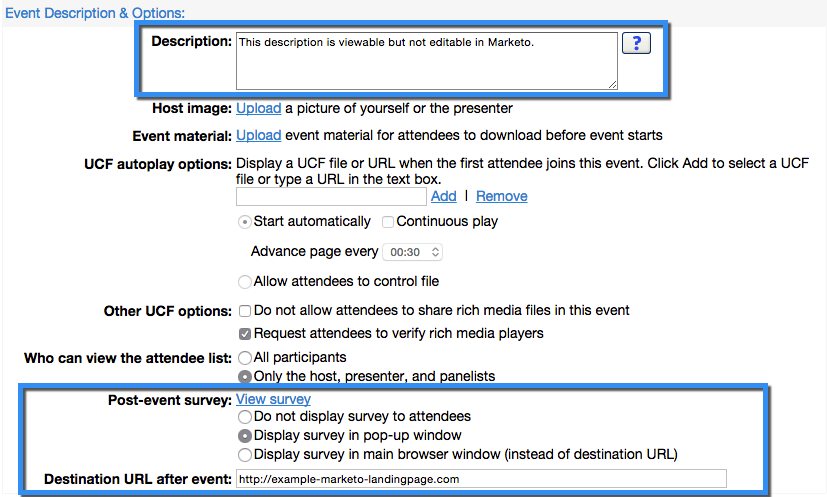

# Création d’un Événement avec WebEx {#create-an-event-with-webex}

>[!PREREQUISITES]
>
>* [Ajouter WebEx en tant que service LaunchPoint](/help/marketo/product-docs/administration/additional-integrations/add-webex-as-a-launchpoint-service.md)
>* [Créer un Programme de Événement](/help/marketo/product-docs/demand-generation/events/understanding-events/create-a-new-event-program.md)
>* Définir les actions de [flux appropriées](http://docs.marketo.com/display/DOCS/Flow+Actions)pour suivre l&#39;engagement

Commencez par créer un Événement Webex dans le Centre de Événement WebEx. Marketo utilise uniquement des paramètres et des champs spécifiques pour votre intégration, ce que nous allons examiner sous peu. D’autres champs que vous pouvez configurer pour WebEx sont expliqués dans le Guide [de l’utilisateur de](http://www.cisco.com/c/dam/en/us/td/docs/collaboration/meeting_center/wbs298/wx_ec_host_ug.pdf)WebEx Événement Center.

## Informations de base {#basic-information}

* **Nom du événement -** Ce nom peut être affiché dans Marketo.
* **Case à cocher non répertoriée**

   * Il est recommandé de ne **pas** liste de votre événement. Ceci garantit que tous les utilisateurs s&#39;enregistrent par l&#39;intermédiaire de votre landing page Marketo. Les personnes qui s’inscrivent par l’intermédiaire d’un mécanisme autre que Marketo seront affichées dans Marketo après la conclusion du événement ET seulement si elles ont assisté au événement.
   * Si vous choisissez de liste du événement, celui-ci s’affichera sur la page Liste des Événements pour toute personne visitant le site Web de votre centre de Événements.

* **Inscription -** Cochez cette case pour définir &quot;obligatoire&quot;. Vous utiliserez un landing page/formulaire Marketo pour capturer les informations d’enregistrement qui seront envoyées à WebEx.
* **Mot de passe** de événement - (facultatif) Si vous utilisez ce champ, veillez à l&#39;inclure dans votre courriel de confirmation !

## Date et heure {#date-time}

* **Date** du début - Entrez votre date de début. Ceci sera visible dans Marketing Cloud.

* **Heure** de début - Entrez votre heure de début. Ceci sera visible dans Marketing Cloud.

* **Durée** estimée : indiquez la durée du événement. Ceci sera visible dans Marketing Cloud.

* **Fuseaux horaires** - Entrez les fuseaux horaires applicables. Ils seront visibles sur le marché.

## Paramètres de conférence audio {#audio-conference-settings}

Ces paramètres résident uniquement dans WebEx. Ils ne sont pas utilisés ou visibles dans Marketo, mais ils peuvent être importants pour votre webinaire, donc vérifiez-les par doublon !

## Description et options du événement  {#event-description-options}

Les options suivantes sont utilisées ou visibles dans Marketing Cloud. Les autres champs résident uniquement dans WebEx.

* **Description** - Entrez une description. Cette option peut être affichée mais pas modifiable dans Marketing Cloud.
* **Questionnaire** post-événement - Marketo n&#39;est pas en mesure de capturer les informations sur un questionnaire post-événement WebEx pour le moment.
* **URL** de destination - (facultatif) Vous pouvez entrer l’URL d’un landing page Marketo qui servira d’URL de destination à afficher après la fin de la session.

## Participants et inscription {#attendees-registration}

Vous contrôlez la liste d&#39;invitation, le formulaire d&#39;inscription et d&#39;autres courriels à l&#39;aide d&#39;un Événement Marketo. D’autres fonctionnalités ne seront pas prises en charge par Marketo, notamment :

* **Nombre maximal d&#39;inscrits** - Actuellement **non** pris en charge à l&#39;aide de l&#39;intégration de Marketo-WebEx.  L’approbation manuelle des inscrits est disponible à l’aide de l’état de progression Approbation en attente dans Marketo.

* **ID d&#39;enregistrement requis** - Actuellement pris en charge à l&#39;aide de l&#39;intégration de Marketo-WebEx. Vous pouvez utiliser Marketing pour envoyer le courriel de confirmation de votre événement. Lorsque la personne s’enregistre, elle reçoit une URL unique qu’elle utilise pour entrer dans le événement.

   >[!TIP]
   >
   >Pour renseigner votre message de confirmation avec cette URL unique, utilisez le jeton suivant dans votre message électronique : `{{member.webinar url}}`. Lorsque l’URL de confirmation est envoyée, ce jeton correspond automatiquement à l’URL de confirmation unique de la personne.
   >
   >Définissez votre message de confirmation sur **Operational** pour vous assurer que les personnes qui s&#39;inscrivent et peuvent être désabonnées reçoivent toujours leurs informations de confirmation.

* **Mot de passe** d’enregistrement - (facultatif) Actuellement non pris en charge par l’intégration de Marketo-WebEx.
* **Règles** d’approbation - Actuellement non prise en charge à l’aide de l’intégration de Marketo-WebEx. Cependant, vous pouvez utiliser des campagnes intelligentes dans Marketo pour contrôler les approbations.

### Présentateurs et panélistes {#presenters-panelists}

Les informations configurées dans cette section ne sont pas transmises à Marketing Cloud.

### Messages électroniques {#email-messages}

Vous utiliserez Marketo pour envoyer des e-mails à vos inscrits, des e-mails de confirmation, etc. Vous n’avez pas besoin de configurer quoi que ce soit dans cette section. Désactivez (décochez) les options de message électronique dans WebEx.

>[!NOTE]
>
>L&#39;intégration de Marketo-WebEx ne peut pas prendre en charge l&#39;envoi de courriers électroniques de confirmation à partir de WebEx. La confirmation doit être envoyée via Marketo. Après avoir planifié le événement, veillez à copier les informations du événement dans le courrier électronique de confirmation de Marketo et définissez le courrier électronique comme **Opérationnel**.

Maintenant, nous sommes prêts à entrer dans le Marketo !

1. Sélectionnez le événement que vous avez créé. Ouvrez la liste déroulante Actions **** Événement. Choisissez Paramètres **du Événement.**

   

   >[!NOTE]
   >
   >Le type de canal du événement sélectionné doit être **webinaire**.

1. Sous **Événement Partner**, sélectionnez **WebEx**.

   

1. Sous **Connexion**, sélectionnez votre connexion WebEx.

   

1. Sous **Événement**, choisissez votre événement WebEx fraîchement créé. Sélectionnez ensuite une page de sauvegarde facultative, puis cliquez sur **Enregistrer**.

   

1. Sélectionnez une page de sauvegarde facultative pour votre événement WebEx. Choisissez dans la liste déroulante des landings page marketing approuvés ou saisissez l’URL d’un landing page non marketing.

   >[!TIP]
   >
   >Définissez une page de sauvegarde pour diriger un membre vers une page spécifique s&#39;il clique sur son URL de événement personnalisé avant l&#39;heure de début du événement.

   >[!NOTE]
   >
   >Les champs envoyés par Marketo sont les suivants : Prénom, Nom, Adresse électronique.

   

   >[!CAUTION]
   >
   >Evitez d’utiliser des programmes de messagerie imbriqués pour envoyer vos messages de confirmation. Utilisez plutôt la campagne intelligente du programme de événement, comme illustré ci-dessus.

   >[!TIP]
   >
   >L’affichage des données dans Marketo peut prendre jusqu’à 48 heures. Si, après avoir attendu si longtemps, vous ne voyez toujours rien, sélectionnez **Actualiser à partir du fournisseur** de webinaires dans le menu Actions de Événement de l’onglet **Résumé** de votre événement.

Doux ! Votre événement WebEx est désormais synchronisé avec votre événement Marketo.  Les personnes qui s’abonnent à votre webinaire seront repoussées vers votre fournisseur de webinaires via l’étape de flux Modifier l’état du Programme lorsque le nouvel état est défini sur &quot;Inscrit&quot;. Aucun autre statut ne poussera la personne vers le bas. Veillez également à passer à l’étape 1 du flux d’état du Programme de modification et à l’étape 2 du flux d’envoi de courrier électronique.

## Affichage de la planification  {#viewing-the-schedule}

Dans la vue [de](http://docs.marketo.com/display/docs/program+schedule+view)Planning du programme, cliquez sur l’entrée de calendrier correspondant à votre événement. Vous pouvez voir la planification sur le côté droit de l&#39;écran !

>[!NOTE]
>
>Pour modifier le calendrier de votre événement, vous devez modifier le webinaire sur WebEx.
