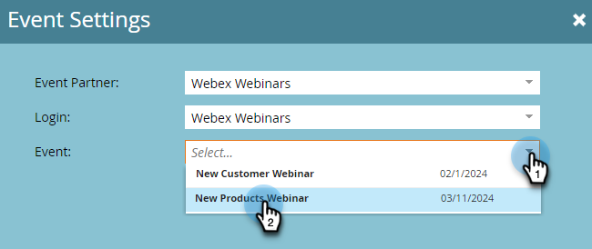

# Créer un événement avec [!DNL Webex] {#create-an-event-with-webex}

Après avoir créé un webinaire dans Webex, vous devrez synchroniser votre événement avec Marketo Engage.

>[!PREREQUISITES]
>
>* [Ajouter [!DNL Webex] as a [!DNL LaunchPoint] Service](/help/marketo/product-docs/administration/additional-integrations/add-webex-as-a-launchpoint-service.md)
>* [Créer un programme d’événement](/help/marketo/product-docs/demand-generation/events/understanding-events/create-a-new-event-program.md)
>* Définir les [actions de flux](/help/marketo/product-docs/core-marketo-concepts/smart-campaigns/flow-actions/add-a-flow-step-to-a-smart-campaign.md) appropriées pour suivre l’engagement

## Planifier Votre Webinaire {#schedule-your-webinar}

Vous planifiez votre événement et choisissez vos paramètres préférés dans [Webex](https://www.webex.com/){target="_blank"}. Seules les informations suivantes sont visibles dans Marketo : nom du webinaire, date et heure de début et de fin, fuseau horaire et description. Des informations supplémentaires sur les webinaires Webex [ici](https://help.webex.com/en-us/landing/ld-7srxjs-WebexWebinars/Webex-Webinars){target="_blank"}.

### Informations de base {#basic-information}

* **[!UICONTROL Nom de l’événement] -** Ce nom sera visible dans Marketo.
* **[!UICONTROL Case à cocher non répertoriée]**
* **Rubrique** : il s’agit du nom de votre événement qui sera visible dans Marketo.
* **Date et heure** : la date de début/fin, l’heure de début/fin, la durée et le fuseau horaire peuvent tous être affichés dans Marketo.
* **Nombre maximal de participants** : le nombre maximal de participants détermine les fonctionnalités Webex prises en charge.
* **Vue de diffusion web pour les participants** : cochez cette case pour que votre webinaire soit diffusé en direct à tous les participants.
* **Panélistes** : invitez des personnes spécifiques à être des panélistes dans votre webinaire.
* **Agenda du webinaire** : renseignez ce champ si vous souhaitez fournir un contexte dans l’invitation par e-mail envoyée aux panélistes.

### Sécurité {#security}

* **Mot de passe du webinaire** : (facultatif) Si vous utilisez ce champ, veillez à l’inclure dans votre e-mail de confirmation.
* **Mot de passe de la liste d’experts** : (facultatif) si vous utilisez ce champ, veillez à l’inclure dans votre agenda de webinaire.
* **Exiger un compte** : limite les participants aux seuls comptes Webex.

### Options de connexion audio {#audio-connection-options}

* **Type de connexion audio** : sélectionnez la manière dont les participants au webinaire rejoignent la partie audio de votre webinaire.
* **Tonalité d’entrée et de sortie** : sélectionnez le son que vous souhaitez entendre lorsque quelqu’un entre ou sort du webinaire (connexion audio par téléphone requise).
* **Désactiver le son du panneau** : sélectionnez les paramètres de désactivation du panneau de votre choix.

### Options avancées {#advanced-options}

* **Enregistrement automatique** : cochez cette case pour enregistrer automatiquement votre webinaire.
* **Session d’exercices pratiques** : cochez cette case pour qu’une session d’exercices pratiques démarre au début du webinaire.
* **Sessions en petits groupes** : les sessions en petits groupes vous permettent de pré-affecter des panélistes et des participants avant le début du webinaire, ou de les autoriser à se joindre pendant le webinaire.
* **Série de webinaires** : l’ajout d’à une série de webinaires permet aux personnes de voir votre webinaire, qu’il soit public ou non.
* **Inscription** : les participants doivent s&#39;inscrire et recevoir l&#39;approbation de l&#39;hôte avant de participer.
* **Rappel par e-mail** : sélectionnez un rappel par e-mail compris entre 15 minutes avant le début du webinaire et deux jours.
* **Options du webinaire** : déterminez les fonctionnalités disponibles pour les participants au webinaire.
* **Privilèges du participant** : les privilèges du participant déterminent les actions disponibles pour les participants au webinaire.

>[!NOTE]
>
>L’intégration Marketo-Webex ne peut pas prendre en charge l’envoi d’e-mails de confirmation en dehors de Webex. La confirmation doit être envoyée via Marketo. Une fois l’événement planifié, veillez à copier les informations de l’événement dans l’e-mail de confirmation Marketo et à définir l’e-mail comme _Opérationnel_.

## Synchroniser votre événement avec Marketo Engage {#sync-your-event-with-marketo-engage}

1. Dans Marketo, recherchez et sélectionnez le programme d’événement souhaité. Dans le menu déroulant **Actions d’événement**, sélectionnez **Paramètres d’événement**.

   

   >[!NOTE]
   >
   >Le type de canal de l’événement sélectionné doit être **webinaire**.

1. Dans le menu déroulant **Partenaire d’événement**, sélectionnez **Webinaires Webex**.

   

1. Dans le menu déroulant **Connexion**, choisissez votre connexion Webex.

   

1. Dans le menu déroulant **Événement**, choisissez votre événement Webex.

   

1. Les détails de votre webinaire seront renseignés. Cliquez sur **Enregistrer**.

   

Votre événement Webex est maintenant synchronisé avec votre programme d’événement Marketo. Les personnes qui s’inscrivent à votre webinaire sont redirigées vers votre fournisseur de webinaires via l’étape de flux _Modifier le statut du programme_ lorsque le nouveau statut est défini sur « Enregistré ». Aucun autre statut ne poussera la personne vers le serveur. Veillez à ce que les étapes de flux _Modifier le statut du programme_ #1 et _Envoyer un e-mail_ soient #2.

## Éléments à noter {#things-to-note}

* Évitez d’utiliser des programmes de messagerie imbriqués pour envoyer vos e-mails de confirmation. Utilisez plutôt la campagne intelligente du programme d’événement.

* Les données peuvent mettre jusqu’à 48 heures pour apparaître dans Marketo. Si, après avoir attendu si longtemps, vous ne voyez toujours rien, cliquez sur **Actualiser à partir du fournisseur de webinaires** dans le menu déroulant **Actions d’événement** de l’onglet **Résumé** de votre programme d’événement.
