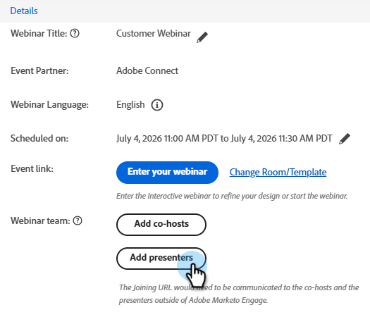

# Ajout d’une équipe de webinaires {#add-a-webinar-team}

Dans les webinaires interactifs, une équipe de webinaires se compose de tous les rôles qui contribuent à la diffusion réussie du webinaire dans Adobe Connect. Cela inclut les présentateurs et les co-hôtes.

>[!NOTE]
>
>Les présentateurs et les co-hôtes dans Marketo Engage correspondent exactement aux rôles du présentateur et de l’hôte lors de la diffusion du webinaire dans Adobe Connect. Les co-hôtes peuvent modifier les dispositions et les capsules, contrairement aux présentateurs.

Le présentateur est un rôle externe qui participe à la diffusion de l’expérience du webinaire, tandis que les co-hôtes peuvent agir en tant que présentateur et gérer les aspects administratifs de la diffusion du webinaire. Les co-hôtes peuvent être internes et externes. Les co-hôtes externes n’auront pas accès aux programmes d’événement de webinaire interactif dans Marketo, mais disposent des autorisations d’hébergement lors de la diffusion dans Adobe Connect. Les co-hôtes internes auront accès au programme d’événement de webinaire interactif dans Marketo, ainsi qu’aux autorisations d’hébergement lors de la diffusion. Cela permet de s’assurer que les co-hôtes internes peuvent prendre les rênes du programme d’événement de webinaire interactif lorsque le créateur d’origine du programme de webinaire interactif ne fait plus partie du jeu d’utilisateurs des webinaires interactifs ou n’est même plus un utilisateur Marketo.

>[!PREREQUISITES]
>
>[Créer un webinaire interactif](/help/marketo/product-docs/demand-generation/events/interactive-webinars/create-an-interactive-webinar.md)

## Ajout d’un co-hôte {#add-a-co-host}

1. Sur la page Présentation du webinaire interactif, cliquez sur **Ajouter les co-hôtes**.

   

1. Vous pouvez ajouter des utilisateurs internes ou externes. Dans cet exemple, nous choisirons externe.

   

   >[!NOTE]
   >
   >Si vous sélectionnez **Utilisateur interactif interne de webinaire**, vous devrez simplement cliquer sur la liste déroulante **Hôtes disponibles** et choisir dans la liste des personnes qui ont été ajoutées en tant qu’utilisateurs de webinaires interactifs dans Marketo Engage.

1. Saisissez le prénom, le nom et l’adresse électronique du co-hôte. Cliquez sur **Ajouter**.

   

1. Votre nouveau co-hôte apparaîtra dans la section Équipe du webinaire .

   

## Ajout d’un présentateur {#add-a-presenter}

1. Sur la page Présentation du webinaire interactif, cliquez sur **Ajouter des présentateurs**.

   

1. Saisissez le prénom, le nom et l’adresse électronique du présentateur de votre choix. Cliquez sur **Ajouter**.

   

   >[!NOTE]
   >
   >Les informations du présentateur seront mises à la disposition d’Adobe Connect lors de la diffusion d’un webinaire afin que les informations appropriées puissent être renseignées automatiquement sans que l’utilisateur ait à les saisir lors de l’entrée pour la diffusion d’un webinaire.

1. Votre nouveau présentateur apparaîtra dans la section Équipe du webinaire .

   

>[!TIP]
>
>Après avoir ajouté une équipe de webinaires, vous pouvez cliquer sur l’icône de copie en regard de chaque utilisateur pour copier (puis partager) ses URL de jointure.

>[!MORELIKETHIS]
>
>[Créer un webinaire interactif](/help/marketo/product-docs/demand-generation/events/interactive-webinars/create-an-interactive-webinar.md)
