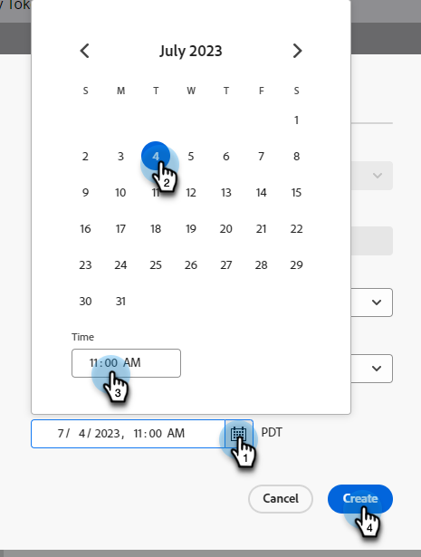

# Créer un webinaire interactif {#create-an-interactive-webinar}

Créez un webinaire interactif en quelques étapes simples.

1. Accédez à **Activités marketing**.

   

1. Cliquez avec le bouton droit sur le dossier souhaité et sélectionnez **Nouveau programme**.

   

   >[!CAUTION]
   >
   >[Notification push mobile](/help/marketo/product-docs/mobile-marketing/push-notifications/understanding-push-notifications.md){target="_blank"} les ressources ne sont **pas** prises en charge dans les webinaires interactifs.

1. Nommez le programme. Sous Type de programme, sélectionnez **Événement**.

   

1. Cliquez sur la liste déroulante Canal et sélectionnez un canal comportant _Événement avec webinaire_ dans sa colonne « S’applique à ». Dans cet exemple, nous choisissons **Webinaire**.

   

   >[!NOTE]
   >
   >Pour voir quels canaux s’appliquent à _Événement avec webinaire_, accédez à **Admin** > **Balises**. « S’applique à » doit être la colonne du milieu. En savoir plus sur « S’applique à » à l’étape 5 de [cet article](/help/marketo/product-docs/administration/tags/create-a-program-channel.md){target="_blank"}.

1. Choisissez **Webinaires interactifs** et cliquez sur **Suivant**.

   

1. Donnez un titre à votre webinaire et décidez de sa durée.

   

   >[!NOTE]
   >
   >* Le titre du webinaire **est** visible par les participants lorsqu’ils rejoignent l’événement. Il est important que le titre soit différent du nom du programme d’événement des webinaires interactifs dans votre instance de Marketo Engage, ainsi que du nom de la salle de webinaire.
   >
   >* Vous ne pouvez pas réutiliser le titre d’un webinaire. Chacun d’eux doit être unique dans votre instance Marketo.
   >
   >* Vous pouvez modifier le titre du webinaire ultérieurement, si vous le souhaitez.
   >
   >* Si vous créez un webinaire de test, il doit être supprimé avant son heure de début afin de vous assurer que la licence de ce webinaire n’est pas utilisée.

1. Planifiez la date et l’heure de votre webinaire, modifiez le fuseau horaire (si vous le souhaitez) et définissez la taille maximale de l’audience. Cliquez sur **Créer** lorsque vous avez terminé.

   

>[!NOTE]
>
>Il est recommandé d’espacer de 30 minutes deux événements consécutifs (à moins que la licence ne prenne en charge les webinaires simultanés) sous forme de mémoire tampon au cas où le webinaire précédent s’exécuterait au-delà de son heure planifiée.

Il est maintenant temps de [concevoir votre webinaire](/help/marketo/product-docs/demand-generation/events/interactive-webinars/designing-interactive-webinars.md){target="_blank"}.

>[!IMPORTANT]
>
>Il est vivement recommandé de concevoir votre webinaire _avant_ d’ajouter des présentateurs ou des co-animateurs.

>[!MORELIKETHIS]
>
>[Découvrez comment ajouter des présentateurs et/ou des co-hôtes](/help/marketo/product-docs/demand-generation/events/interactive-webinars/add-a-webinar-team.md){target="_blank"}
